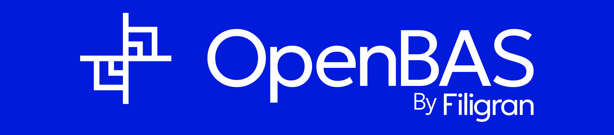

<h1 align="center">
  
</h1>

  
  
  
  
  
  
  

## Introduction

OpenBAS is an open source platform allowing organizations to plan, schedule and conduct cyber adversary simulation
campaign and tests.

## Objective

The goal is to create a powerful, reliable and open source tool to effectively plan and play all types of simulations,
training and exercises from the technical level to the strategic one. Also, the platform is able to give you a proper
overview of any security gaps regarding actual threats with knowledge coming from
the [OpenCTI platform](https://opencti.io).

OpenBAS aims to respond to these issues, which not only concern state services but also many private organizations. With
different modules (scenarios, teams, simulations, verification of means of communication, encryption, etc.), the
platform offers advantages such as collaborative work, real-time monitoring, statistics or the management of feedback.

Finally, OpenBAS supports different types of inject, allowing the tool to be integrated with emails, SMS platforms,
social medias, alarm systems, etc. All currently supported integration can be found in
the [OpenBAS ecosystem](https://docs.openbas.io/latest/development/injectors/).

## Editions of the platform

OpenBAS platform has 2 different editions: Community (CE) and Enterprise (EE). The purpose of the Enterprise Edition is
to provide [additional and powerful features](https://filigran.io/offering/subscribe) which require specific investments
in research and development. You can enable the Enterprise Edition directly in the settings of the platform.

* OpenBAS Community Edition, licensed under the [Apache 2, Version 2.0 license](LICENSE).
* OpenBAS Enterprise Edition, licensed under the [Enterprise Edition license](LICENSE).

To understand what OpenBAS Enterprise Edition brings in terms of features, just check
the [Enterprise Editions page](https://filigran.io/offering/subscribe) on the Filigran website. You can also try this
edition by enabling it in the settings of the platform.

## Documentation and demonstration

If you want to know more on OpenBAS, you can read the [documentation on the tool](https://docs.openbas.io). If you wish
to discover how the OpenBAS platform is working, a [demonstration instance](https://demo.openbas.io) is available and
open to everyone. This instance is reset every night and is based on reference data maintained by the OpenBAS
developers.

## Releases download

The releases are available on the [Github releases page](https://github.com/OpenBAS-Platform/openbas/releases). You can
also access the [rolling release package](https://releases.openbas.io) generated from the mater branch of the
repository.

## Installation

All you need to install the OpenBAS platform can be found in
the [official documentation](https://docs.openbas.io/latest/deployment/installation/). For installation, you can:

* [Use Docker](https://docs.openbas.io/latest/deployment/installation/#using-docker)
* [Install manually](https://docs.openbas.io/latest/deployment/installation/#manual-installation)

## Contributing

### Code of Conduct

OpenBAS has adopted a [Code of Conduct](CODE_OF_CONDUCT.md) that we expect project participants to adhere to. Please
read the [full text](CODE_OF_CONDUCT.md) so that you can understand what actions will and will not be tolerated.

### Contributing Guide

Read our [contributing guide](CONTRIBUTING.md) to learn about our development process, how to propose bugfixes and
improvements, and how to build and test your changes to OpenBAS.

### Beginner friendly issues

To help you get you familiar with our contribution process, we have a list
of [beginner friendly issues](https://github.com/OpenBAS-Platform/openbas/labels/beginner%20friendly%20issue) which are
fairly easy to implement. This is a great place to get started.

### Development

If you want to actively help OpenBAS, we created
a [dedicated documentation](https://docs.openbas.io/latest/development/environment_ubuntu/) about the
deployment of a development environment and how to start the source code modification.

## Community

### Status & bugs

Currently OpenBAS is under heavy development, if you wish to report bugs or ask for new features, you can directly use
the [Github issues module](https://github.com/OpenBAS-Platform/openbas/issues).

### Discussion

If you need support or you wish to engage a discussion about the OpenBAS platform, feel free to join us on
our [Slack channel](https://community.filigran.io). You can also send us an email to contact@filigran.io.

## About

### Authors

OpenBAS is a product designed and developed by the company [Filigran](https://filigran.io).

### Data Collection

#### Usage telemetry

To improve the features and the performances of OpenBAS, the platform collects anonymous statistical data related to its
usage and health.

You can find all the details on collected data and associated usage in
the [usage telemetry documentation](https://docs.openbas.io/latest/reference/usage-telemetry/).

#### OpenStreetMap server

To provide OpenCTI users with cartography features, the platform uses a dedicated OpenStreetMap
server (https://map.openbas.io). To monitor usage and adapt services performances, Filigran collects access log to this
server (including IP addresses).

By using this server, you authorize Filigran to collect this information. Otherwise, you are free to deploy your own
OpenStreetMap server and modify the platform configuration accordingly.

If you have started using the Filigran server and change your mind, you have the right to access, limit, rectify, erase
and receive your data. To exercise your rights, please send your request to privacy@filigran.io.