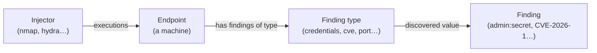
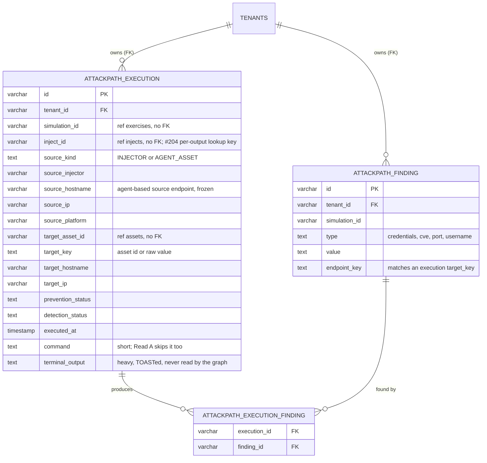
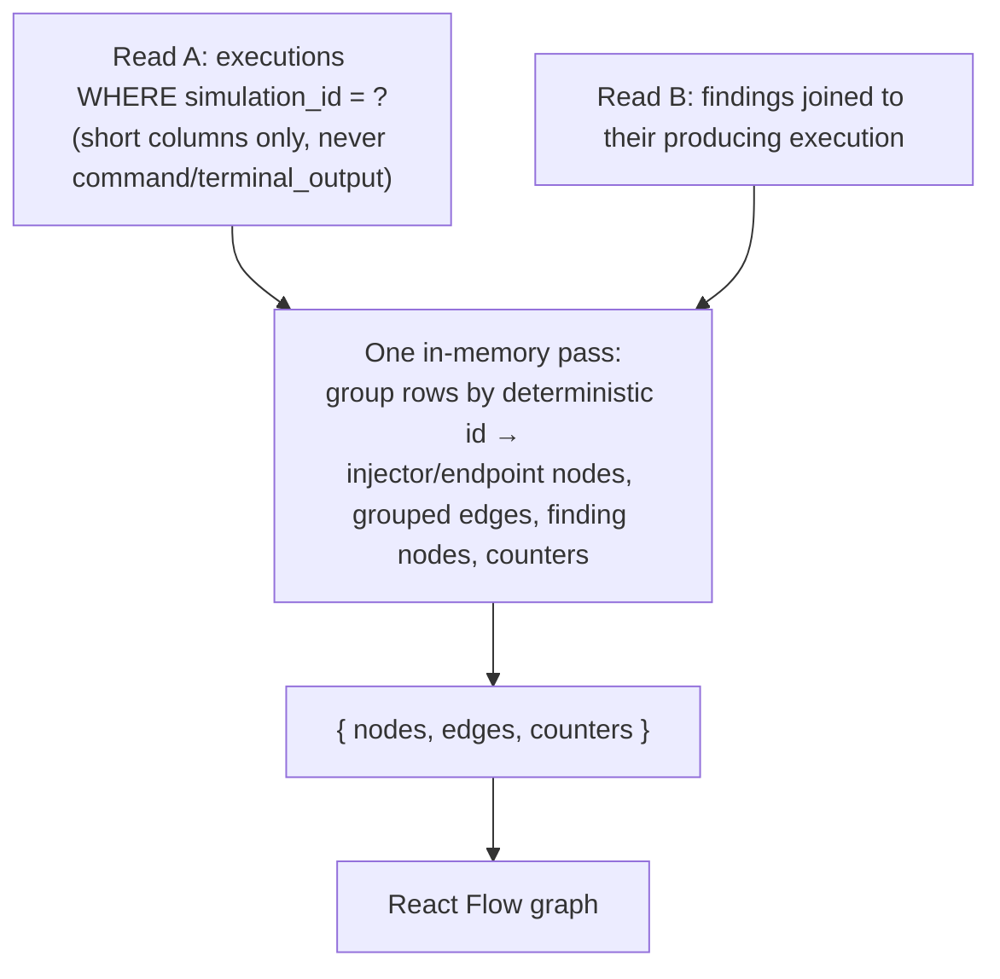
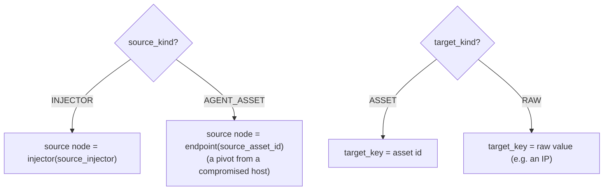
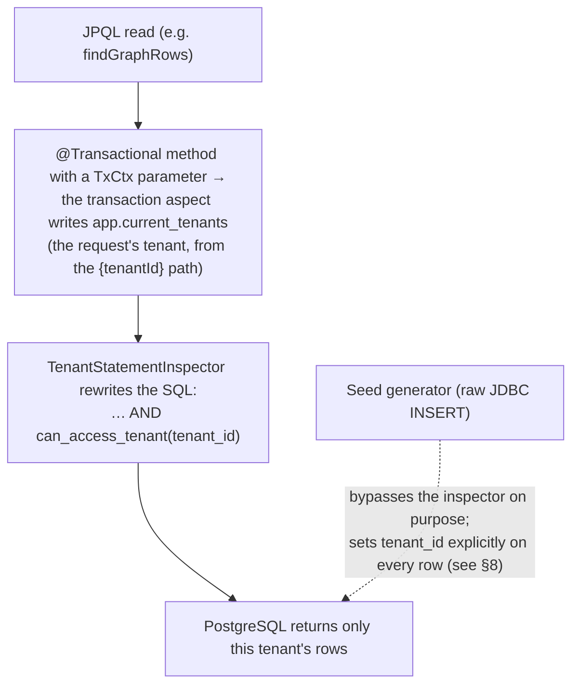
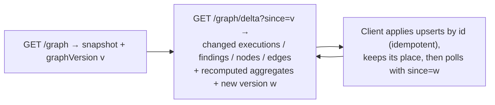

# Attack path

!!! warning "Proof of concept"

    The attack-path execution store is a proof of concept (issue 6647). The design rationale and the
    options weighed are in
    `adr/ADR-003-attack-path-execution-store-on-postgresql.md` at the repository root; this guide is the
    hands-on companion for developers building on the POC.

## 1. The big picture

During a breach-and-attack simulation, **injectors** (tools such as `nmap`, `hydra`, `crackmapexec`)
run steps against **endpoints** (machines on the target network). Each step is an **execution**, and it
has an outcome — was it **prevented** (blocked) and was it **detected** (seen)? — and it may uncover
**findings**: credentials, CVEs, open ports, usernames.

The **attack path** view is the graph of all of that for one simulation: which injector hit which
endpoint, what each hit found, and how it chains. It is read as four left-to-right levels:



**The problem this POC addresses.** Today the chaining engine stores each step as a serialized `Inject`
object inside one JSONB column, `step_data`. That blob is a weak base for the attack path: every update
rewrites the whole document (write amplification, table bloat), reading one value parses the whole
document, and there is no clean index to aggregate. So rebuilding the graph would mean parsing every
blob and walking it — the feared "one giant recursive query".

**What the POC does.** It stores the attack path in three small, normalized PostgreSQL tables and
rebuilds the graph from flat, indexed reads — no recursion, a constant two reads regardless of
graph size. It proves the store, the rebuild, per-simulation read performance, tenant isolation
(multi-tenancy v2), and a **collapsed** (aggregated) mode for very large simulations. A React Flow
front renders it as an **Attack path** tab on a simulation.

## 2. The data model

Three tables, all prefixed `attackpath_`, additive and droppable. The key idea: **reference ids**
(simulation, asset, agent, contract) are stored as **plain columns frozen at execution time**, not
foreign keys to the live product tables. The one real foreign key is to `tenants`, because that is what
the tenant inspector enforces isolation through (see §6).



- **`attackpath_execution`** — one row is one **hop**: a source (an injector, or an agent on an already
  compromised asset) acting on a target endpoint. It carries a snapshot of the run (hostname, ip,
  platform, agent, prevention/detection status, payload), plus the heavy `terminal_output` text column
  that PostgreSQL stores off-row (TOAST) and a shorter `command` column — **neither is read by the
  graph** (Read A selects only the short display columns).
- **`attackpath_finding`** — one row is one `(endpoint, type, value)`: a thing discovered on an
  endpoint. `endpoint_key` matches an execution's `target_key`, which is how a finding attaches to an
  endpoint.
- **`attackpath_execution_finding`** — the many-to-many link that records **which execution produced
  which finding** (used to cross-reference the feed with the finding nodes).

A fourth, bookkeeping table sits beside them: **`attackpath_graph_version`**, one monotonic counter per
`(simulation, tenant)`, with a matching `row_version` column on the two projection tables. It is what
makes the incremental read possible (see §7) and is not part of the graph rebuild.

Why no foreign keys to `exercises` / `assets` / `agents`? So the POC is **self-contained and
droppable**: you can add and remove these tables without touching product tables, and the ids are a
frozen snapshot (an endpoint renamed after the run keeps the name it had at execution time).

## 3. The rebuild: two reads and one pass

The whole graph is rebuilt from exactly **two flat reads plus one in-memory pass**. No recursion; the
number of read statements is a constant two, whatever the graph size (an auto-served request first runs
one cheap indexed `COUNT` to choose full vs collapsed — an O(1) probe, not a third read of the graph).
This is the heart of the POC.



- **Read A** (`findGraphRows`, a JPQL projection — JPQL is Hibernate's typed query language) becomes the
  **edges** (one grouped edge per `source → target`, carrying how many executions it groups) and the
  **injector** and **endpoint** nodes.
- **Read B** (findings joined to their execution) becomes the **finding** nodes, deduplicated by
  `(type, value)` so the same credential on two endpoints is one node.
- The **single pass** turns the rows into `{ nodes, edges, counters }`. The counters (endpoints,
  credentials, users, cves, ports) are accumulated **in that same pass** — no extra query, and each read
  is walked exactly once.

An **execution is carried on the edge** (its `executionIds`), not drawn as its own node on the map
(design decision O2). The left-hand **feed** still lists every execution; the graph stays a handful of
node kinds no matter how many executions ran.

### Source and target resolution

A row's source and target depend on how the step ran. An injector scanning a machine and an agent
pivoting from an already-compromised machine produce different source nodes; a target can be a known
asset or a raw discovered value (an IP that is not a registered asset).



> The **seed and benchmark generate injector-sourced executions only** (a single-hop injector →
> endpoint star). The `AGENT_ASSET` pivot branch above is exercised by the rebuild unit test
> (`AttackPathGraphServiceTest`), not seeded or scale-tested; adding a fraction of pivot rows to the
> seed is a small follow-up.

### Deterministic ids

Every node and edge id is computed **deterministically from its content** (`AttackPathIds`), so the two
reads and the in-memory pass can reference the same node without a lookup table, and the same input
always yields the same id (idempotent, collision-safe even when a value contains the delimiter).

| Node / edge | Derived from |
| --- | --- |
| injector node | the injector name |
| endpoint node | `target_key` |
| finding-type node | `(type, endpoint_key)` |
| finding node | `(type, value)` |
| execution feed node | `(execution id, target_key, agent id)` |
| grouped execution edge | `(source node id, target node id)` |

## 4. Two read modes: full and collapsed

The rebuild above is the **full** mode. It materializes every node and edge and the per-execution feed.
That is fine for a small or medium simulation, but a very large one has too many rows to send and render
(a 500k-execution simulation is seconds of rebuild and gigabytes of heap — see §9). So there is a second
mode.

- **Full** — the two reads + in-memory pass above. Every endpoint, every finding, every execution.
- **Collapsed** — the graph is built entirely from **four DB aggregations** (`GROUP BY`): one endpoint
  node per `target_key`, grouped edges, and per-type / per-endpoint-type distinct finding counts. The
  per-execution and per-finding rows are **never materialized**; the front loads an endpoint's detail on
  click (the expand / relations reads).

The mode is chosen automatically: a cheap indexed `COUNT` compares the execution count to a **configurable
threshold** (`openaev.attackpath.collapse-threshold`, declared in `application.properties`, default
20000); above it the simulation is served collapsed. The front can also force a mode (`?mode=full` /
`?mode=collapsed`).

Collapsed is the answer to scale: it removes the JVM materialization cost and bounds the number of nodes
the front renders (one per endpoint, not one per execution). It is measured in §9.

## 5. Severity colours (prevention + detection)

An endpoint and its edges are coloured by a **three-state severity** that combines both outcomes, worst
first:

- **GREEN** — prevented (blocked).
- **ORANGE** — detected but not prevented (seen, but it got through).
- **RED** — neither detected nor prevented (it went unnoticed — the worst case).

An endpoint takes the **worst-case** severity of the executions targeting it (`RED > ORANGE > GREEN`).
In full mode the service computes this per execution and folds to the worst; in collapsed mode the
`GROUP BY` counts, per endpoint, the executions that are RED and those that are ORANGE (null-safe: a
missing status counts as "not prevented" / "not detected"), and the worst non-zero bucket wins.

## 6. Tenant isolation (multi-tenancy v2)

Isolation is **not** written by hand in the queries. The `attackpath_*` tables are declared tenant-active
(`openaev.tenant.active-tables`), and every read goes through Hibernate, so the **statement inspector**
rewrites each query to add `can_access_tenant(tenant_id)` against the tenant scope of the request.



The crucial detail: each read endpoint declares a **`TxCtx` parameter**. That is what makes the
transaction aspect write the request's tenant scope into `app.current_tenants`; without it the scope
stays empty and the inspector **fails closed** (returns nothing) rather than leaking. This is proven
end-to-end by `AttackPathPocHttpIsolationTest` (owner sees its data, another tenant sees empty, a
scope-less read is empty although the rows exist) — for the full graph, the collapsed aggregations, the
expand/relations reads, and the simulation picker.

## 7. The API

All endpoints live under `/api/attack-path` (and the tenant-prefixed
`/api/tenants/{tenantId}/attack-path`, which the front uses). They exist only when the flag is on.

| Method & path | Returns |
| --- | --- |
| `GET /simulations` | the tenant's simulations with endpoint + execution counts (the picker) |
| `GET /simulations/{id}/graph?mode=` | the `AttackPathDTO` (full or collapsed), carrying the graph's current `graphVersion` |
| `GET /simulations/{id}/graph/delta?since=` | what changed since a version — the incremental read (below) |
| `GET /simulations/{id}/endpoint/findings?ref=` | one endpoint's finding-type and finding nodes |
| `GET /simulations/{id}/endpoint/relations?ref=&page=&size=` | one endpoint's executions (feed) and grouped edges. The **executions are paged** (default 50, clamped to 200 — an over-sized request is clamped, never rejected) and the response carries `totalExecutions`; the **edges come back whole**, since they are bounded by the endpoint's in-degree and reference execution ids across page boundaries |
| `GET /simulations/{id}/findings?category=&page=&size=` | a page of a widget category's findings for the drawer (credentials masked) |
| `GET /simulations/{id}/executions/{executionId}` | one execution's Result & Terminal detail: command + output (credentials masked), ATT&CK techniques, payload detection remediations, and `securityPlatforms` — the platforms that prevented/detected it, with their per-platform status and linked alerts, resolved live from the inject's expectations. **Enterprise-gated**: without an active license the list comes back empty, which the panel renders as "attribution requires Enterprise Edition", never as an evaluated-negative verdict (see [Enterprise Edition](../administration/enterprise.md)). The verdict labels themselves (`Prevented`, `Not Detected`, `Pending`…) are the platform's expectation statuses, and a pending one turns negative only when the expiration manager says so — see [expectation management](../usage/evaluate/expectations/expectations.md). 404 if not in the caller's simulation |
| `POST /seed` | admin-only; generates synthetic data (see §8) |

`ref` is an endpoint's `target_key` (asset id or raw value); the front reads it off the asset node's
`ref` field, since the node id is a non-reversible hash.

### Live updates during a run (versioned deltas)

While a simulation is running, the view **keeps itself up to date incrementally** instead of
re-downloading the graph. Each simulation's attack-path state carries a **monotonic version**
(`attackpath_graph_version`, bumped in the same transaction as every projection write, so version
order equals commit order); each projection row carries the version it was last written at.



- The front loads one snapshot, then applies deltas as upserts keyed by stable id. Aggregates
  (endpoint `findingCounts`, edge `count`) are shipped whole, never as increments, so a replayed
  delta converges: `snapshot(v) + delta(v→w)` equals `snapshot(w)`. A single accumulated graph feeds
  both render modes — the old duplicated 10 s full refresh of the collapsed and full DTOs is gone.
- **What triggers a delta read.** Every version bump publishes an `attack-path-version` event on the
  platform's shared SSE stream (`/api/stream`, the one long-lived connection the whole app already
  holds through `useDataLoader`), carrying `{simulation_id, version}` and nothing else. The view
  fetches on that nudge, debounced 300 ms so a burst of bumps costs one read. The timer that used to
  *be* the mechanism is now only a safety net: **45 s ± 10 %** while the stream delivers, back to
  **3 s** (`DELTA_POLL_MS`) when it does not — a proxy that strips streaming, or any environment
  without `EventSource`, therefore keeps exactly the pre-nudge behaviour. Only one delta read is ever
  in flight; a nudge arriving during one queues a single follow-up.
- **The nudge is a nudge, never data.** It carries no graph state, so a lost, duplicated or reordered
  event cannot corrupt the client — the delta read remains the only source of truth, and two cases
  drop events silently by design (published outside a transaction, or suppressed during a bulk
  operation), which the safety net absorbs. Delivery waits for the ingestion commit, so a client
  fetching on a nudge never observes a version lower than the announced one.
- Applying a delta preserves everything the user owns: pan/zoom, selection, highlights, expanded
  clusters, table sort, drawer search/page/scroll. Layout is recomputed only when the graph's shape
  moves.
- **Execution verdicts update live**: when prevention / detection / vulnerability expectation results
  land, they are written to the projection and bump the version, so a node's colour *and* status
  label change on the graph without a reload.
- A discreet **freshness chip** shows *Live*, *Reconnecting…* (tooltip carries the last update time,
  and the last good graph stays on screen) or *Run finished*. Polling **pauses while the browser tab
  is hidden** (one resync on return) and **stops for good** once the run reaches a terminal status.
- A cursor the server cannot answer — unknown, too old, or from another simulation — comes back as
  `resyncRequired`, and the client silently reloads the snapshot; never a partial graph. The same
  happens when a delta would exceed `openaev.attackpath.delta-max-rows` (default 5000): past that
  size, assembling the delta costs more than the reload the client would do anyway.
- **Authorization.** Every byte of graph data still comes from the per-request delta read (same
  `assertCanReadSimulation` and `TxCtx` tenant scoping as the snapshot), so a revoked permission stops
  the data at the next fetch. The nudge travels on the shared long-lived channel instead, where each
  event is filtered per consumer on strict tenant equality plus the read's own predicate
  (`AttackPathAccessControl.canRead`, seed ids included) resolved through the stream's cached
  decisions — so a nudge may still arrive within that cache's TTL after a permission is lost, and it
  is a notification the client cannot act on.

!!! note "Upgrading an environment that already has attack-path data"

    The migration that adds the versioning (`V6_20260730213000000__Add_attackpath_graph_version`)
    creates two cursor indexes, on `attackpath_execution` and `attackpath_finding`. The build is not
    `CONCURRENTLY`, so on very large projection tables it takes the table's write lock for the
    duration and attack-path ingestion is briefly blocked. Upgrade **outside an active simulation
    window**. The row-version columns themselves are `NOT NULL DEFAULT 0` and need no backfill:
    existing rows read as version 0, which any `since = 0` delta includes.

## 8. Enable, seed, explore

### Start the feature

Start the backend and the front (`cd openaev-front && yarn start`, the dev server runs on port 3001 and
proxies `/api` to the backend on 8080). The tab appears on every simulation page.

### Seed demo data

The `attackpath_*` tables are tenant-active, so a simulation's rows are only visible under **your own
tenant**. The seed endpoint therefore takes a `tenantId`: pass yours (the single-tenant default is
`2cffad3a-0001-4078-b0e2-ef74274022c3`, also the `{tenantId}` segment in the URLs the front calls) so the
seeded simulations show up in your tab. `POST /api/attack-path/seed` is admin-only — authenticate
with the admin token (`openaev.admin.token`) or your logged-in session.

| preset   | shape                                                   | ~rows   | seed time |
|----------|---------------------------------------------------------|---------|-----------|
| `smoke`  | 6 tiny simulations                                      | ~1k     | instant   |
| `nav`    | 1 simulation, ~100 endpoints (smooth to navigate)       | ~2k     | ~1 s      |
| `medium` | 20 simulations, 100–450 endpoints, one 100k outlier     | ~0.5M   | ~100 s    |
| `large`  | 80 simulations (volume-scaling comparison)              | ~2M     | minutes   |
| `full`   | ~200 simulations, the 100k/300k/500k outliers           | ~5.8M   | ~20 min   |

`medium` alone gives the full spectrum for a front demo. Use the `AttackPathBenchmark` harness (not the
endpoint) for `full`.

```bash
TENANT=2cffad3a-0001-4078-b0e2-ef74274022c3
TOKEN=<your openaev.admin.token>

# the full spread: 20 simulations from ~100 to ~450 endpoints (one 100k-execution outlier)
curl -X POST http://localhost:8080/api/attack-path/seed \
  -H "Authorization: Bearer $TOKEN" -H "Content-Type: application/json" \
  -d "{\"preset\":\"medium\",\"seed\":7,\"tenantId\":\"$TENANT\"}"

# a light ~100-endpoint simulation, smooth for testing navigation
curl -X POST http://localhost:8080/api/attack-path/seed \
  -H "Authorization: Bearer $TOKEN" -H "Content-Type: application/json" \
  -d "{\"preset\":\"nav\",\"seed\":3,\"tenantId\":\"$TENANT\"}"
```

The seed is reproducible: the same `seed` integer produces the same rows. Seeded simulation ids are
`ap-seed-<seed>-sim-<n>`; `sim-0` is the largest.

!!! note "Why the seed uses raw JDBC (the one inspector exception)"

    The seed writes millions of rows with batched, multi-row **raw JDBC** that bypasses the tenant
    inspector. This is safe: the inspector adds no guarantee to a plain `INSERT ... VALUES` (it passes
    those through unchanged), and the seed sets `tenant_id` explicitly on every row — the exact guarantee
    the ORM path would have given. Going through the inspector was measured at ~1,500 rows/s (it parses
    every statement), which would make the full dataset (~20M rows once findings and links are counted)
    take ~4 hours; raw JDBC is ~17x faster. The bypass
    is admin-only, flag-gated, and isolated to the seed service (allowlisted with `@AllowRawJdbc`). It
    must not spread to the read path.

### Explore the graph

Open any simulation → the **Attack path** tab. The **Simulation id** field is a dropdown of your seeded
simulations with their **endpoint count** (the number of graph nodes, which drives the render cost — not
the execution count), largest first. Pick one, then:

- Toggle **Collapsed / Full / Auto**. On the 100k outlier (`ap-seed-7-sim-0`), collapsed renders ~450
  nodes vs full's ~2,800 nodes plus a 100k-row feed — the render-cost lever the POC is about. (The
  backend rebuild for this outlier is ~0.3 s collapsed vs ~1.4 s full, §9; the front latency itself was
  reasoned from node counts, not browser-measured — see §9 and results.md.)
- **Click an endpoint** to lazy-load its findings (collapsed) and its executions (side panel), and to
  highlight its path.

### Run the tests

```bash
# backend (real PostgreSQL): the whole POC suite plus the arch rule
mvn -pl openaev-api test -Dtest="AttackPath*,TenantNonOrmAccessArchTest"

# front (from openaev-front): unit tests, typecheck, lint
yarn vitest run src/__tests__/actions/attack-path src/__tests__/admin/components/simulations/simulation/attack_path
yarn check-ts && yarn lint
```

The scaling benchmark is not a unit test; it is env-gated and run explicitly:
`ATTACKPATH_BENCHMARK=true ATTACKPATH_BENCHMARK_PRESET=medium mvn -pl openaev-api test -Dtest=AttackPathBenchmark`.

## 9. Performance and results

### Method

The `AttackPathBenchmark` harness (env-gated, `ATTACKPATH_BENCHMARK=true`, skipped in CI) seeds a
prod-fidelity dataset (rows carry realistic TOAST-able `command`/`terminal_output`, power-law fan-out,
endpoints scaling with size), `ANALYZE`s the tables, then times `buildGraph` per simulation-size bucket
(p50/p95), with the reads-vs-assembly split, peak heap, an ORM A/B, a heavy-column A/B, `EXPLAIN`, and a
full-vs-collapsed comparison. Numbers below are the `full` preset: **5.78M executions across 200
simulations / 4 tenants, 148k findings**. Single-run, dev machine, local PostgreSQL — indicative, not a
lab benchmark. Full detail and caveats are in the POC's `results.md`.

### What we measured

- **The rebuild works, but full mode is above target at 5M for typical sizes.** The read plan is a
  bounded index scan on the `simulation_id` composite index, **no recursion**, a constant two reads. A
  typical ~30k simulation's *full* rebuild is ~0.75 s p50 (up to ~1.4 s p95) at 5M total — above the
  300 ms design target. Because ~30k is over the collapse threshold (20k), the auto mode serves such a
  simulation **collapsed**, where the cost tracks the aggregation scan (well under the full cost; the
  collapsed numbers below are measured on the 100k+ outliers, so ~30k collapsed is faster still). So
  collapsed, not full, is what keeps typical simulations fast at 5M.
- **A large single simulation's full rebuild is expensive.** It grows with the simulation and, once the
  wide-row table outgrows cache, becomes IO-bound:

  | full rebuild | p50 / p95 | peak heap |
  | --- | --- | --- |
  | 100k executions | 1.4 / 1.8 s | ~0.9 GB |
  | 300k executions | 3.8 / 4.3 s | ~1.9 GB |
  | 500k executions | 6.3 / 8.2 s | ~3.2 GB |

- **Collapsed mode is the lever, and it is large.** Forcing collapsed on the same outliers:

  | outlier | full → collapsed (p50) | heap | speed-up |
  | --- | --- | --- | --- |
  | 100k | 1.4 s → **0.32 s** | 0.9 GB → ~0 | 4.3x |
  | 300k | 3.8 s → **0.84 s** | 1.9 GB → 8 MB | 4.5x |
  | 500k | 6.3 s → **1.2 s** | 3.2 GB → 16 MB | **5.2x, ~200x heap** |

  The collapsed `GROUP BY` on the 500k simulation is one indexed scan (`Finalize GroupAggregate` over a
  parallel bitmap scan on `idx_ap_exec_sim_targetkey`), **2,050 endpoint groups out of 500k rows in
  577 ms** — so the front renders ~2,050 nodes, not 500k.
- **An endpoint expand touches one endpoint, not the simulation.** The relations read for a single
  `target_key` on the 500k simulation returns **898 of 500,000 rows (0.18%) in 2.2 ms** (index scan).
- **The short-column read is worth ~2x.** The 500k read is 1.3 s (short projection) vs 2.5 s for a
  `SELECT *` that detoasts the heavy columns — which is why Read A never selects them.
- **ORM overhead is negligible** (JPQL vs a native query through Hibernate), so no native read fallback
  was needed.

### What it means

- **The relational store is the right choice.** It gives flat, indexed, per-simulation reads, a real
  join, and tenant isolation on the existing stack, with no new datastore.
- **Interactive latency for the very largest single simulations is not fully solved.** Even collapsed,
  the 500k aggregation is ~1.2 s because the scan is IO-bound at 5M total — collapsed removes the **heap
  wall** and the **render wall**, not the underlying database scan. It is not a free 300 ms.
- **The front render ceiling is real.** React Flow stays interactive to roughly a couple thousand nodes;
  the collapsed 500k (~2,050 nodes) is at that band. The front lays nodes out in a grid and culls
  off-screen elements to cope; past that, endpoint clustering is the lever (see §10).

## 10. How to continue

Ordered by importance:

1. **Ingest from the real chaining engine.** The POC validates the store, rebuild, and read performance
   only, on synthetic data. Feeding these tables from real executions — and the blast radius of pulling
   fields out of `step_data` — is the number-one next step and the biggest unknown.
2. **A production model, not a parallel store.** In production the finding side already exists (the real
   `findings` table, `ContractOutputType`, `findings_assets`), so a production implementation would
   **reuse and extend it**. The genuinely new relational object is the per-execution edge that lives in
   `step_data` today, which becomes `attackpath_execution`.
3. **Endpoint clustering (front) for very large simulations.** Collapse the many-endpoint mesh into
   cluster super-nodes that expand on click, so a 2,050-endpoint simulation is a handful of clusters. The
   front is structured so a cluster node type can be added; the grouping key (subnet, status, platform, or
   a product concept) is an open product decision.
4. **Shave the last of the large-simulation read.** Sub-second on a giant simulation would need a
   pre-computed rollup, or the open comparison of PostgreSQL `GROUP BY` vs an Elasticsearch terms
   aggregation kept as a **separate read model** fed from PostgreSQL (a read-optimised copy queried
   instead of the source of truth; needs an ES instance and an A/B).

**Explicitly out of scope** (decided): path computation and named "attack paths" (e.g. "PrintNightmare →
Jump → DC"). The graph shows all executions, not a chosen path.

### Where things live

- Backend: `io.openaev.api.attackpath` (the controller), `io.openaev.service.attackpath` (rebuild,
  collapsed, ids, seed), `io.openaev.database.model.attackpath` + `…repository.attackpath` (entities,
  projections, queries), `io.openaev.migration.V6_2026071…` (the Flyway tables).
- Front: `openaev-front/src/admin/components/simulations/simulation/attack_path/` (the flow, nodes,
  edges, helpers) and `src/actions/attack-path/`.
- Benchmark: `AttackPathBenchmark` (env-gated). Design rationale: `adr/ADR-003-…md`.
