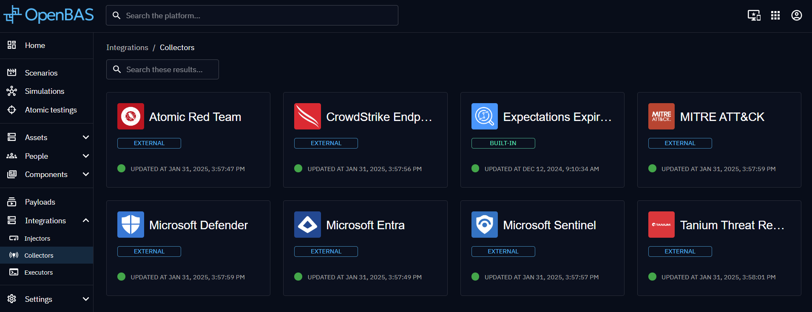

# Injector development

!!! question "What are injectors?"

    For a functional overview of the role of Injectors within the OpenAEV ecosystem, please refer to [the User Guide section on Injectors](../usage/environment/injectors.md).

### Introduction

This guide explains how to implement an **OpenAEV injector**, to extend the platform's capabilities by adding new type
of injects.

!!! note

    The following is based on the Filigran-maintained [HTTP Injector](https://github.com/OpenAEV-Platform/injectors/tree/main/http-query)
    and only highlights the larger picture of the steps to create an injector from scratch. Please refer to the HTTP injector's
    codebase for an example of the implementation of a functional injector.

### Implementing the Injector

#### 1. Define one or more contracts

The contract is the list of parameters and corresponding fields that will constitute the data that the injector will
handle as part of its core logic. It describes how OpenAEV will parse and display the input form in the GUI for defining
new injects to be executed by the injector. It is also the data structure that the injector handles
internally to access the parameter values.

!!! note "🐍 Python-based injectors"

    For injectors created with the Python language, Filigran maintains the [`pyoaev` library](https://pypi.org/project/pyoaev/)
    which provides a wealth of utility classes to compose a functional contract.

    Note however that injectors are typically independent processes communicating with OpenAEV via a network transport, 
    and may be implemented in any language.

#### 2. Define the internal logic

The next step is to implement the internal logic based on the parameters defined in the contract.
When the injector executes an inject based on its contract, it will retrieve the parameters provided by the end user and
use them within its internal logic to perform the necessary actions.

### Use it

Now, the new injector may be launched as a new process, and it should register with OpenAEV. It will then be listed
in ***Integrations > Injectors*** and its inject contracts should be available for creating new injects.

