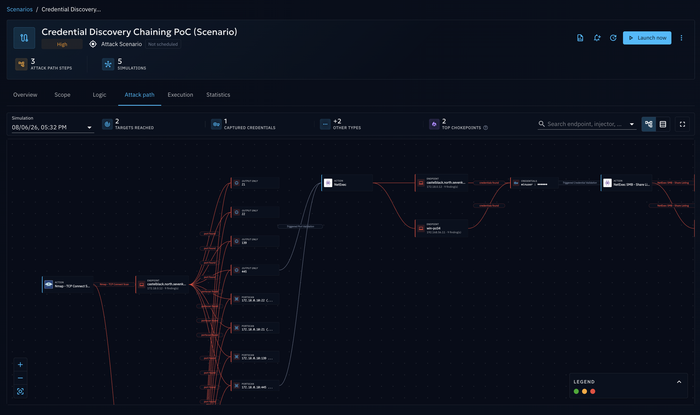
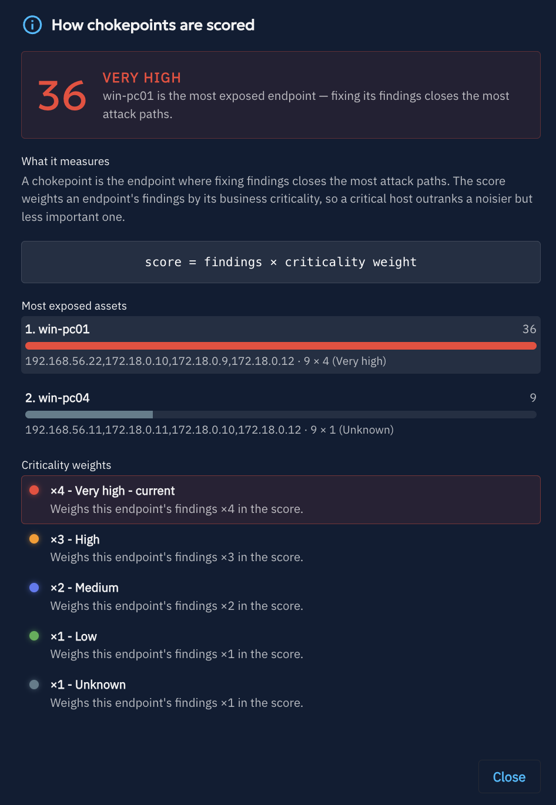
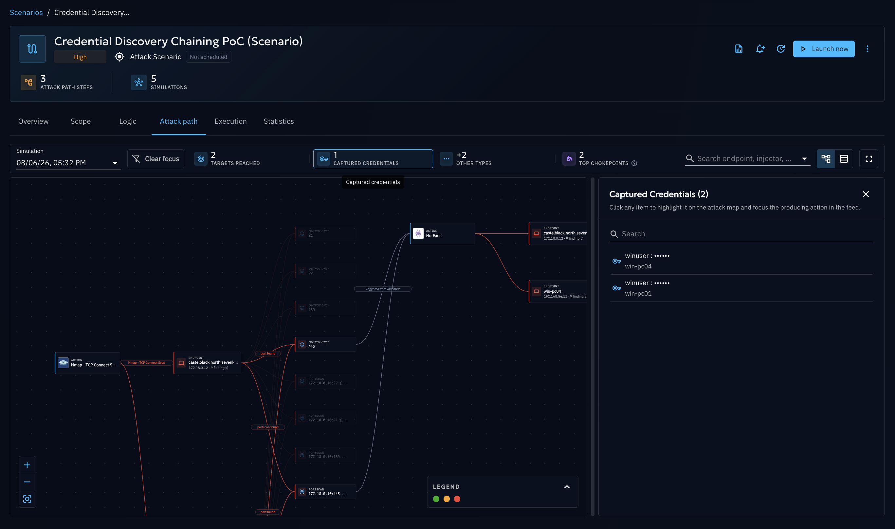
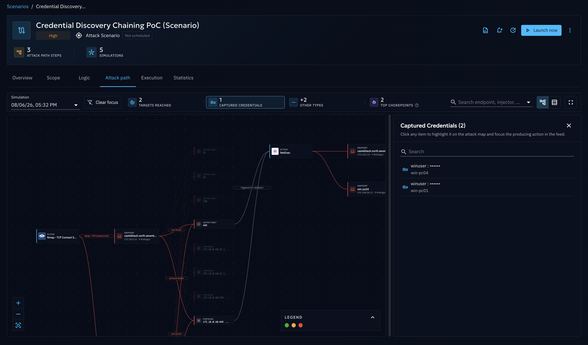
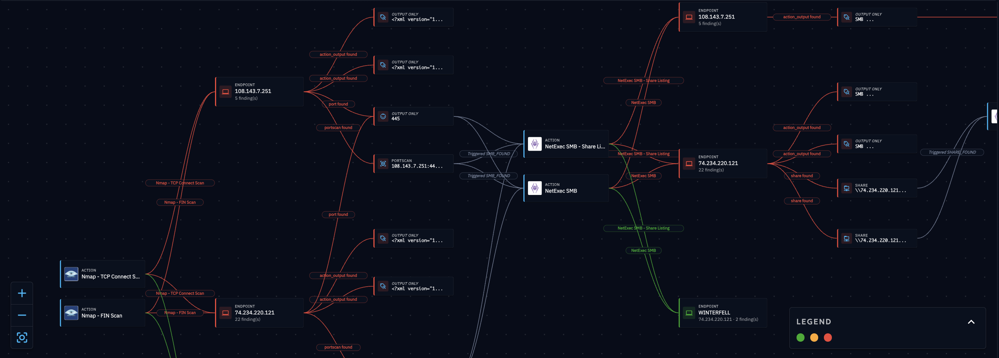
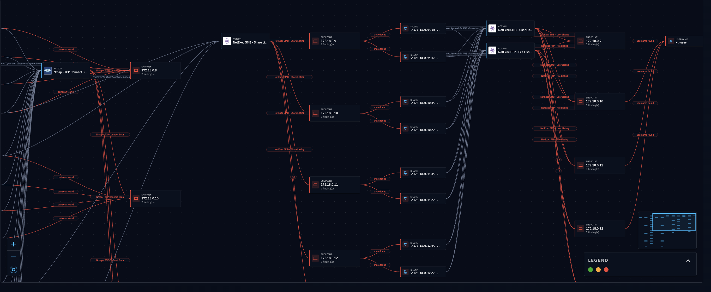

# Attack Path Map

Once a chained Simulation has run, the **Attack path** tab reconstructs how the chain actually propagated across your
Assets: which endpoints were reached, in what order, and what Findings resulted along the way.

!!! note

    The **Attack path** tab is only available for chained Simulations (it does not apply to time-based Simulations,
    since they have no chaining logic to reconstruct).

## Follow the run before reading its Attack Path Map

Before the map itself has anything to show, the **Execution** tab is where a chained run actually happens. It combines:

- A **status header** with the run's elapsed time, headline statistics (processed, pending, errors, pending
  validations), and an overall progress track.
- An **attack timeline**, showing when each Inject actually fired.
- A **live execution board**, where Injects move from *up next* to *in flight* to *completed* in real time as the
  Chaining Engine enqueues and resolves them — unlike a time-based Simulation, where the full list is known upfront.

If an expected Action never appears on the board, check whether its Event's conditions are still unmet (see
[Logic Creation](logic-creation.md)) or whether the run hit its [timeout or rate limit](scope-definition.md). Once
enough Actions have executed against your Assets, open the **Attack path** tab to see how the chain actually
propagated.

## What is the Attack Path Map?

The Attack path view is an interactive graph built from the actual executions of your chained run. It connects:

- **Injectors** (square nodes): each executed Action, click to inspect the Inject it ran.
- **Endpoint clusters** (dashed circles): groups of endpoints reached at that point in the chain; click to expand
  them individually.
- **Finding clusters** (pills): groups of Findings produced at that point; click to expand them.
- **Findings** (circles): individual Findings, click for details.

Nodes and edges are colored to convey the outcome at a glance:

| Color | Meaning |
|-------|---------|
| Green | Prevented on all endpoints |
| Orange | Detected, or prevented/detected on only part of the endpoints |
| Red | Neither prevented nor detected |
| Highlighted node | Chokepoint — the most exposed endpoint (highest weighted Finding count) |
| Highlighted edge | Event link — a Finding that triggered the next Action in the chain |
| Primary-colored path | Selected attack path — the path currently highlighted after clicking a node or table row |

A legend in the bottom-left corner of the graph recalls this color and shape key at any time; it starts collapsed
(showing only the verdict-color dots) and expands on click, and automatically collapses again whenever you open a
detail panel to keep the working area clear.

## Why use it?

- **Understand real propagation**: see exactly which endpoints an automated chain reached, instead of inferring it
  from raw logs.
- **Prioritize remediation with chokepoints**: the **Top chokepoints** card ranks the most exposed endpoints using a
  transparent, weighted score — each endpoint's Finding count is multiplied by its Asset criticality weight
  (`VERY_HIGH` = ×4, `HIGH` = ×3, `MEDIUM` = ×2, `LOW` or unset = ×1) — so a handful of findings on a critical Asset
  can outrank many findings on a low-value one. The card includes an in-app explanation of this scoring. Because a
  chokepoint sits where multiple execution paths converge, fixing it (patching, segmenting, adding detection) tends
  to break the largest number of downstream paths at once — this is what makes it a natural starting point for
  prioritizing remediation work.
- **Prioritize remediation with Findings**: the same logic applies at the Finding level — filter or sort by
  criticality/Finding type to prioritize which individual Findings (a captured credential, an exposed share) to
  address first, independently of whether the endpoint that produced them is a chokepoint.
- **Trace causality**: follow the *Event link* edges to understand which Finding caused which subsequent Action to
  fire.

## How do I do it?

1. Open your chained Simulation and go to the **Attack path** tab. If you opened the Attack path tab from a
   **Scenario** (which can have several chained Simulation runs), a **Simulation** picker at the top lets you switch
   between runs; the graph, summary cards, and chokepoints always reflect whichever Simulation is currently selected.
2. Review the summary cards above the graph: **Discovered assets**, **Discovered Shares**, **Captured Files**,
   **Captured Credentials**, **Discovered Users**, and the **Top chokepoints** card (any other Finding type produced
   by your run gets its own auto-generated card).
3. Use the search bar and filters (kill chain phase, Finding type, criticality) to narrow down the graph.
4. **Pick a chokepoint or a Finding to prioritize**, then follow its path through the map:

    

      - Selecting a chokepoint endpoint (or a row in the **Top chokepoints** card) highlights its path across the
        graph in the primary color, so you can see every Action, Event, and Finding that led to it.
      - Selecting a Finding does the same for the path that produced that specific Finding.
      - From there, open the **Injector** node along that path to reach the Action's details and start fixing the
        underlying issue (patch, reconfigure a control, add a detection rule) that let the chain reach that
        endpoint or produce that Finding.

    

5. Click any node to open its detail panel or hover it for a quick summary:
      - Hovering an **Endpoint** node shows an interactive tooltip with its verdict and a **Details →** button;
        clicking it (or the node itself) opens the endpoint's full detail panel, listing every execution and Finding
        it was involved in. A chokepoint endpoint additionally shows a numbered badge (e.g. "🔥 #1") — hovering the
        badge explains its rank and total weighted Finding count.
      - Clicking an **Injector** node opens the executed Action/Inject and its results.
      - Clicking a **Finding** node opens its detail panel, including the Expectation verdicts and the Action that
        produced it.

    

6. Toggle between the **graph view** and the **table view** (top-right) if you prefer reviewing endpoints as a
   sortable list.
7. Use the fullscreen toggle for a larger working area on complex chains.
8. Use the **Export as PNG** button (next to the fullscreen toggle, in the graph view) to download the map as an
   image. The export always contains the **whole** graph — every node, whatever the current zoom or pan — so it can
   be dropped into a report or a debrief as-is.

### Reading the legend

The legend in the bottom-left corner recalls every shape and color used on the map:

- **Square** = Injector (an executed Action).
- **Dashed circle** = Endpoint cluster (grouped endpoints, labeled with a `+N` count); expand it to reveal individual
  endpoints.
- **Pill** = Finding cluster (grouped Findings); expand it the same way.
- **Circle** = an individual Finding (or endpoint, once expanded).
- **Green / Orange / Red** = the verdict colors described above (Prevented / Detected or partial / Neither).
- **Highlighted (violet) node** = a chokepoint.
- **Highlighted edge** = an Event link — the causal connection between a Finding and the next Action it triggered.
- **Primary-colored path** = the attack path currently selected (after clicking a node, a chokepoint, or a table
  row).

It starts collapsed, showing only the verdict-color dots; click it to expand the full key, and it automatically
collapses again whenever you open a detail panel to keep the working area clear.

## Example: tracing a credential discovery chain

Following the chained logic built in [Logic Creation](logic-creation.md#example-chaining-a-credential-discovery-attack)
(`Nmap TCP Connect Scan` → Event "Port Validation" → `NetExec FTP Anonymous Get File` → Event "Credential
Validation" → `NetExec SMB Share Listing (auto creds)`), here is how that same run reads once it has actually
executed:

- `Nmap TCP Connect Scan` runs against the target Asset and reports an open port, producing a portscan Finding.
- Because the "Port Validation" Event's condition is satisfied, `NetExec FTP Anonymous Get File` fires next and
  retrieves a file over an anonymous FTP session that exposes a credential.
- Because the "Credential Validation" Event's condition is satisfied, `NetExec SMB Share Listing (auto creds)`
  fires last, reusing that credential to list SMB shares on the target.
- The endpoint where the credential was exposed is highlighted as a **chokepoint**: it is the single point every
  downstream path depends on, so remediating it (removing anonymous FTP access) closes every path that depends on
  it at once.

Clicking the endpoint opens its detail panel, showing both Actions that reached it. Following the **Event link** edge
backward from `NetExec SMB Share Listing (auto creds)` to `NetExec FTP Anonymous Get File` confirms exactly which
step exposed the credential that made the lateral validation possible in the first place.

## What's next?

- [Logic Creation](logic-creation.md): adjust your Events and Actions based on what you observed.
- [Scope Definition](scope-definition.md): revisit the Assets, timeout, and rate limit that bounded this run.
- [Attack Chaining overview](overview.md): back to the feature hub.
- [Findings](../evaluate/findings/findings.md): explore Findings platform-wide, beyond a single chained run.
