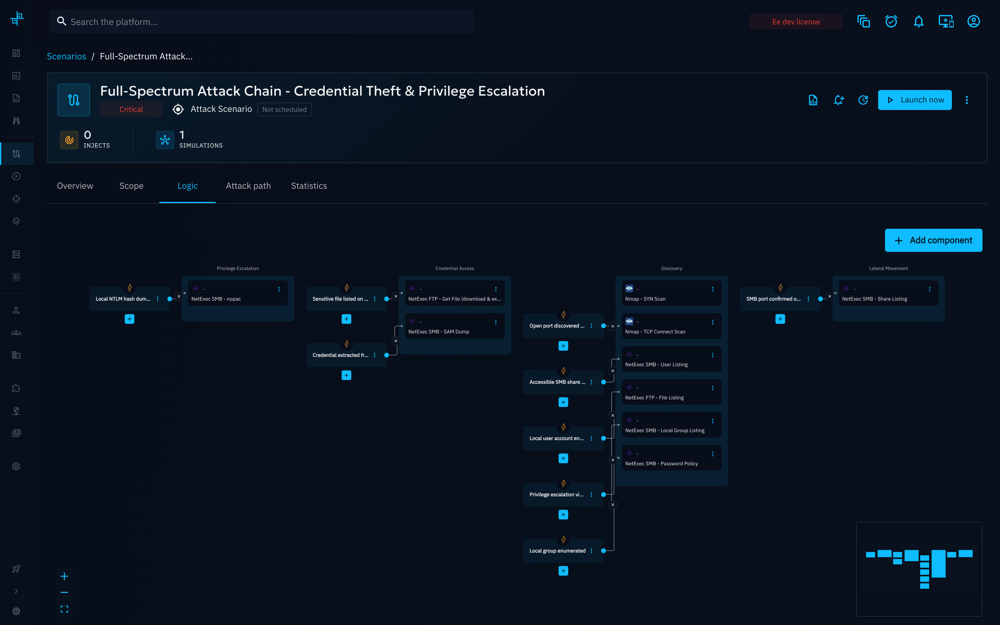
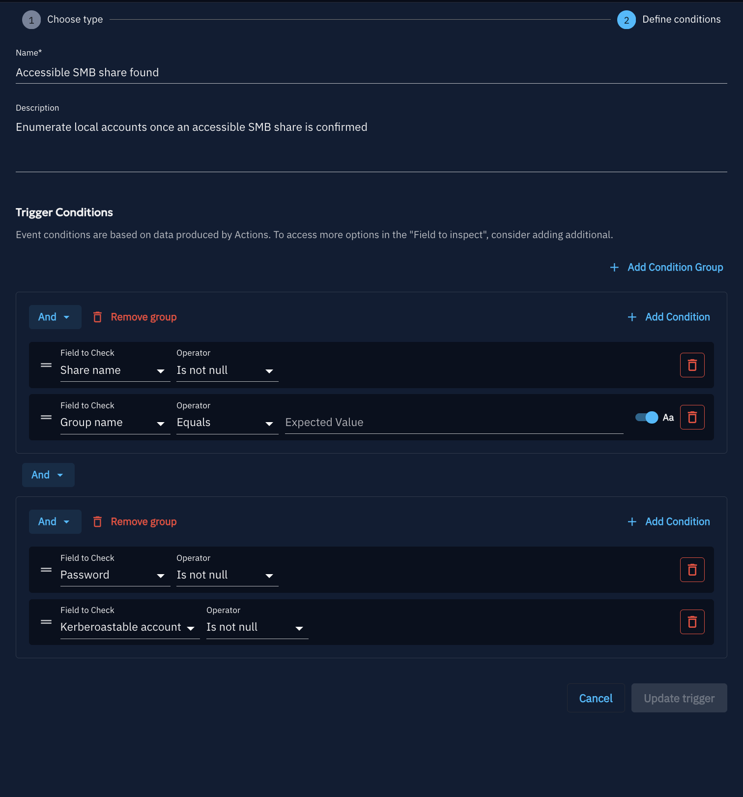
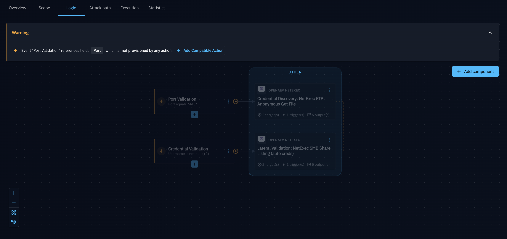
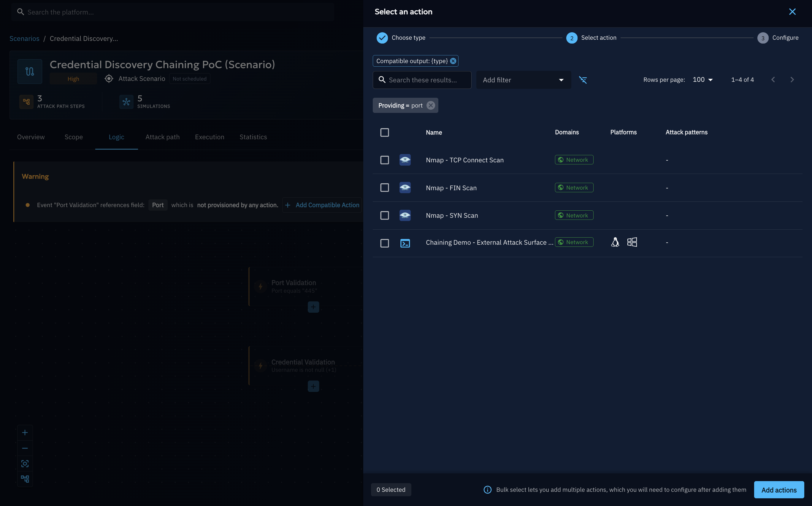
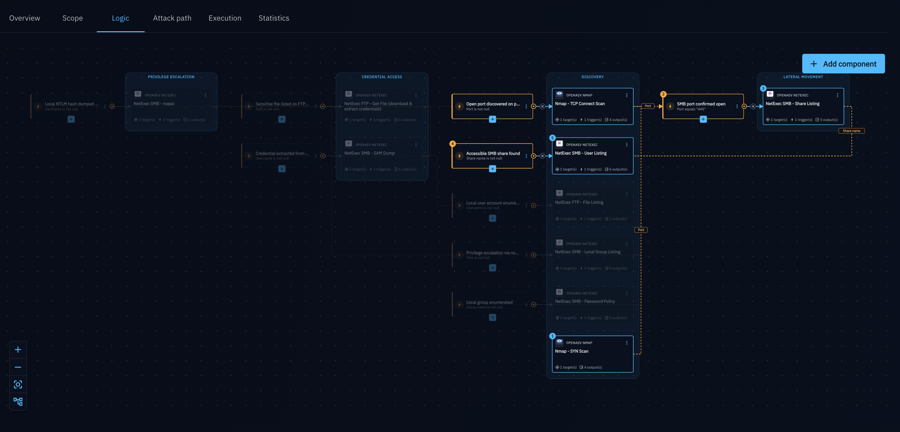

# Logic Creation

The **Logic** tab is where you build the simulation engine that drives a chained Scenario or Simulation: **Actions** that execute,
and **Events** that decide what runs next. This page details how to build and validate that graph.

## What is the Logic graph?

The Logic graph is made of two building blocks, laid out on a visual canvas:

- **Action**: executes a Threat Arsenal action with the parameters you configure. Represented as a square
  node.
- **Event**: a set of conditions or condition groups, combined with AND/OR, evaluated against the data produced by Actions or Variables. When its
  conditions are satisfied, it triggers the Actions connected to it.

The chain is formed only in one direction: an Event triggers the Action(s) it is linked to. There is no link the
other way — an Action never connects directly to an Event. Instead, when an Action finishes, its outputs are
recorded, and every Event evaluates its conditions against the recorded data; if an Event's conditions are
satisfied, it triggers the Action(s) it is linked to. Nothing runs until its upstream Event's conditions are met.

## Why use it?

- **Fully customize your run's behavior**: the Logic graph is your own Chaining Engine definition for this
  Scenario or Simulation — however you define it is exactly how the run will behave, letting you customize it to
  your own attack narrative.
- **Branch on real outcomes**: trigger the next step only when the previous one actually produced the expected
  result, instead of always running every Inject.
- **Compose complex attack trees**: combine multiple conditions (AND/OR, nested groups) to model precise decision
  points.
- **Reuse data across steps**: link an Action's argument to the output of a previous Action or to a
  [scope Variable](scope-definition.md#variables), instead of hardcoding values.
- **Catch mistakes early**: the canvas warns you inline when an Event references data that no Action currently
  produces.

## How do I do it?

### Add an Action

1. Click **Add component**, then choose **Action** ("Execute an injector contract with configured parameters").
2. Select a Threat Arsenal action from the catalog, configure its arguments (optionally linking any of them to a
   scope Variable or to another Action's output), and save — see [Action Selection](action-selection.md) for the
   full walkthrough, including how to filter the catalog and how local vs. global linking works.
3. The Action appears as a node on the canvas.

### Add an Event

1. Click **Add component**, then choose **Event** ("Define conditions to trigger the next actions").
2. Name the Event and, optionally, describe it.
3. Build one or more **Condition groups**. A group holds a list of individual conditions plus, optionally, nested
   sub-groups, and always has its own **AND** / **OR** operator:
      - **AND** requires every condition (and every nested sub-group) in that group to be true.
      - **OR** requires at least one of them to be true.
      - Nesting a sub-group inside a group lets you mix logic — for example, an outer `OR` between two inner `AND`
        groups models "(A and B) or (C and D)". Each condition inside a group sets:
          - **Field to Check**: the output field to inspect. The list of available fields is not a fixed set — it is
            built dynamically from the Threat Arsenal's argument types (execution status, Expectation results, and
            any data field an Action can produce, such as a discovered port, username, or CVE). Each option shows a
            tooltip listing which Action(s) already on the canvas actually produce that field, to help you pick a
            field that is provisioned.

            

          - **Operator**: `Equals`, `Not equals`, `Is null`, `Is not null`, `Contains`, `Not contains` — plus
            `Greater than`, `Greater than or equals`, `Less than`, `Less than or equals` on numeric fields only
            (`Number`, `Port`, `Severity`). Those four compare numerically, so they are hidden on text-like fields
            (a hostname or a CVE id can't be ordered). Changing the **Field to Check** to a non-numeric field
            resets an ordering operator back to `Equals`. Despite the name, `Contains`/`Not contains` performs a
            set-style match against the field's value rather than a literal list-membership check — use it to test
            whether a field matches one of several expected values.
          - **Expected value** (not required for `Is null` / `Is not null`), with an optional case-sensitive toggle,
            available only for `Equals`, `Not equals`, `Contains`, and `Not contains` on non-numeric fields.

            The value must be a number when the inspected field only holds numbers (`Number`, `Port`) or when the
            operator is a numeric comparison (`Greater than`, `Greater than or equals`, `Less than`, `Less than or
            equals`) — those operators compare numerically, so a text value could never match. Anything else shows
            *"The value should be a number"* and blocks saving. The case-sensitive toggle is also hidden on numeric
            fields, since it is meaningless on numbers.
4. Save, then connect the Event to the Action(s) it should trigger.

!!! note

    If the value you need isn't in the **Field to Check** list, use the **Action Output** field type instead: it
    covers the raw CLI output of any Action on the canvas. Combined with the `Contains` operator, this lets you
    check whether a specific keyword or value shows up anywhere in an Action's output, even if that output isn't
    exposed as a dedicated field.

!!! note

    Linking an Action's argument to a scope Variable or to another Action's output — and choosing whether that
    link reads from global or local scope — is covered in [Action Selection](action-selection.md#local-and-global-variables).

### Validate your graph

You can define an Event whose condition references a field that no Action currently on the canvas actually
produces — for example, an Event checking a `Port` field when no Action on the graph reports a port. In that case,
the platform can't guarantee the Event will ever trigger, so it shows a warning banner listing each affected Event,
the missing field, and an **Add Compatible Action** shortcut that lets you add an Action known to produce that
field directly from the banner.

Clicking **Add Compatible Action** opens the same **Add actions** panel used for adding any Action to the canvas,
but pre-filtered with a **Providing** filter set to the missing field (for example `group_name`), so only Actions
from the Threat Arsenal that actually produce that field are listed:

Selecting one or more Actions and clicking **Add actions** drops them onto the canvas as new, unconnected Action
nodes — it does not automatically wire them into the graph. You still need to connect the new Action(s) to the
Event yourself (and to any upstream Action(s) they should depend on) for the warning to clear, since the platform
only confirms the field is *available* on the canvas, not that it is actually wired into that Event's condition.

### Reading the links between components

Once your graph has Actions and Events connected, click an Event to inspect it: the canvas draws two different kinds
of links to help you trace how data flows into it.

- **Solid links**: the real, saved connections — always an Event triggering the Action(s) it is linked to. This is
  the only kind of link the Chaining Engine actually executes; there is never a saved link running from an Action to
  an Event.
- **Dotted (orange) links**: informational only, never saved, and never a real connection. When an Event is
  selected, the canvas draws a dotted link from every Action that currently *produces* one of the fields used in
  that Event's conditions, even if that Action is not connected to the Event at all. This is just a visual hint —
  "this Action's output could satisfy this Event's condition" — to help you see, at a glance, which Actions already
  on the canvas could feed data into the selected Event's conditions; the same relationship is surfaced by the
  per-field tooltips in the condition builder.

Selecting an Event also dims every Action and Event outside its data-flow path, so the provider Actions, the Event
itself, and the Action(s) it triggers stand out clearly against the rest of the graph.

## Example: chaining a credential discovery attack

Here is a real Logic graph, built with the steps above, that chains a port scan into a credential discovery attempt,
then reuses the harvested credentials for lateral validation:

1. **Recon**: `Nmap TCP Connect Scan` probes the target Asset.
2. **Event "Port Validation"**: triggers once the scan reports a non-null port, confirming a service is reachable.
3. **Credential Discovery**: `NetExec FTP Anonymous Get File` attempts to retrieve a file over an anonymous FTP
   session, which may expose credentials.
4. **Event "Credential Validation"**: triggers once that step's output actually contains a credential.
5. **Lateral Validation**: `NetExec SMB Share Listing (auto creds)` reuses that credential to list SMB shares on
   the target, validating whether it grants further access.

If Step 1 finds no open port, or the credential discovery step doesn't return a credential, the downstream Action
is never triggered — each Action only runs once the previous stage's output actually satisfies the Event's
condition.

## What's next?

- [Attack Path Map](attack-path-map.md): see how the chain propagated across your Assets, and review the run's
  results, once it executes.
- [Scope Definition](scope-definition.md): restrict targets and define reusable Variables.
- [Attack Chaining overview](overview.md): back to the feature hub.
