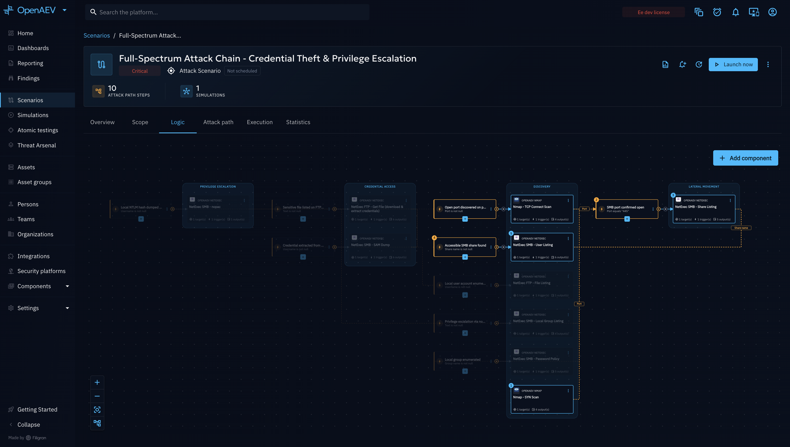

# Attack Chaining

Attack Chaining lets you build a Scenario or Simulation that reacts to its own results while it runs, automatically
triggering the next Actions as conditions are met. This page gives you the fastest path to build and run your own
chained Scenario. Each step links to a dedicated page if you need more detail.

!!! note

    Attack Chaining is an **Enterprise Edition** feature. See [Enterprise edition](../../administration/enterprise.md)
    to activate it on your platform.

## What is Attack Chaining?

A classic OpenAEV Scenario or Simulation runs a fixed list of Injects at fixed times. Attack Chaining replaces that
fixed plan with a **logic flow**: a graph of **Actions** (the Threat Arsenal actions you want to execute) and
**Events** (the conditions that decide what happens next). When an Action finishes, its outputs are recorded, and
each Event evaluates its conditions against those outputs — once satisfied, the Event triggers the Action(s) it is
linked to.

This is powered by the **Chaining Engine**, which orchestrates the whole run: it evaluates conditions, tracks a shared
pool of outputs (the **global state**), enqueues Actions when they become ready, and enforces the boundaries you
define (allowed targets, timeout, rate limit).

## Why use it?

- **Model real multi-stage attacks**: run lateral movement only if initial access succeeded, escalate only after a
  credential dump returned usable output, and so on.
- **React to live data**: branch on values produced during execution (an open port, a discovered credential, a scan
  result), not just on success/failure.
- **Stay in control**: restrict execution to an explicit allow/deny list of Assets, cap the total runtime, and
  throttle how often a step can retry.
- **Watch it unfold**: follow the graph live, then review the resulting Attack Path across your Assets once the run
  completes.

!!! note

    Attack Chaining is a different mechanism from [Inject chaining and transfer](../inject-chaining.md), which links
    individual Injects with a simple parent/child condition. Use Attack Chaining when you need a full graph of Actions
    and Events, shared outputs, and platform-enforced execution boundaries (scope, timeout, rate limit).

## How do I do it?

### 1. Create a chained Scenario or Simulation

1. Start creating a new Scenario (or a standalone Simulation) as usual.
2. On the type selection step, pick **Chained scenario** (or **Chained simulation**) instead of the default
   **Time-based** option.

Once created, the Scenario/Simulation opens with dedicated tabs.

### 2. Define the scope

Before building your logic, restrict which Assets the chained run is allowed to touch.

1. Open the **Scope** tab.
2. Add targets — Assets, Asset groups, or manually entered/CSV-imported IPs, IP subnets, or hostnames — to the
   **allow list** (targets the run may use) and, optionally, to the **deny list** (targets it must never use — deny
   always wins).
3. Optionally set a **timeout** (maximum total runtime) and a **rate limit** (maximum retry attempts per time
   window) to keep the run safe and bounded.

See [Scope Definition](scope-definition.md) for the full reference (Asset groups, CSV import, Variables, timeout and
rate limit details).

### 3. Build the logic

1. Open the **Logic** tab and click **Add component**.
2. Add an **Action**: pick a Threat Arsenal action and configure its arguments. This is your first step
   (for example, an initial access attempt).
3. Add an **Event**: define one or more conditions on the data that Action produces (its execution status, an
   Expectation result, or any output field), combined with AND/OR.
4. Add the next **Action(s)** that the Event should trigger when its conditions are met.
5. Repeat to build out your full attack graph.

The platform warns you inline if an Event references a field that no Action on the canvas currently produces, with a
shortcut to add a compatible Action.

See [Logic Creation](logic-creation.md) for the full reference (Actions, Events, operators, and linking outputs
between steps).

### 4. Launch and follow the run

1. Launch the Scenario/Simulation as you would any other.
2. Use the **Execution** tab to follow Injects live as they fire, complete, and produce results.
3. Once Actions have run against your Assets, open the **Attack path** tab to visualize how the chain actually
   propagated across your Assets and to review the Findings it produced.

See [Attack Path Map](attack-path-map.md) for details on both the live execution view and the resulting graph.

Once you can build a chained Logic graph by hand, you can go one step further with
[Autonomous Attack Chaining](../autonomous-attack-chaining/overview.md): instead of authoring every Action and Event yourself,
you give an AI orchestrator an objective in plain language and it plans, executes, and adapts a full attack path on
its own, live, against your authorized environment.

## What's next?

- [Scope Definition](scope-definition.md): allow/deny lists, Variables, timeout, and rate limit.
- [Logic Creation](logic-creation.md): Actions, Events, conditions, and output linking.
- [Attack Path Map](attack-path-map.md): follow a chained run live, then read the resulting graph across your Assets.
- [Autonomous Attack Chaining](../autonomous-attack-chaining/overview.md): let an AI orchestrator plan and drive a chained run
  for you.
- [Inject chaining and transfer](../inject-chaining.md): the simpler, non-EE parent/child linking mechanism.
