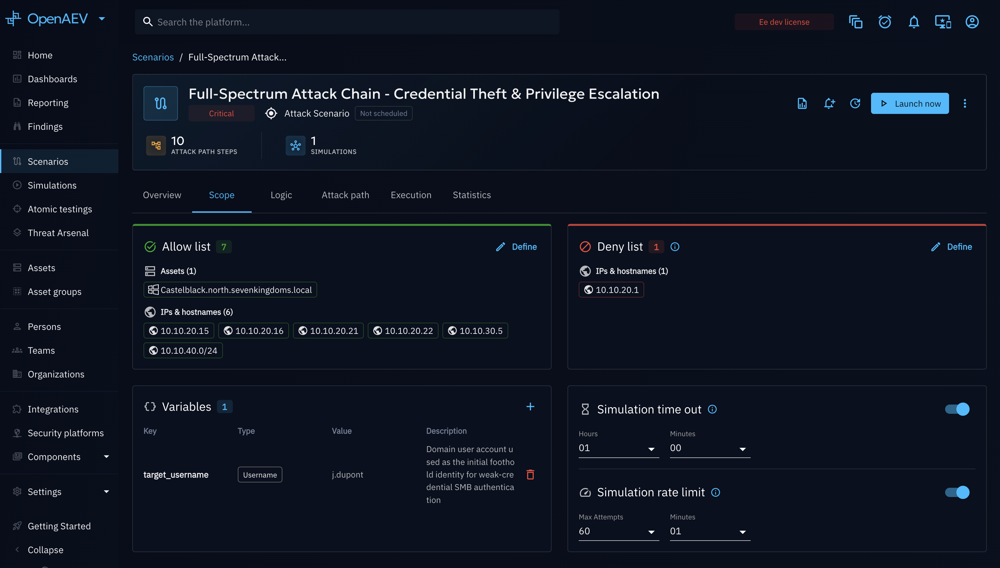

# Scope Definition

The scope of a chained Scenario or Simulation defines which Assets the Chaining Engine is allowed to target, and the
operational boundaries (timeout, rate limit) that keep an automated run safe. This page details the **Scope** tab.

## What is a scope?

A scope is made of:

- An **allow list** and a **deny list** of targets (Assets, Asset groups, or manually entered/CSV-imported IPs, IP
  subnets, and hostnames). The deny list always takes priority: a target listed in both is excluded.
- **Variables**: named values you can reuse across your logic (see [Variables](#variables)).
- A **timeout**: the maximum total runtime for the whole chained run.
- A **rate limit**: how frequently an Action is allowed to execute — the interval between consecutive executions.

## Why use it?

- **Prevent unintended blast radius**: a chained run can create and trigger many Injects dynamically as conditions
  resolve; the scope guarantees it never touches Assets outside your allow list.
- **Model brute-force or stealthy behavior**: the rate limit lets you control how frequently an Action executes,
  simulating a slow, stealthy attacker instead of one that acts all at once.
- **Cap runaway executions**: the timeout stops the run automatically if it does not converge (for example, a
  condition that never resolves).
- **Reuse values**: Variables let you define a value once (an account name, a shared path) and reference it from
  multiple Actions — handy to try out a specific value across your simulation, or simply to validate that a value
  is correct before wiring it into several Actions.

## How do I do it?

### Allow list and deny list

1. Open the **Scope** tab of your chained Scenario or Simulation.
2. In the **Scope** section, click **Add** on the **Allow list** column. This opens the **Define allowlisted scope**
   drawer.
3. In the drawer, select targets from the **Assets** or **Asset groups** tabs, or add custom values manually or via
   CSV import. Before importing, you can download a CSV template to see the exact `type,value` structure expected.
4. Click **Define scope** to save.
5. Repeat for the **Deny list** if you need to explicitly exclude some targets (for example, a subset of an Asset
   group added to the allow list). This opens the equivalent **Define denylisted scope** drawer.

| Rule | Detail |
|------|--------|
| Deny vs allow | The deny list always takes priority over the allow list: a target present in both is excluded from execution |
| Sources | Assets, Asset groups, manually entered IPs/IP subnets/hostnames, CSV import |
| CSV import | A two-column `type,value` file, with `domain`, `ip`, or `ip_subnet` as the accepted types (a header row is detected and skipped automatically). Duplicate rows are removed, and each invalid row is reported individually with the reason (unknown type, malformed domain, invalid IP or subnet) so you can fix and re-import without losing valid entries |

!!! warning

    A chained Scenario or Simulation **cannot be launched** with an empty scope: the **Launch** button is disabled
    and a tooltip explains that a defined scope is required. The platform's health checks also flag an empty scope as
    a warning, with a shortcut back to this **Scope** tab.

### Variables

Defining Variables is optional; add one only if you need to reuse a value across your logic.

1. In the **Variables** section, click the **+** icon.
2. Provide a **key**, a **type**, a **value**, and an optional **description**. The **type** is required: it is how
   the platform matches Variables to Action inputs.
3. In the [Logic](logic-creation.md) tab, when an Action input has the same type as a Variable, that Variable is
   available for that input and can be used by linking it instead of typing a static value. If no Action input matches
   a Variable's type, that Variable stays unused.

### Timeout

1. In the **Simulation time out** section, toggle it on.
2. Set the maximum duration in hours and minutes. Execution stops automatically once this duration is reached,
   whatever the state of the run.

If you leave the timeout toggled off, the Chaining Engine still applies a **default timeout of one hour (3600
seconds)** to every chained run — a run is never allowed to continue indefinitely, even without an explicit setting.

### Rate limit

1. In the **Simulation rate limit** section, toggle it on.
2. Set the **maximum attempts** and the time window (in minutes) over which that maximum applies. This defines the
   interval at which an Action is allowed to execute — useful for simulating brute-force or slow, stealthy attacks.

When enabled without further changes, the rate limit defaults to **1 attempt per 30 minutes** — adjust both values to
match the behavior you want to model.

## Example

You are targeting a subnet of 50 endpoints represented by an Asset group, but two of them are production systems you
must never touch:

1. Add the Asset group to the **allow list** — for example, an entire `10.0.4.0/24` subnet entered via CSV import as
   an `ip_subnet` row.
2. Add the two production endpoints individually to the **deny list**: since deny always wins over allow, this
   carves them out of the subnet you just allowed without having to redefine the allow list.
3. Enable the **rate limit** (5 attempts / 30 minutes) to throttle a credential-spraying Action.
4. Enable a **timeout** of 2 hours so the run cannot exceed your test window.

Once the Simulation has completed, you can generate a **custom report** of the run from the Simulation's report
options, or **schedule** recurring reporting — the same reporting mechanism available for any Simulation, chained or
not.

## What's next?

- [Logic Creation](logic-creation.md): build the Actions and Events that will run within this scope.
- [Attack Path Map](attack-path-map.md): see which of your allowed Assets were actually reached.
- [Attack Chaining overview](overview.md): back to the feature hub.
