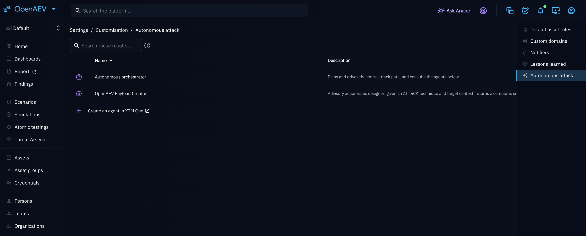

# Configuration

This page details how to configure what an autonomous run should achieve (its objective and scope mode), and how to
interact with a run once it is live.

## Why use it?

- **Point the AI at the right target**: an objective's scope mode tells the orchestrator whether it should discover
  its own targets or focus on one you specify.
- **Stay in control of a live run**: steering lets you redirect, reconfigure, or unblock a running autonomous attack
  without stopping it.

## Objectives and scope modes

Every objective has a **scope mode** that tells the AI whether it needs a specific target:

- **Environment** objectives operate over the whole authorized environment (for example *"find and prove any path
  to domain admin"*). The AI does not need you to pick a target — it discovers its own.
- **Target** objectives need a specific target the AI must focus on (for example *"exploit this web application"*).
  If the objective needs a target and you did not provide one, the AI raises a **Question** and waits for you rather
  than guessing.

!!! note

    Scope modes apply the same way whether you plan the Scenario with AI or launch it in autonomous mode: an
    *environment* objective lets the orchestrator discover its own targets, while a *target* objective without a
    target makes it raise a **Question** and wait rather than guess.

## Steer a running attack path

You do not have to stop a run to change its direction. Steering is a first-class, real-time capability.

- **Send a directive**: type an instruction ("focus on the finance subnet", "avoid the production database",
  "try phishing the helpdesk") and it is queued for the run. The orchestrator consumes pending directives on its
  next decision cycle and records a **Directive** timeline event when it applies one — without stopping.
- **Edit live configuration**: adjust scope, rate limits, or safe mode on the fly. The change is applied to the live
  run and its chained Simulation without a restart.
- **Answer questions**: when the AI is in **Waiting input**, answer its question to unblock it.
- **Stop**: stop the run and its underlying Simulation.

## Configure the specialist agents (Settings → Customization)

The orchestrator is not a single monolithic model: for a given run it can consult **specialist agents** — separate
AI agents each focused on one job (payload creation, code generation, recon, exploitation support) — instead of
doing everything itself. Which agents it consults by default is configured platform-wide, and can still be adjusted
per run.

- Go to **Settings → Customization → Autonomous attack** to manage the tenant-wide defaults. This page requires an
  Enterprise Edition license and a configured **XTM One** integration — the orchestrator itself is an XTM One
  (agentic AI) capability, so the settings page stays hidden until XTM One is connected.

- **Built-in specialist**: OpenAEV ships a built-in payload-creation agent, enabled by default. Like any other
  agent, you can turn it off here if you do not want the orchestrator generating payloads on its own.
- **Add or remove agents**: any additional agent registered in your XTM One instance can be enabled or disabled as
  a tenant default from this page. You can also add a brand-new agent straight from here — the page links out to
  create one directly in XTM One — and it becomes available to select as soon as it exists there.
- **Per-agent discovery mode**: each enabled agent gets a discovery mode that controls how much it may create while
  investigating — **Existing only** (only enrich Assets, Teams, and Persons that already exist and are in scope),
  **In scope** (may create new Assets, Findings, and Persons, but only within the run's allow-scope perimeter), or
  **Expansive** (may create new entities anywhere; the deny-list still applies).
- **Per-run override**: the tenant defaults just prefill a new run — from the **Autonomous attack** launch drawer,
  you can still enable or disable individual agents, and change discovery modes, for that specific run only.

## What's next?

- [Scenario Creation](scenario-creation.md): build a chained Scenario and choose how to launch it.
- [Autonomous Attack Chaining overview](overview.md): back to the feature hub.
- [Scope Definition](../attack-chaining/scope-definition.md): the allow/deny lists, timeout, and rate limit that
  bound any chained run, autonomous or not.
