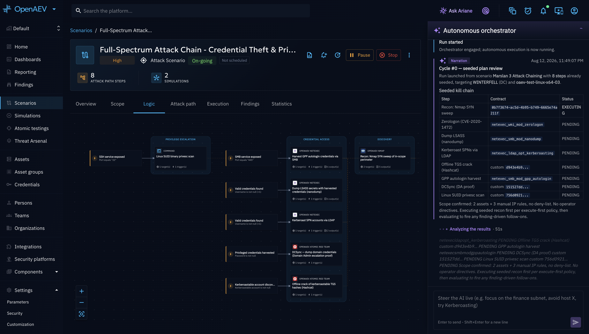
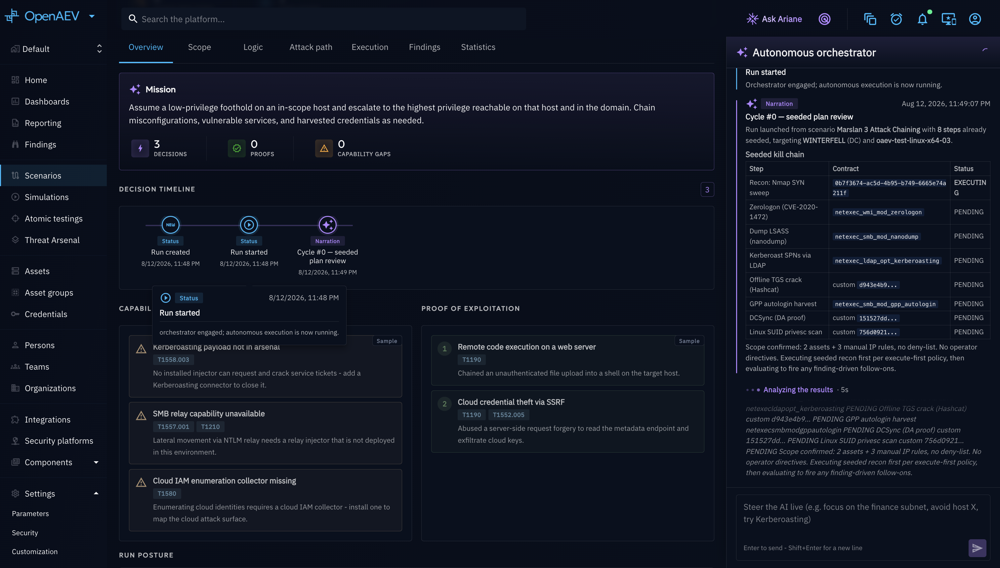
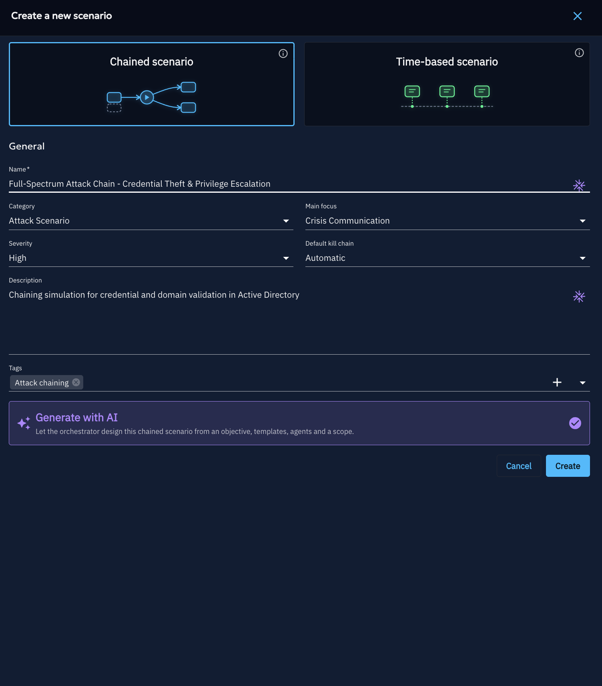

# Autonomous Attack Chaining (AI Penetration Testing)

Autonomous Attack Chaining lets an AI orchestrator plan, execute, and adapt a full attack path against your
authorized environment on its own, instead of you authoring every Action and Event by hand. This page gives you the
fastest path to understand and run your first autonomous attack. Each step links to a dedicated page if you need
more detail.

!!! note

    Autonomous Attack Chaining is an **Enterprise Edition** feature. See
    [Enterprise edition](../../administration/enterprise.md) to activate it on your platform.

## What is Autonomous Attack Chaining?

An **Autonomous Attack Chaining** run is an AI-driven penetration test: you describe your objective in plain
language (for example *"find and prove any path to domain admin"*), and an autonomous AI orchestrator turns that
prompt into a full Logic graph of Actions and Events, then executes and adapts it against your authorized
environment on its own. It reasons about what to do next, launches the relevant Injects, reads the results, pivots,
and keeps going until the objective is reached or it needs your input — all animated live on an attack-path graph
and a decision timeline.

This is the highest level of automation in OpenAEV. It builds directly on [Attack Chaining](../attack-chaining/overview.md):
a chained Scenario is a Scenario whose Actions and Events are linked into a Logic graph. **Autonomy is not a
separate kind of Scenario — it is a way to launch a chained Scenario.** You author (or let the AI plan) the chained
Scenario once, then choose at launch time whether to run it yourself (normal mode) or hand it to the orchestrator
(autonomous mode), which seeds itself with your authored steps and then adapts, extends, and drives them live.

## Why use it?

- **Turn a plain-language objective into a Logic graph**: describe what you want to achieve, and the orchestrator
  designs the Actions, Events, and conditions needed to pursue it — no manual graph-building required.
- **Close the gap to autonomous pentest tooling**: continuous, objective-driven testing without writing a Scenario
  by hand.
- **Find real attack paths**: the AI chains techniques the way an attacker would, instead of running a fixed list.
- **Advice on missing capabilities**: when a technique needs an injector or contract you have not installed, the run
  records a capability gap and tells you which marketplace connector to install to close it.
- **Proof of exploitation**: every confirmed compromise is captured as a case-file fragment you can export as a
  report.

## Prerequisites

| Requirement | Why |
|---|---|
| **Enterprise Edition** | Autonomous Attack Chaining is an AI feature and, like every other AI capability in OpenAEV, is Enterprise Edition only. |
| **`INJECT_CHAINING` feature enabled** | Autonomy is a launch-time mode of a chained Scenario, not a feature of its own, so it shares the chaining preview flag. Any tenant with chaining enabled can launch a chained Scenario in autonomous mode — there is no dedicated autonomous flag. |
| **A registered XTM One platform** | The autonomous orchestrator (the AI "brain") runs in XTM One. OpenAEV is the execution and visualization substrate; it must be connected to an XTM One instance. |
| **Installed injectors / collectors** | The AI can only execute techniques your installed arsenal supports. Gaps are surfaced as advice, not silent failures. |

See [Enterprise editions](../../administration/enterprise.md) and [Parameters](../../administration/parameters.md) for
how to enable the license and preview features.

## How it works

An Autonomous Attack Chaining run splits responsibilities across the two platforms:

1. **OpenAEV** stores the run, executes the Injects it is told to run through a chained Simulation, enforces scope
   and isolation, and renders the live UI (attack-path graph + decision timeline).
2. **XTM One** hosts the autonomous orchestrator — a multi-agent system that plans the attack, decides the next
   action, calls back into OpenAEV to record what it is doing, and reads your steering directives.

The two sides talk over a small callback API. The orchestrator streams its reasoning and decisions back as
**timeline events**, updates the **run status**, consumes your **steering directives**, and resolves **capabilities**
against your installed arsenal.

### The decision timeline

Everything the AI does is streamed to a timeline next to the animated graph. Each entry has a type:

| Event | Meaning |
|---|---|
| **Narration** | Free-form reasoning streamed from the orchestrator as it thinks. |
| **Decision** | A concrete choice the AI made (pick a technique, a target, a pivot). |
| **Tool action** | A call into OpenAEV (recon, launch an Inject, read scope). |
| **Handover** | A switch between orchestrator sub-agents (recon → exploit → lateral movement...). |
| **Gap** | A capability gap: no installed injector or contract can perform a needed technique. |
| **Status** | A run-status transition. |
| **Directive** | A steering directive you sent that the run consumed. |
| **Question** | A question the AI raised to you when it is blocked (human-in-the-loop). |
| **Proof** | A proof-of-exploitation case-file fragment for the final report. |

### Run lifecycle

A run moves through these states:

| Status | Meaning |
|---|---|
| **Created** | The run exists but has not been handed to the orchestrator yet. |
| **Running** | The orchestrator is actively planning and executing. |
| **Waiting input** | The AI is blocked and asked you a question. It resumes once you answer. |
| **Completed** | The objective was reached, or the AI decided to stop successfully. |
| **Failed** | The run ended with an error. |
| **Stopped** | You stopped the run. |

## Capability gaps and advice

The AI can only run techniques your installed arsenal supports. When a needed technique has no matching injector or
contract, the run does not fail silently: it records a **capability gap** and, where possible, tells you which
marketplace connector to install to close it. The run continues with the paths it can still execute. This turns
missing capabilities into actionable advice for hardening your testing coverage.

Before falling back to a gap, the orchestrator can also close some of these holes itself: it consults specialist
agents in XTM One, including the built-in **payload creator**, to generate a payload or piece of code on demand for
the technique it needs. Additional specialist agents (recon, exploitation support, custom agents you configure in
XTM One) can be consulted the same way, either as tenant-wide defaults or added/removed for a specific run at launch.

## Proof of exploitation

Every confirmed compromise is captured as a **Proof** event with its supporting evidence. The run view aggregates
these into a **Proof of exploitation** panel — a numbered case file of what was actually proven, not just attempted.

A Proof is only considered valid when it is backed by at least one linked **Finding**: a proof entry with no
associated Finding is flagged as such in its detail view, since there is no verifiable evidence behind it. Clicking
into a Proof shows its full narrative plus every linked Finding, with a direct link back to the Simulation's
**Findings** tab to inspect the underlying evidence.

Any capability gaps recorded during the run are tracked alongside the proofs, so you see both what was proven and
what could not be attempted due to missing tooling.

## Long-running actions

Some techniques take a long time to resolve — a phishing Inject may wait hours or days for a click, a scheduled task
may fire later. The orchestrator does not block on these. It records the action, moves on to other productive paths,
and re-evaluates on its decision cycle: when a long-running expectation finally resolves, the AI folds the outcome
back into its plan. This keeps a run progressing instead of stalling on a single slow step.

## Example: building your first autonomous run

There are three real entry points into an autonomous run, all built around the same shared configuration drawer
(objective, specialist agents, allow/deny scope). Pick whichever fits how much control you want before anything
executes.

### Entry point A — "Generate with AI" at Scenario creation

When you create a new Scenario and pick the **Chained scenario** type, a **Generate with AI** card appears at the
bottom of the form. Toggle it on, fill in the Scenario's name, then create it: you land on the new Scenario with the
AI builder drawer already open, ready for you to set an objective and scope (see Entry point B below for what
happens next).

### Entry point B — the "AI builder" button on an existing chained Scenario

On any chained Scenario's page, a compact **AI builder** icon button (AI-purple, a sparkle-with-pen icon) opens a
drawer where you set an **objective**, choose which **specialist agents** the orchestrator may consult, and define
the **allow/deny scope** — then choose:

- **Save**: persists this configuration on the Scenario without starting anything. You can come back and Build or
  Launch later, prefilled from what you saved.
- **Build**: the orchestrator designs the attack path from your objective and writes it onto the Scenario's Logic
  graph — recon, exploitation, lateral movement, objective. **Nothing executes.** You launch the Scenario yourself
  afterwards, in Normal or Autonomous mode. If the Scenario already has an authored Logic graph, this button reads
  **Rebuild with AI** instead, and asks whether to **refine** the existing logic (keep it, continue from it) or
  **rebuild from scratch** (wipe and re-author).

### Entry point C — the "Autonomous" button

Next to the regular **Normal** launch button on a chained Scenario's page, there is an **Autonomous** button
(AI-purple, sparkle icon). It opens the same configuration drawer, but the primary action here is **Launch**: it
starts a live run immediately. The orchestrator **seeds itself with whatever Logic graph the Scenario already has**
(empty if you never authored or built one) and takes it from there — verifying, executing, and adapting the path
live from what it finds. This is the fastest path to a running autonomous attack: no separate build step, objective
in, live run out.

If you skip the allow/deny lists entirely (in any of the three entry points), the AI asks you which targets are in
scope the first time it needs to act, instead of failing.

### Either way: watch, steer, and review

Once a run is executing (whichever entry point started it):

- **Watch and steer the run**: follow the live attack-path graph and decision timeline right on the Scenario's page.
  Send a directive if you want to redirect it, or answer a **Question** if it gets blocked — see
  [Configuration](configuration.md#steer-a-running-attack-path).
- **Review the results**: once the run reaches **Completed**, open the proof-of-exploitation panel to see every
  confirmed compromise, and export the report.

## Example: from a blank Scenario to a proven attack path

The walkthrough below follows one run start to finish, using the built-in **"Reach the Domain Controller"**
objective template — one of the ready-made objectives shipped with the platform — against a small in-scope
environment.

**1. Create the Scenario.** From the Scenarios list, click **Create scenario**, pick **Chained scenario** as the
type, and enable the **"Generate with AI"** toggle (see [Entry point A](#entry-point-a-generate-with-ai-at-scenario-creation)).
Name it `Domain Controller Reachability - Q3` and submit. The AI builder drawer opens automatically on the new
Scenario.

**2. Pick the objective.** In the drawer's objective gallery, select **Reach the Domain Controller** — its
built-in prompt is: *"Starting from the in-scope perimeter, perform reconnaissance, find and exploit a foothold,
escalate privileges, and move laterally until you reach and prove administrative access on a domain controller.
Prefer the shortest credible path and record every hop as proof."* You don't need to retype this — selecting the
template fills it in for you. You could also skip the gallery and write a free-text objective instead.

**3. Scope the perimeter.** Move to the **Allow list** step and add the Asset Group that represents the target
environment, for example `Corporate-AD-Segment` (a group containing the workstations, file servers, and the
domain controller itself). On the **Deny list** step, carve out anything that must stay untouched even though it
sits inside that group — for example the `PROD-Backup-Server` Asset. Deny always wins over allow. If you skip both
lists, the AI will simply ask you which targets are in scope the first time it needs to act.

**4. Review the specialist agents and time budget.** Leave the built-in `openaev-payload-creator` agent enabled so
the orchestrator can generate payloads on demand, and set a time budget of `8` hours — a sensible ceiling for an
overnight run. See [Configuration](configuration.md) for what each agent and discovery mode controls.

**5. Build the Logic graph.** Click **Build**. The orchestrator designs the attack path — recon, exploitation,
lateral movement, objective — and writes it onto the Scenario's Logic graph. Nothing executes yet: you land on
`/admin/scenarios/{id}/logic`, where you can review the steps the AI proposed (for instance: an Nmap-style recon
sweep of `Corporate-AD-Segment`, exploitation of an unpatched service on `WKS-042`, credential harvesting, lateral
movement to `FILESRV-03`, then a privileged logon attempt on `DC-01`) and edit any step before running anything.

**6. Launch it.** Satisfied with the plan, click the **Autonomous** button on the Scenario's page (see
[Entry point C](#entry-point-c-the-autonomous-button)). This seeds the orchestrator with the Logic graph you just
built and starts a live run immediately.

**7. Watch it work.** On the Scenario's page, the decision timeline starts filling in:

- Recon confirms `WKS-042` is reachable and running the vulnerable service the plan targeted.
- Exploitation succeeds — the orchestrator asks its specialist agent to build a matching payload, executes it, and
  records a **Proof** event: initial foothold on `WKS-042`.
- Credential harvesting on `WKS-042` turns up a service account with reuse on `FILESRV-03`. Lateral movement
  succeeds — another Proof event, with the harvested-credential evidence attached.
- The path to `DC-01` needs a technique your installed arsenal doesn't cover. The run doesn't fail: it records a
  **capability gap** ("no injector/contract for the required technique") with a suggested marketplace connector to
  close it, and keeps pursuing any other path still open — see [Capability gaps and advice](#capability-gaps-and-advice).
- If the run stalls waiting on a decision it isn't confident about (for example, two viable next hops), it raises a
  **Question**; you answer it directly from the Scenario's page to keep the run moving — see
  [Configuration](configuration.md#steer-a-running-attack-path).

**8. Reach Completed and review proof.** Once the orchestrator proves administrative access on `DC-01` (or
exhausts the paths available within scope and time budget), the run moves to **Completed**. Open the
proof-of-exploitation panel to see the full chain of confirmed compromises — foothold on `WKS-042`, lateral move to
`FILESRV-03`, privileged access on `DC-01` — each with its narrative and supporting evidence, plus the capability
gap recorded along the way. Export the report as Markdown to share with the team or archive it.

**9. Reuse it.** Because the attack path lives on the Scenario, you can revisit it later: launch it again in
**Normal** mode to replay the exact same path yourself, or click **Autonomous** again to let the orchestrator adapt
and drive a fresh run — useful after you've patched `WKS-042` or closed the capability gap, to confirm the fix
holds.

## What's next?

- [Scenario Creation](scenario-creation.md): build a chained Scenario by hand or with AI, then launch it in
  autonomous mode.
- [Configuration](configuration.md): objectives, scope modes, and steering a running attack path.
- [Attack Chaining overview](../attack-chaining/overview.md): the hand-authored Logic graph that autonomous runs
  build on and adapt.
