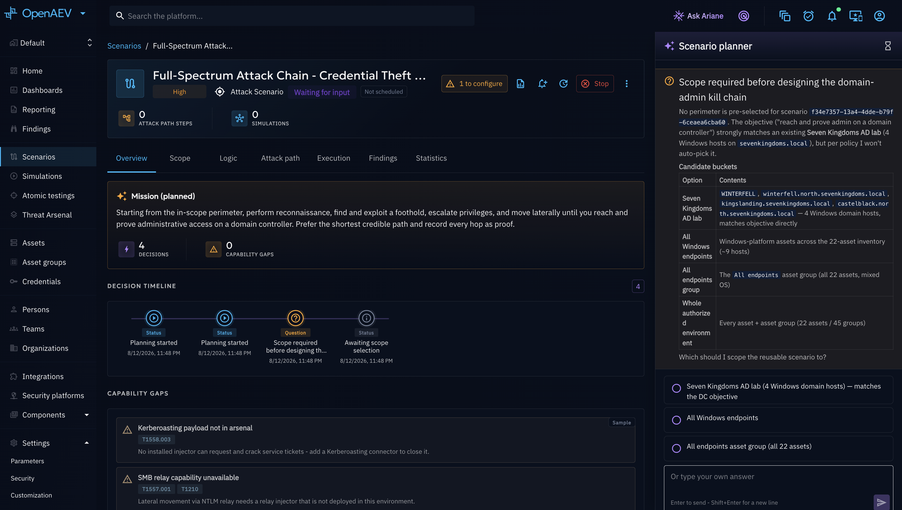

# Scenario Creation

Every Autonomous Attack Chaining run is driven from a **chained Scenario**, and the AI can create or complete that
Scenario's Logic graph for you. This page details the three ways to get there and how a run is actually launched.

## Why use it?

- **Save authoring time**: instead of building every Action and Event by hand, let the orchestrator design a full
  attack path for you, then review and adjust it before ever executing anything.
- **Build now or later**: save your objective and scope configuration on the Scenario without starting anything, and
  come back to Build or Launch whenever you are ready.
- **Full repeatability**: the attack path lives on the Scenario, so a Rebuild or a relaunch can refine or redrive the
  same authored steps.

## The three entry points

- **"Generate with AI" at creation**: when creating a Scenario, pick the **Chained scenario** type, then toggle
  **Generate with AI** at the bottom of the form before submitting. The new Scenario opens straight into the AI
  builder drawer (see below) so you can set the objective right away.
- **"AI builder" on an existing chained Scenario**: a compact AI-purple icon button on the Scenario's page. Opens
  the same drawer to **Save** the configuration, or **Build** the Logic graph onto the Scenario (nothing executes).
  If the Scenario already has authored logic, this becomes **Rebuild with AI**, offering a choice between
  **refine** (keep the existing logic, continue from it) and **rebuild from scratch** (wipe and re-author).
- **"Autonomous" launch button**: next to the **Normal** launch button on a chained Scenario's page. Opens the same
  drawer, but its primary action is **Launch** — it starts a live run immediately, with the orchestrator seeding
  itself from whatever Logic graph the Scenario already has (empty if none was ever authored or built).

All three open the same configuration drawer: an **objective** (free text or a template), the **specialist agents**
the orchestrator may consult, and an **allow/deny scope**. If you skip the allow/deny lists entirely, the AI asks
you which targets are in scope the first time it needs to act, instead of failing.

## Build vs. Launch

The drawer's available actions depend on which entry point opened it:

- **Save**: persists the objective/agents/scope on the Scenario without starting anything. Come back later to Build
  or Launch, prefilled from what you saved.
- **Build** (or **Rebuild with AI**): the orchestrator designs the attack path and writes it onto the Scenario's
  Logic graph. **Nothing executes.** You launch the Scenario yourself afterwards, in Normal or Autonomous mode.
- **Launch**: starts a live, executing run right away. The orchestrator seeds itself with the Scenario's current
  Logic graph as the starting attack path, then verifies, executes, and adapts/extends it live from what it finds —
  the AI-driven pentest experience. The run starts in **Created**, then moves to **Running** as the orchestrator
  engages.

While an autonomous run is active, the Scenario's page becomes its cockpit: the AI overview, the live attack-path
graph, and an always-open reasoning panel, with a stop control in the header. Manual configuration
(scope, logic, manual launch) is not exposed while the run is autonomous — the AI owns it.

If you enable Lessons on the Scenario later, the Lessons target picker uses the teams defined in the
run scope, just like other chained Scenarios and Simulations.

## What's next?

- [Configuration](configuration.md): objectives, scope modes, and steering a running attack path.
- [Autonomous Attack Chaining overview](overview.md): back to the feature hub.
- [Attack Chaining overview](../attack-chaining/overview.md): the hand-authored Logic graph this feature builds on.
