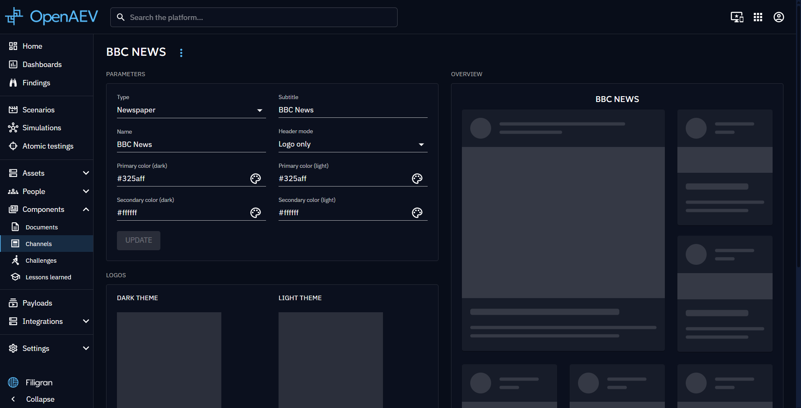

# Channels

Channels represent communication media with a particular look and feel. They define how [articles and media content](media-pressure.md) are presented to Players during a Simulation — as a newspaper, a microblog, or a TV channel.

## Why use Channels?

- Give realistic visual context to media pressure Injects.
- Customize branding (colors, logos, layout) to match the Simulation narrative.
- Reuse the same Channel template across multiple Scenarios.

## Create a Channel

First step is to click on the + button at the bottom right and give your new Channel a type (Newspaper, Microblogging, TV Channel), a name and a subtitle.

Once done, click on the Channel in the list to access its overview. Here you can define how media content associated to this Channel will be displayed to Players.

You can define primary and secondary colors, choose logos and define how the header is presented.

On the right, a mock up of the overview is displayed to give you the look and feel of it.

## Use a Channel

A Channel will then be used in Scenario and in Simulation definition. When you create an Article, you have to choose the Channel that will give it an adequate shape.

See [Media pressure](media-pressure.md) page to know how to create and add Articles to your Scenarios.

## What's next?

- [Media pressure](media-pressure.md) -- Create Articles and publish them through Channels
- [Scenarios](../scenario/scenario.md) -- Use Channels in your Scenarios
- [Built-in Injects](../../environment/injects-builtin.md) -- Overview of all built-in Injectors including the Channel Injector
