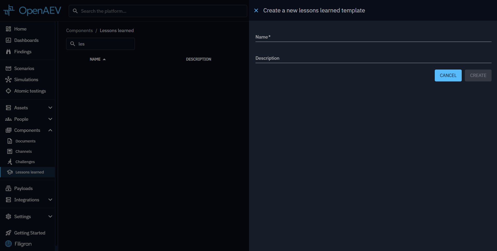

# Lessons

Lessons let you create customizable surveys that collect qualitative feedback from Players after a Scenario or Simulation. Each survey is composed of categories and questions that you define.

## Why use Lessons?

- Capture qualitative feedback that complements the quantitative results of a Scenario or Simulation.
- Identify gaps in processes, communication, or awareness that technical metrics alone cannot reveal.
- Automate the lessons-learned step that is often overlooked in Breach and Attack Simulations.

## Use Lessons with Scenarios and Simulations

Enable Lessons on the Scenario or Simulation details page to expose the Lessons learned tab.

- **Time-based Scenarios and Simulations** use the Teams already configured on the Scenario or Simulation.
- **Chained Scenarios and Simulations** use the teams defined in the run scope, so the Lessons target picker shows the same audience you selected for the chain.

The rest of the workflow is the same: create categories and questions, apply a template, and send the survey to the selected Teams.

## Create a lesson template

To create a new lesson template, follow these steps:

1. Click the + button at the bottom right corner of the screen.
2. Give your new lesson template a name.

Once completed, your new lesson will appear in the lesson learned list.

### Create a category

To create a new category, follow these steps:

1. Click the + button at the bottom right corner of the screen.
2. Give your new category a name and an order to organize your categories.

### Create a question

To create a new question, follow these steps:

1. Click the + button at the bottom of your category.
2. Give your new question a content and an order to organize your questions.

## Use a lesson template

Use lesson templates in the **Lessons learned** tab:

1. Apply a new template.
2. Add relevant teams to the most pertinent categories.
3. Send your survey to collect feedback.

By integrating lesson templates into your Simulations, you can gather valuable insights and improve the effectiveness of
your Breach and Attack Simulations.

## What's next?

- [Simulations](../../evaluate/simulation/simulation.md) -- Launch Simulations and collect Player feedback
- [Scenarios](../scenario/scenario.md) -- Build Scenarios that include lessons-learned surveys
- [People](../people.md) -- Manage the Players and Teams who will respond to surveys
