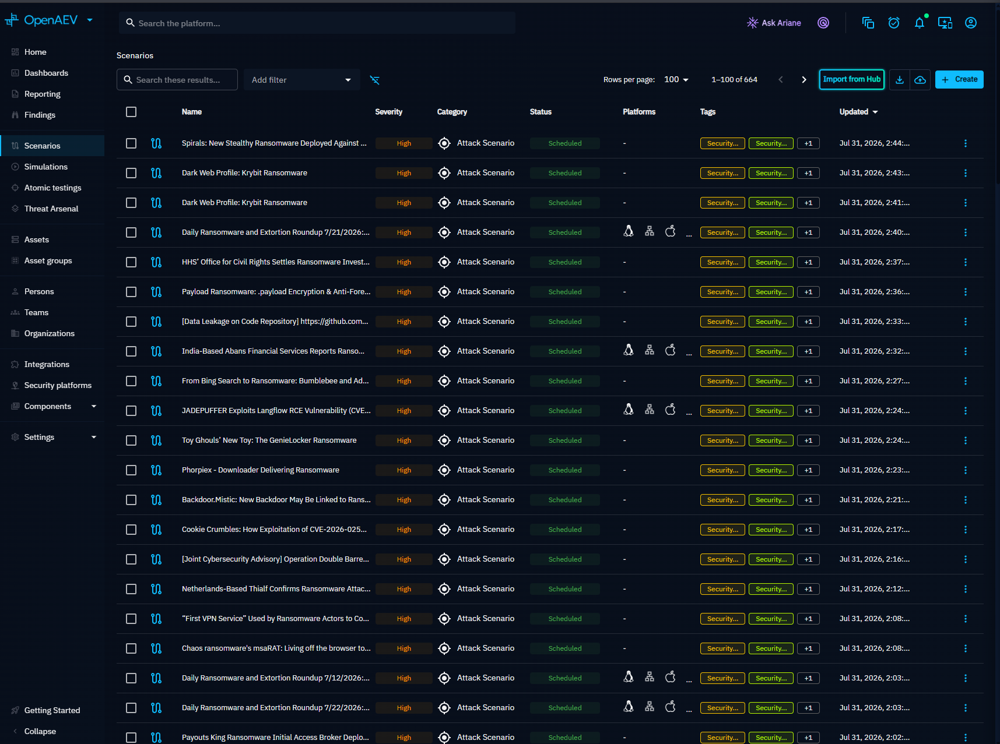
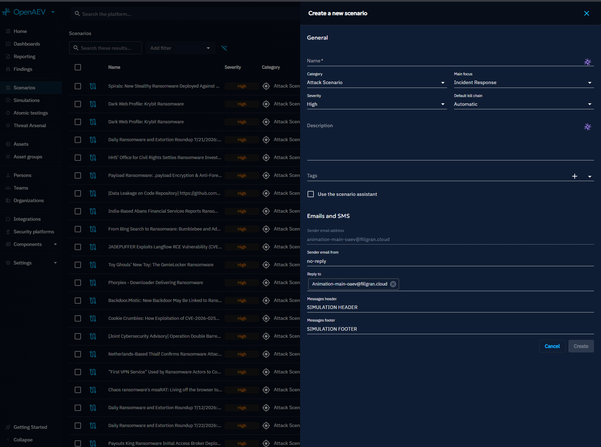
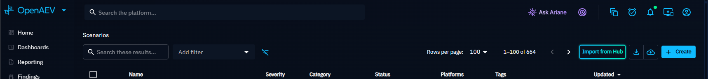
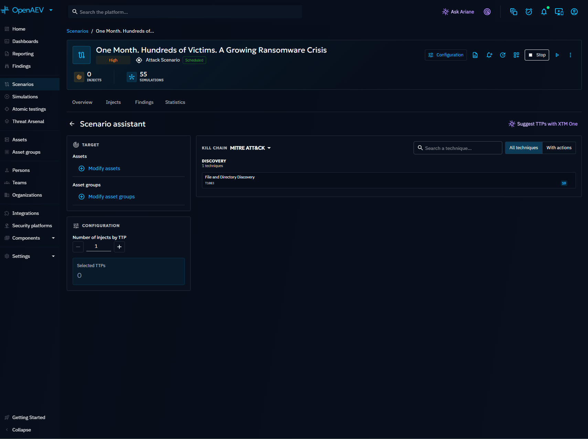

# Scenario

A Scenario translates a threat context into a reusable sequence of [Injects](../../evaluate/injects/inject-overview.md) that can be simulated repeatedly to track your security posture over time. Scenarios act as templates: define the attack once, then run multiple [Simulations](../../evaluate/simulation/simulation.md) from it.

## Why use Scenarios?

- Model a threat actor's full attack chain and replay it against your infrastructure.
- Reuse the same Scenario across multiple Simulations to track security posture trends.
- Combine technical Injects (endpoint commands) and non-technical Injects (phishing, media pressure) in a single timeline.

## Scenario list

Navigate to **Scenarios** in the left menu to see all Scenarios. Filter by category, main focus, severity, or tags using the quick filters at the top. Use the search bar to find Scenarios by name.

## Create a Scenario

1. Click the **+ Create** button at the top right.
2. Define the general metadata: name, category, main focus, severity, tags.
3. Click **Create**.

## Import from XTM Hub

Import pre-built Scenarios from the XTM Hub with a single click:

1. Register your platform following the [XTM Hub documentation](../../../administration/hub.md).
2. Click **Import from Hub** at the top right of the Scenarios list.
3. Browse the XTM Hub, select a Scenario, and click **Deploy in OpenAEV**.
4. The Scenario appears in your list.

## Define a Scenario

Open the Scenario and navigate to the **Definition** and **Injects** tabs.

In the **Definition** tab, add the elements that make up the Scenario:

- [Teams and Players](../people.md) involved in the Scenario
- [Custom variables](../components/variables.md) for dynamic content in Injects
- [Media pressure](../components/media-pressure.md) articles
- [Challenges](../components/challenges.md) for CTF (Capture The Flag) elements

In the **Injects** tab, create the chain of events by adding Injects. See [Inject overview](../../evaluate/injects/inject-overview.md) for the creation workflow.

## Scenario assistant

The Scenario assistant automates Inject creation based on your selected targets and MITRE ATT&CK techniques.

!!! warning

    The Scenario assistant requires attack patterns with associated Threat Arsenal Actions.

### How to use

1. Click the **Scenario assistant** button to open the assistant drawer.
2. Select targets: specific endpoints or Asset groups.
3. Choose TTPs (Tactics, Techniques, and Procedures) to cover.
4. Specify how many Injects to create per TTP.
5. Click **Create injects**.

The assistant generates Injects compatible with your targets' platform architectures. When targets have different architectures (e.g., Linux and Windows), the assistant finds universal Actions or falls back to platform-specific ones. If no matching Action exists, a placeholder Inject is created.

!!! tip "Enterprise Edition"

    In the Enterprise Edition, Ariane AI can analyze threat reports and files to automatically identify relevant TTPs for your Scenario.

## Launch a Simulation

Once the Scenario is defined, click **Simulate now** to evaluate your security posture. You can:

- Schedule a one-time Simulation for a specific date and time
- Set up recurring Simulations to track posture over time

A visual indicator next to the Scenario title shows whether a Simulation is currently running. Results of each Simulation populate the Scenario overview.

## What's next?

- [Simulation](../../evaluate/simulation/simulation.md) -- Run and monitor Simulations
- [Inject overview](../../evaluate/injects/inject-overview.md) -- Create and configure Injects
- [Scenario generation from OpenCTI](security-coverage.md) -- Auto-generate Scenarios from threat intelligence
- [Scenario import](scenario-import.md) -- Import Injects from XLS files
- [Threat Arsenal](../threat-arsenals/threat-arsenals.md) -- Browse and create Actions
