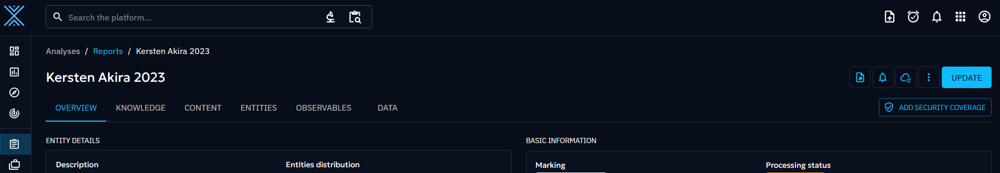
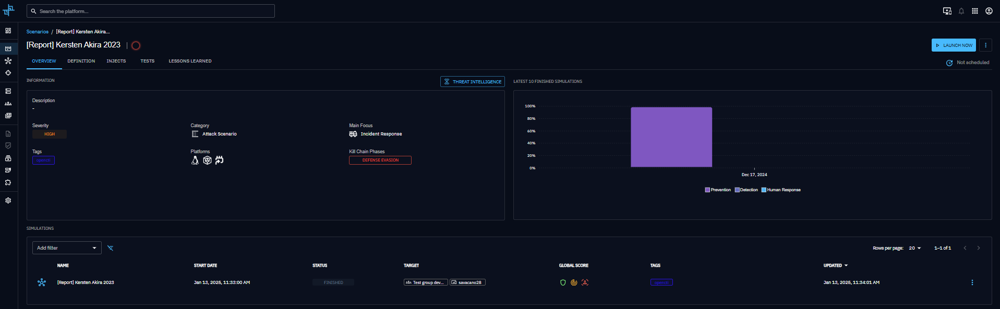
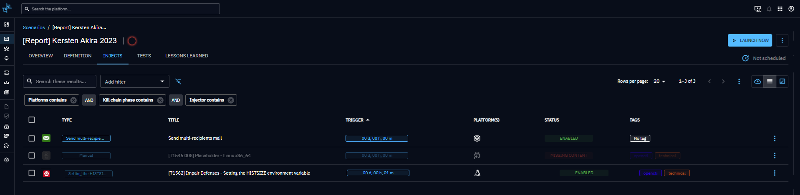
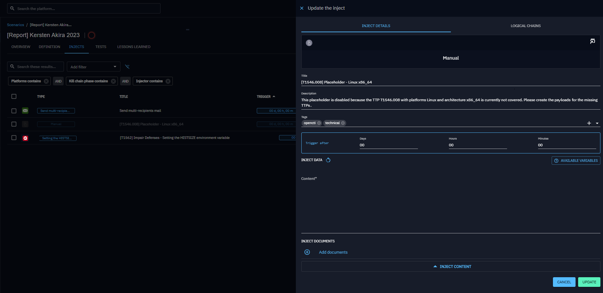
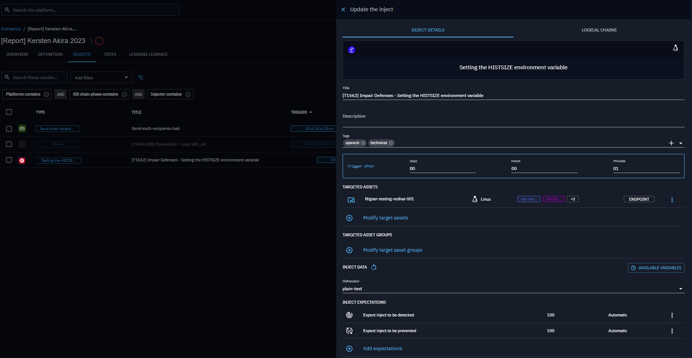
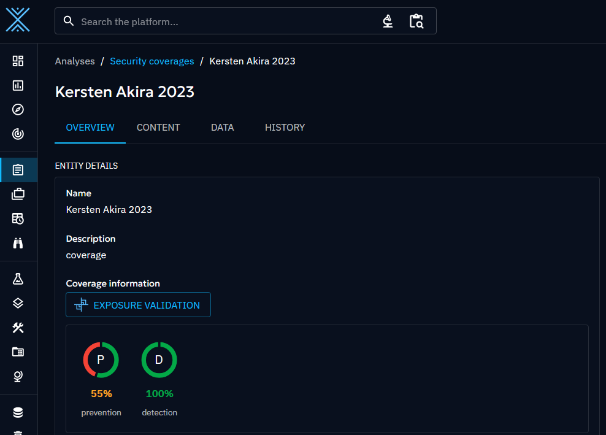

# Scenario generation from OpenCTI Security Coverage

## Overview

OpenAEV can automatically generate Scenarios from OpenCTI Security Coverage entities, transforming threat
intelligence, such as Attack Patterns, Vulnerabilities, Artifacts, and others, into actionable operational Scenarios.

## Why use Scenario generation?

- Automatically turn threat intelligence from OpenCTI into executable Scenarios.
- Eliminate manual Scenario creation when coverage data already exists in your threat intelligence platform.
- Create a continuous feedback loop between threat intelligence and security validation.

This integration enables organizations to track simulation results and security coverage directly within OpenCTI,
creating a complete feedback loop between threat intelligence and security validation.

This integration works across multiple OpenCTI entity types:

- Reports
- Incident Response
- Incidents
- Campaigns
- Intrusion Sets
- Groupings

## How it works

When you click on the **Add Security Coverage** button in
OpenCTI ([see OpenCTI documentation](https://docs.opencti.io/latest/usage/security-coverage/)), OpenAEV receives a **STIX (Structured Threat Information Expression) 2.1 bundle** representing the Security Coverage.

OpenAEV then:

1. Parses the STIX object
2. Builds a scenario in OpenAEV

> **Note:** At time of writing, the automated Security Coverage feature can assess coverage for the following entities:
> Attack Patterns

3. Extracts relevant **Attack Patterns references**
4. Resolves Asset Groups using **Custom Tag Rule** labeled `opencti`, extracting the associated **platforms and architectures** to match compatible Threat Arsenal Actions.
5. Generates injects for each extracted entity
6. Schedules the scenario for execution

## STIX fields used for Scenario creation

OpenAEV requires specific fields from the STIX object, divided into **Mandatory** (id, name, covered_ref) and **Optional** fields (e.g., description, labels, periodicity) for additional context.

### Mandatory parameters

| STIX Field      | STIX Path     | Description                                                    | Used For                            |
|-----------------|---------------|----------------------------------------------------------------|-------------------------------------|
| **id**          | `id`          | Unique STIX identifier of the Security Coverage                | Mapping, de-duplication, externalId |
| **name**        | `name`        | Name of the Security Coverage                                  | Scenario name in OpenAEV            |
| **covered_ref** | `covered_ref` | Reference to the main entity (intrusion-set, malware, report…) | Build external link to OpenCTI      |

### Optional parameters

| STIX Field                 | STIX Path                 | Description                                 | Used For                       | 
|----------------------------|---------------------------|---------------------------------------------|--------------------------------|
| **description**            | `description`             | Description of the Security Coverage        | Scenario description           |
| **labels**                 | `labels[]`                | Labels/tags from OpenCTI                    | Tags in scenario and tag rules |
| **periodicity**            | `periodicity`             | Scheduling frequency (e.g., `P1D`)          | Scenario scheduling            |
| **created_at** (extension) | `extensions.*.created_at` | Creation timestamp inside OpenCTI extension | Period start date              |

## How OpenAEV builds the Scenario

After parsing and validating the **Security Coverage STIX** object, OpenAEV follows the process below:

- **Create or update an OpenAEV scenario**

- **Extract all references** related to Attack Patterns, DNS or Artifact.

    - For each **Object Reference** identified:

        - If the referenced **Attack Pattern**, **DNS** or **Artifact** exists in OpenAEV  
          (matched by **External ID** or **Name**) **and** a related [Threat Arsenal](../threat-arsenals/threat-arsenals.md) exists that
          matches the **platforms and architectures** derived from the Asset groups resolved via **Custom Tag Rule
          labeled `opencti`**.   
          => **Concrete Inject** is created.

        - If the Attack Pattern does **not** exist in OpenAEV, or no compatible Threat Arsenal Action exists for the resolved
          platforms/architectures.  
          => **Placeholder Inject** is created to highlight missing coverage.

> **Note**  
> To ensure meaningful inject generation:
>
> - Attack Patterns defined in **OpenCTI** (by External ID or Name) must be aligned with those configured in **OpenAEV
    **.
> - Targets are resolved via **Custom Tag Rule labeled `opencti`**, and the corresponding **platforms and architectures
    ** are extracted from these Asset groups.
> - Threat Arsenal Actions are matched against the Attack Patterns **and** must be compatible with the extracted platforms and
    architectures.
>
> In other words, inject creation only occurs when:
> 1. The Attack Pattern exists in OpenAEV, and
> 2. A Threat Arsenal Action exists that matches both the Attack Pattern **and** the platforms/architectures derived from the Asset groups
     defined in the Custom Tag Rules.
>
> If either condition is not met, a **Placeholder Inject** is created to highlight missing coverage.

Inject creation depends on matching the **Object Reference** values between OpenCTI and OpenAEV, example:  

| OpenCTI Attack Pattern   (External ID or Name) | Matching Threat Arsenal Action in OpenAEV   (Attack Pattern + Platform + Architecture) | Result                  |
|----------------------------------------------------|--------------------------------------------------------------------------------------------|-------------------------|
| T1059.001                                          | Yes                                                                                        | Concrete inject created |
| T1059.001                                          | No                                                                                         | Placeholder inject      |

  

After injects are generated:

- Review and customize the **Scenario** to match your organization’s needs.
- Assign appropriate **Asset groups** to each inject.
- Optionally, configure default **Asset Groups** for scenarios created from OpenCTI using
  the [Default Asset Groups](../../../administration/default-asset-rules.md) page.

- Finally, the **Scenario will execute** according to its configured schedule.

## Execution and reporting back to OpenCTI

Once the scenario is finalized and scheduled:

- OpenAEV executes the scenario according to the periodicity.
- After simulation, the results are compiled into new SROs (STIX Relationship Objects).
- OpenAEV sends these results back to OpenCTI as part of
  automated [Enriched Security Posture Assessment](../../evaluate/xtm-suite-connector.md) in the same **STIX 2.1 bundle**
  representing the Security Coverage.
- OpenCTI displays the updated coverage assessment.

This creates a complete feedback loop between threat intelligence and security validation.

## What’s next?

- [Security Coverage enrichment (XTM Suite)](../../evaluate/xtm-suite-connector.md) -- Push Simulation results back to OpenCTI automatically
- [Scenarios](scenario.md) -- Create and manage Scenarios manually
- [Injects](../../evaluate/injects/inject-overview.md) -- Understand how Injects are created and executed

