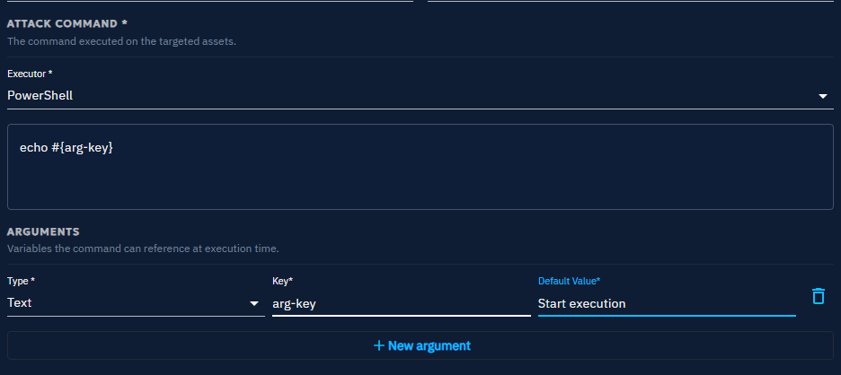

# Action properties

This page documents every property of an **Action**, tab by tab, as they appear in the Action form of the
[Threat Arsenal](threat-arsenals.md). Some properties are common to all Actions, while others depend on the Action
type.

## General properties

Set these properties in the **General** tab.

| Property        | Description                     |
|-----------------|---------------------------------|
| Name            | Action name                     |
| Description     | Action description              |
| Attack patterns | Command-related attack patterns |
| Tags            | Tags                            |

## Commands common properties

Set these properties in the **Commands** tab. They apply to every Action type.

| Property         | Description                                                                          |
|------------------|--------------------------------------------------------------------------------------|
| Type             | Action type: Command Line, Executable, File Drop, or DNS Resolution                  |
| Architecture     | Architecture the command runs on (x86_64, arm64, all architectures)                  |
| Platforms        | Compatible platforms, such as Windows, Linux, or macOS                               |
| Prerequisites    | Prerequisites required to execute the command                                        |
| Cleanup executor | Executor for the cleanup command                                                     |
| Cleanup command  | Cleanup command that removes or resets the changes made                              |
| Arguments        | Arguments for the cleanup, the prerequisites, and the command line                   |

### Arguments in depth

Arguments let you set variables dynamically within command lines, whether for cleanup commands, prerequisites, or
execution commands. OpenAEV supports two types of arguments: text and targeted Asset.

For text arguments, specify:

- **Key** -- How you reference the argument in your command, using a placeholder.
- **Default value** -- The value that replaces the placeholder during execution. You can override it when you create an
  Inject.

For targeted Asset arguments, specify:

- **Key** -- How you reference the argument in your command, using a placeholder.
- **Targeted property** -- The attribute of each targeted Asset to use in the command: Hostname, Local IP (first), or
  Seen IP.
- **Separator** -- The character that separates multiple values at execution time, so that the arguments match the
  format your script expects. A comma, for example.

!!! example

    To create an Action that runs `nuclei` for scanning, write the command as `nuclei -t #{asset-key}` and add a
    targeted Asset argument with the key `asset-key`.

    Then create an Inject based on this Action. In the Inject, designate a source Asset, which is where the command
    runs -- the Asset where `nuclei` is installed -- and define the targeted Assets that serve as the scan targets.

### Prerequisites in depth

| Property         | Description                                     |
|------------------|-------------------------------------------------|
| Command executor | Executor for the prerequisite                   |
| Check command    | Verifies that specific conditions are met       |
| Get command      | Runs when the check command fails               |

## Additional properties by type

### Command line

This Action type executes commands directly on the CLI of the target system, such as Windows Command Prompt,
PowerShell, or a Linux shell. Command Line Actions run commands remotely to simulate common attacker behavior, such as
privilege escalation or data exfiltration.

| Property         | Description                     |
|------------------|---------------------------------|
| Command executor | Executor for command to execute |
| Command          | Command to execute              |

### Executable

An Executable Action delivers a binary file that the system runs as an independent process, such as an `.exe` on
Windows or an ELF binary on Linux. Executables perform a variety of functions, from establishing a backdoor to running
complex scripts that mimic malware.

| Property        | Description     |
|-----------------|-----------------|
| Executable file | File to execute |

### File drop

A File Drop Action delivers files to the target system without executing them immediately, such as scripts, documents,
or binaries. Use it to simulate scenarios where attackers place files in specific locations for later use, either
manually or through another process.

| Property     | Description  |
|--------------|--------------|
| File to drop | File to drop |

### DNS resolution

A DNS Resolution Action resolves hostnames to their associated IP addresses. Use it to test whether specific hostnames
resolve correctly, which helps you assess network accessibility, detect issues, and simulate potential attacker
behavior.

| Property  | Description              |
|-----------|--------------------------|
| Hostnames | Hostname list to resolve |

## Detection remediation properties

Set these properties in the **Remediation** tab. The platform displays a dedicated tab for each security platform it
integrates.

!!! tip "Enterprise Edition"

    Detection remediation requires a valid Enterprise Edition license. Ariane generates rules with AI for Actions of
    type Command Line or DNS Resolution, and for the Splunk and CrowdStrike security platforms.
    See [Enterprise Edition](../../../administration/enterprise.md) for activation instructions.

### Status of detection remediation rules

| Status                                                                     | Description                                                                                                                     |
|----------------------------------------------------------------------------|-----------------------------------------------------------------------------------------------------------------------------------|
| Rules written by Human                 | A human wrote the rules.                                                                                                        |
| Rules generated by AI                  | AI generated the rules.                                                                                                         |
| Action changed since rule was edited   | The Action changed after the last AI rules generation. See [Fields used for AI rules generation](#fields-used-for-ai-rules-generation). |

### Fields used for AI rules generation

| Field                                | Tab      |
|--------------------------------------|----------|
| Name                                 | General  |
| Description                          | General  |
| Attack patterns                      | General  |
| Type                                 | Commands |
| Architecture                         | Commands |
| Platforms                            | Commands |
| Attack command - Executors (Command) | Commands |
| Attack command - Content (Command)   | Commands |
| Arguments                            | Commands |
| Hostname (DnsResolution)             | Commands |

## What's next?

- [Threat Arsenal](threat-arsenals.md) -- Create, use, and manage Actions
- [Output parsers](output-parsers.md) -- Configure the properties of the **Output** tab
- [Domains](domains.md) -- Understand how Domains classify Actions by security control
