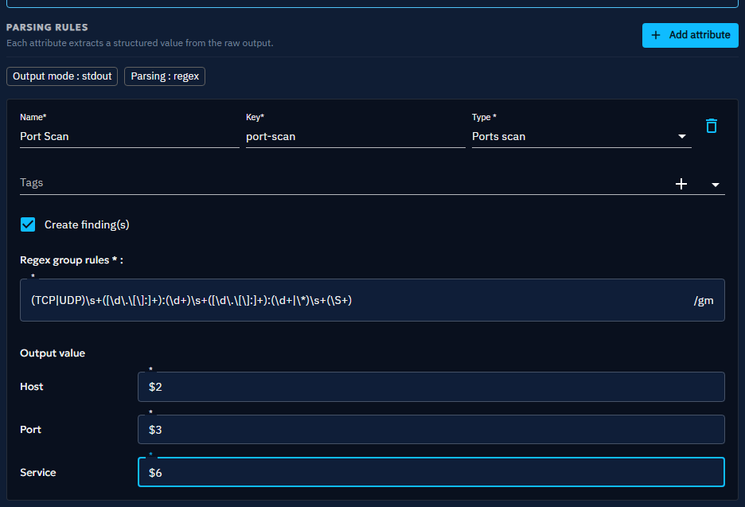
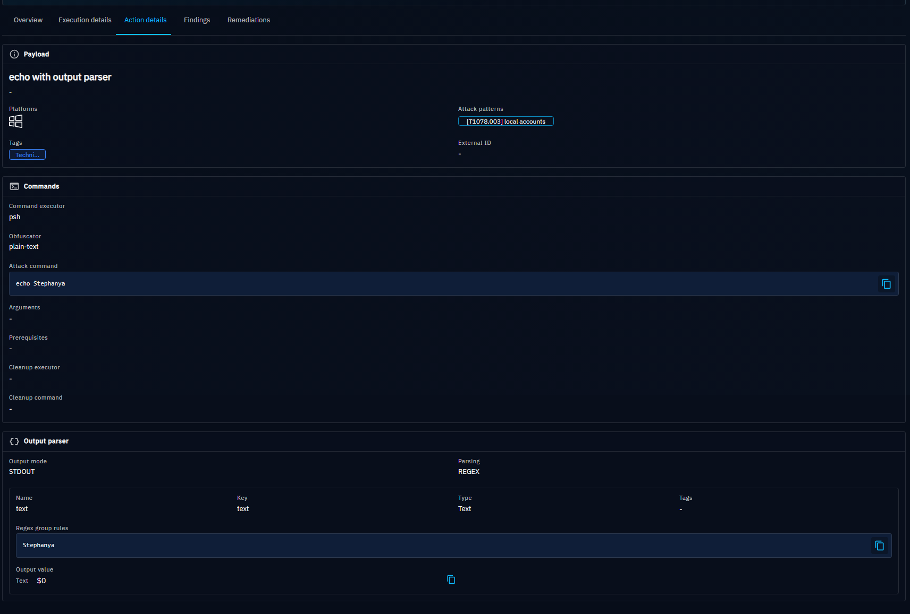

# Output parsers

**Output parsers** process the raw output of an [Action](threat-arsenals.md) execution. Define rules to extract
specific data from the output and link it to variables. You can then use those variables to
[chain Injects](../../inject-chaining.md#conditional-execution).

You attach output parsers to an Action from the **Output** tab of the Action form.

Output parsers currently support the **StdOut** output mode and the **REGEX** parsing type.

## Why use output parsers?

- Extract structured data from raw output, such as hosts, ports, credentials, or CVEs.
- Generate [Findings](../../evaluate/findings/findings.md) automatically from an execution.
- Reuse extracted values as variables in the Injects that follow.

## Add an output parser to an Action

1. Open the Action from the Threat Arsenal view, or [create a new one](threat-arsenals.md#create-an-action).
2. Go to the **Output** tab.
3. Click **Add attribute**, then define the properties of the rule as described in
    [Defining a rule](#defining-a-rule). Each attribute extracts one structured value from the raw output.

    

## Defining a rule

When you add a rule with **Add attribute**, define the following properties:

| Property     | Description                                                                                                                                                                                                                | Mandatory |
|--------------|----------------------------------------------------------------------------------------------------------------------------------------------------------------------------------------------------------------------------|-----------|
| Name         | The name of the rule.                                                                                                                                                                                                      | Yes       |
| Key          | A unique key identifier.                                                                                                                                                                                                   | Yes       |
| Type         | The data type to extract, such as Text, Number, Port, Ports scan, IPv4, IPv6, Credentials, CVE, or Vulnerability.                                                                                                           | Yes       |
| Tags         | Tags that help you categorize the rule.                                                                                                                                                                                    | No        |
| Regex        | A regular expression that extracts data from the raw output. It supports capturing groups and line anchors, such as `^` for the start of a line. The parser applies `Pattern.MULTILINE`, `Pattern.CASE_INSENSITIVE`, and `Pattern.UNICODE_CHARACTER_CLASS` by default. | Yes       |
| Output value | Maps each regex capture group to the corresponding field, based on the selected type.                                                                                                                                      | Yes       |

## Output value mapping

Depending on the type, you can extract a specific number of fields using the group index from the regex:

| Type        | Fields                 | Output format       |
|-------------|------------------------|---------------------|
| Ports scan  | host, port, service    | host:port (service) |
| Credentials | username, password     | username:password   |
| CVE         | host, id, severity     | host:id (severity)  |
| Other       | single extracted value | single value        |

Prefix the group index with `$` to differentiate between multiple capture groups.

To combine multiple groups in a single field, concatenate them by placing the group references next to each other, such
as `$n$m`. The final value of the field is the composition of these groups.

## Example: extracting elements with regex for a port scan rule

The next image shows a rule named **Port Scan (port-scan)** with the type **Ports scan**. Its regex pattern
`(TCP|UDP)\s+([\d\.\[\]:]+):(\d+)\s+([\d\.\[\]:]+):(\d+|\*)\s+(\S+)` matches a line of `netstat -an` output and
defines six capture groups that you can extract from the raw output.

Define the group that builds the output in the **Output value** section. In this example, each field maps to a specific
capture group:

- **Host** -- `$2`
- **Port** -- `$3`
- **Service** -- `$6`

The rule generates the following Finding:

## Generate Findings from parsed output

If the extracted data is compatible with a [Finding](../../evaluate/findings/findings.md), select **Create
finding(s)** on the rule. The Findings results and the output parser details then appear in the **Findings** and
**Action details** tabs of the [Atomic Testing detail view](../../evaluate/atomic-testing/atomic-testing.md).

## What's next?

- [Threat Arsenal](threat-arsenals.md) -- Create and manage the Actions that output parsers apply to
- [Action properties](action-properties.md) -- Reference of every Action property
- [Findings](../../evaluate/findings/findings.md) -- View the data extracted from Action executions
- [Injects](../../evaluate/injects/inject-overview.md) -- Chain Injects with the variables you extract
