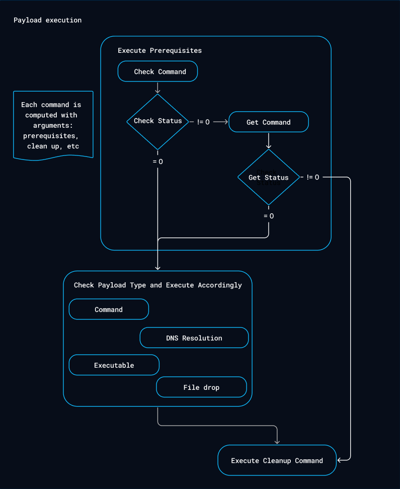

# Threat Arsenal

The **Threat Arsenal** is the section in OpenAEV where you manage all the Actions available for building Injects.

An **Action** defines what happens when an Inject executes on a target: a shell command, an executable, a file drop, or
a DNS resolution. Actions unify what were previously known as **Payloads** and **Injector Contracts** into a single,
simplified interface.

Depending on their source, Actions fall into three categories:

| Source                  | Description                                                                                                            | What you can edit               |
|-------------------------|------------------------------------------------------------------------------------------------------------------------|---------------------------------|
| **User-created**        | Built from scratch through the Threat Arsenal interface, and supported by the OpenAEV Implant Injector.                | Every property                  |
| **Injector-provided**   | Inserted automatically by Injectors integrated into the platform, such as Nuclei.                                      | Domains, attack patterns, tags  |
| **Collector-provided**  | Inserted by Collectors, such as Atomic Red Team. The Collector manages them entirely.                                  | Nothing -- these are read-only  |

## Why use the Threat Arsenal?

- Build custom attack Actions tailored to your environment and threat landscape.
- Leverage community and vendor-provided Actions from Injectors and Collectors.
- Attach output parsers to automatically generate Findings from execution results.
- Define detection and remediation rules to validate Collector coverage.

## Action list view

The Threat Arsenal view displays every Action available in the platform. Each entry in the list includes the following
columns:

| Column       | Description                                                                                                     |
|--------------|-----------------------------------------------------------------------------------------------------------------|
| **Type**     | The Injector type that supports the Action. User-created Actions rely on the OpenAEV Implant Injector.          |
| **Name**     | The name assigned to the Action.                                                                                |
| **Domains**  | The domains the Action operates on, such as Endpoint, Network, Web App, or E-mail infiltration.                 |
| **Platform** | The platforms the Action supports, such as Windows, Linux, or macOS.                                            |
| **Tags**     | Tags that help you categorize and search for Actions.                                                           |
| **Status**   | The reliability or lifecycle state of the Action. See [Action status logic](#action-status-logic).              |
| **Updated**  | The date of the last modification.                                                                              |

### Action status logic

| Status          | Description                                                                                                     |
|-----------------|-----------------------------------------------------------------------------------------------------------------|
| **Verified**    | OpenAEV has tested the Action and confirmed that it works as expected.                                          |
| **Unverified**  | OpenAEV has not tested the Action. It may or may not work.                                                      |
| **Deprecated**  | The original source marked the Action as deprecated. It remains available for reference, but OpenAEV does not guarantee that it still works. |

## Create an Action

To create a new Action, follow these steps:

1. Click the **Create** button at the top right of the list.

2. In the **General** tab, fill in the required details. Assign a name to the Action, then provide general details
    such as its description, attack patterns, and tags.

    

3. In the **Commands** tab, choose an Action type:

    - **Command Line** -- Executes a command through an Executor, such as PowerShell or Bash.
    - **Executable** -- Runs an executable file on an Asset.
    - **File Drop** -- Drops a file onto an Asset.
    - **DNS Resolution** -- Resolves a hostname into IP addresses.

    Specify the platform, then provide the command details such as arguments and prerequisites. Add a cleanup Executor
    and a cleanup command to remove any remnants that the execution leaves on the Asset.

    

4. In the **Output** tab, add [output parsers](output-parsers.md) to process the raw output of the execution, and
    specify whether to generate [Findings](../../evaluate/findings/findings.md) from that output. This step is
    optional.

    

5. In the **Remediation** tab, define detection rules that identify Actions which existing security systems did not
    block or detect. The platform displays a dedicated tab for each security platform it integrates. This step is
    optional. See [Detection remediation properties](action-properties.md#detection-remediation-properties).

    

Once you complete these steps, the new Action appears in the Action list.

For the complete list of the fields available in each tab, see [Action properties](action-properties.md).

## Use an Action

After you create an Action, a new Inject type appears automatically in the Inject types list, provided that the implant
you use supports it. The OpenAEV Implant does.

The following diagram shows how an Action executes on a target:

## Update an Action

As described in the [Action list view](#action-list-view) section, you can create Actions yourself, or the platform can
insert them through Injectors or Collectors. The update process depends on the source of the Action:

- **User-created Actions** -- Update them directly from the Threat Arsenal view. Click the Action and modify any of its
  properties.
- **Actions inserted through Injectors** -- Update only the domains, attack patterns, and tags linked to the Action.
- **Actions inserted through Collectors**, such as Atomic Red Team -- You cannot update them from the platform, because
  the Collector manages them.

## Delete an Action

The deletion process also depends on the source of the Action:

- **User-created Actions** -- Delete them directly from the Threat Arsenal view. Click the Action, then select the
  delete option.
- **Actions inserted through Injectors or Collectors** -- You cannot delete them from the platform.

## Bulk operations

The Action list view supports bulk operations, so you can act on several Actions at once.

### How to use

1. Select one or more Actions using the checkboxes on the left side of the list.
2. A bulk action toolbar appears at the top of the list with the available operations.
3. Choose the operation you need.

### Available bulk operations

| Operation      | Description                                                                                                     |
|----------------|-----------------------------------------------------------------------------------------------------------------|
| **Delete**     | Deletes several user-created Actions at once. You cannot delete Actions that come from Injectors or Collectors. |
| **Export**     | Exports the selected Actions as a JSON ZIP archive, in [JSON:API](https://jsonapi.org/) format.                 |
| **Tag**        | Adds or removes tags on several Actions simultaneously.                                                         |
| **Run a Test** | Launches a Scenario or an Atomic Test directly from the selected Actions.                                        |

### Run a test from bulk selection

When you click **Run a Test** in the bulk toolbar, a drawer opens with three execution options:

| Option                       | Description                                                                          | Availability                 |
|------------------------------|----------------------------------------------------------------------------------------|------------------------------|
| **Create a new scenario**    | Builds a fully customized Scenario. The selected Actions are prefilled as Scenario steps. | One or more Actions selected |
| **Add to existing scenario** | Inserts the selected Actions as new steps into one or more existing Scenarios.        | One or more Actions selected |
| **Run atomic test**          | Executes the selected Action immediately as a one-off Simulation.                     | **Single Action only**       |

#### Create a new scenario

1. Select one or more Actions, then click **Run a Test**.
2. Choose **Create a new scenario**.
3. The standard Scenario creation funnel opens in the drawer.
4. Click **Create**. OpenAEV creates the Scenario with the selected Actions prefilled as Inject steps.

#### Add to existing scenario

1. Select one or more Actions, then click **Run a Test**.
2. Choose **Add to existing scenario**.
3. Select one or more target Scenarios from the dropdown list. Multi-selection is supported.
4. Click **Create**. OpenAEV adds the selected Actions as Inject steps to all the chosen Scenarios.

#### Run atomic test

1. Select exactly one Action, then click **Run a Test**.
2. Choose **Run atomic test**.
3. The standard Atomic Test execution funnel opens with the Action prefilled.
4. The Simulation executes as a one-off run.

## Import and export Actions

OpenAEV supports importing and exporting Actions using the [JSON:API](https://jsonapi.org/) specification, so you can
share Actions across instances or within the community.

There are two ways to export Actions:

- **CSV export** -- Filter or search the Action list, then export the current view as a **CSV (Comma-Separated
  Values)** file. The exported file
  contains the same information that the Threat Arsenal page displays. This export works for every type of Action.
- **JSON ZIP export** -- Pair this export with the import feature: you export to reimport elsewhere. It works only for
  user-created Actions, because it contains all the details of the Action -- the command, arguments, output parsers,
  and more -- which you cannot edit on Actions that come from Injectors or Collectors.

Use these exports to share complex Actions with teammates or the community, and to move Actions across your
development, test, and production environments.

## What's next?

- [Action properties](action-properties.md) -- Reference of every field of the Action form
- [Output parsers](output-parsers.md) -- Extract structured data from execution output
- [Domains](domains.md) -- Understand how Domains classify Actions by security control
- [Injects](../../evaluate/injects/inject-overview.md) -- Use Actions in Injects
- [Atomic testing](../../evaluate/atomic-testing/atomic-testing.md) -- Run individual Actions as Atomic Tests
- [Findings](../../evaluate/findings/findings.md) -- View parsed output from Action executions
