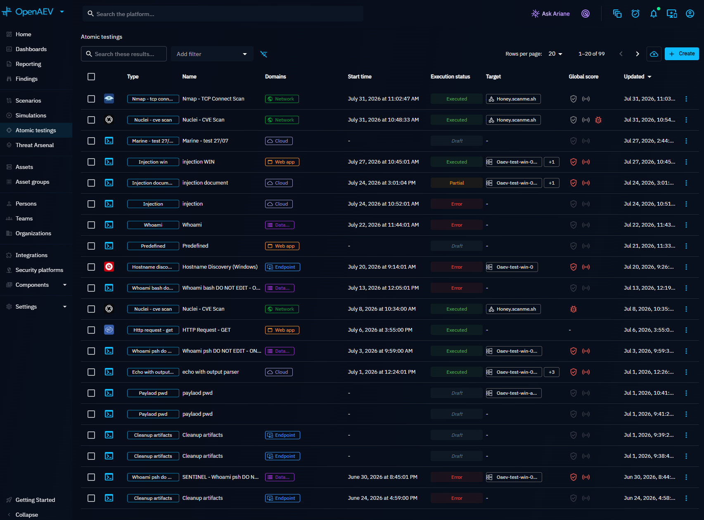
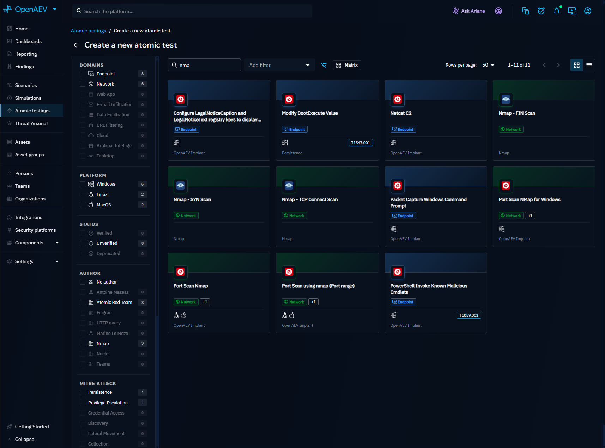
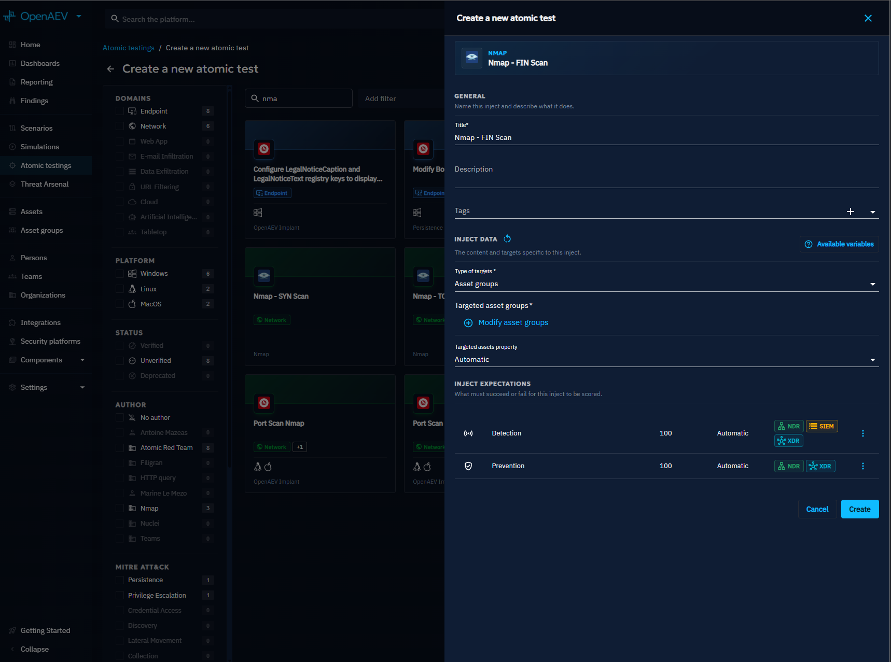
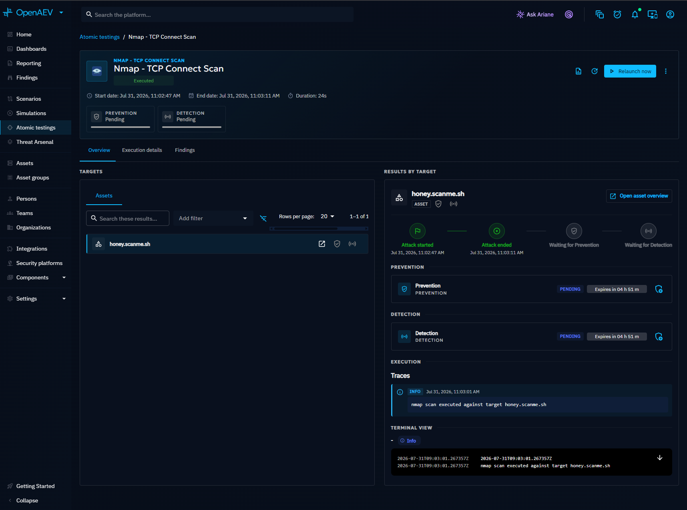

# Atomic testing

Atomic testing lets you execute a single attack technique in isolation and immediately measure your ability to prevent and detect it. Unlike Simulations that run a full Scenario, Atomic Tests focus on one Inject at a time for rapid, targeted validation.

## Why use Atomic Tests?

- Quickly validate whether a specific MITRE ATT&CK technique is detected or prevented.
- Isolate and troubleshoot individual defensive controls without running a full Scenario.
- Onboard new Threat Arsenal Actions by testing them before adding them to Scenarios.

## Atomic testing list

Navigate to **Atomic testing** in the left menu to see all Atomic Tests launched on the platform. The list shows the global score for each test, allowing you to quickly identify which techniques your security stack handles well and which need attention.

Use the search bar and filters to narrow results.

## Create an Atomic Test

1. Click the **+** button at the bottom right of the screen.
2. On the left panel, browse the list of available Threat Arsenal Actions. Filter by kill chain phase, Injector, compatible platform, or MITRE ATT&CK tactic. Click the **ATT&CK** icon near the search bar to filter by a specific technique.
3. Select an Action. The form on the right populates with a default title and a delay field (set to 0 for immediate execution).

4. Click **Inject content** to define the targeted Assets or Players, required configuration, and Expectations.

5. Click **Create**.

## Schedule a recurring Atomic Test

Recurring Atomic Tests are the simplest way to continuously validate that a prevention or detection capability keeps working over time. The same technique is replayed automatically and each run produces fresh results.

1. Open the Atomic Test and click the scheduling action in the header.
2. Choose a frequency: **once**, **hourly**, **daily**, **weekly**, or **monthly**, with the execution time and day.
3. Define the start date and optionally an end date.
4. Save. The next planned execution is displayed on the Atomic Test.

The platform checks for due recurring Atomic Tests every minute and launches them automatically. Each execution archives previous results and creates new Expectations for all targets.

!!! note

    Scheduling requires the permission to launch the Atomic Test. The recurrence can be updated or removed at any time from the same dialog.

## Atomic Test detail

The detail page has three parts:

- **Header**: title, status tooltip (tags, description), pie charts summarizing results, and actions (launch, update, delete, export)
- **Overview**: quick summary of test results across all targets with posture gauges
- **Execution details**: Inject Expectations and detailed execution traces

The result tabs (Overview, Findings, Execution details, Threat Arsenal Action info, Remediations) follow the same layout as any Inject result. See [Inject result](../injects/inject-result.md) for details on each tab.

## What's next?

- [Inject result](../injects/inject-result.md) -- Understand result breakdown and remediation
- [Inject overview](../injects/inject-overview.md) -- How Injects work
- [Threat Arsenal](../../build/threat-arsenals/threat-arsenals.md) -- Browse and create Actions
- [Simulation](../simulation/simulation.md) -- Run full Scenario-based Simulations
