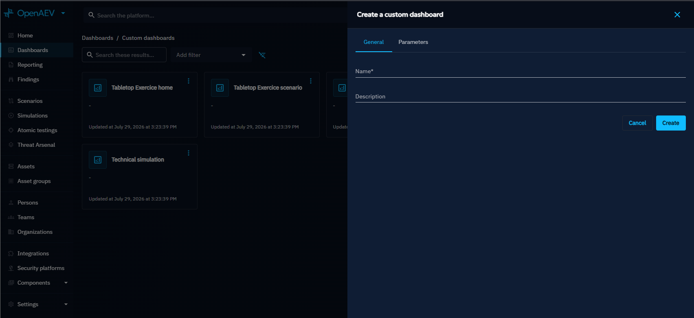
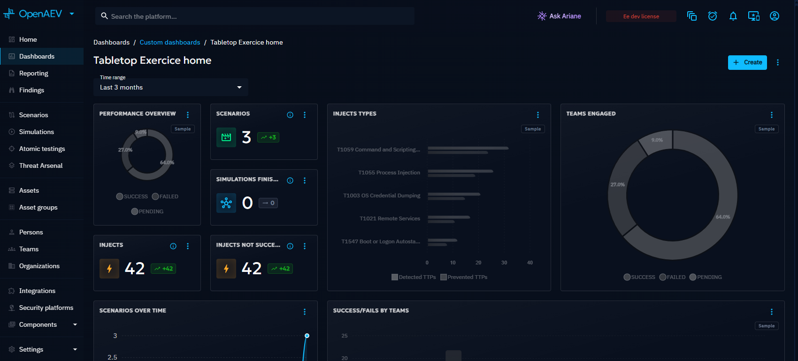
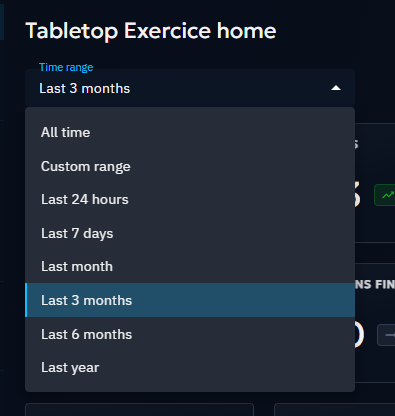
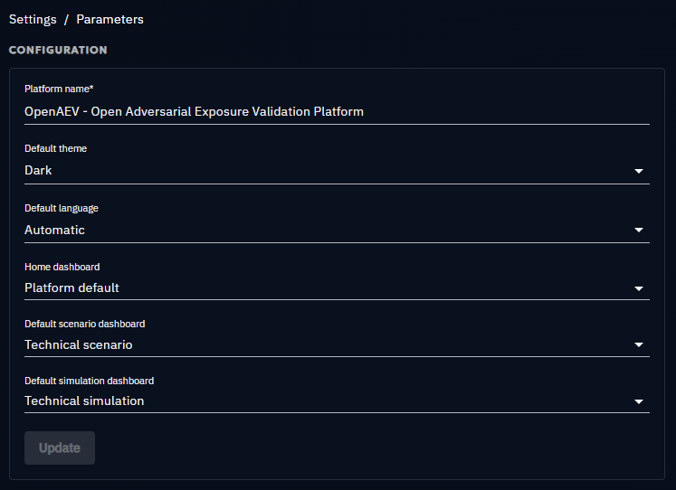
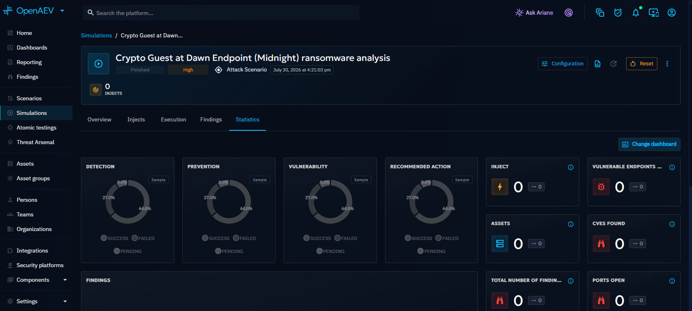
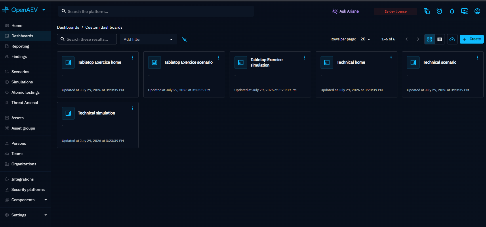

# Custom Dashboards

Custom Dashboards let you build tailored views of your platform data. Use them to monitor specific metrics, track Simulation results over time, or create reporting views for different audiences.

## Why use custom Dashboards?

The default home screen provides a general overview, but custom Dashboards let you focus on what matters most to your role or workflow:

- **SOC (Security Operations Center) leads**: track detection rates and missed Injects over time
- **Red team operators**: monitor Simulation execution and Findings by category
- **Management**: build high-level posture summaries for reporting

## Create a Dashboard

1. Click the **+** button at the bottom right of the custom Dashboards page.
2. In the **General** tab, set the name, description, and optionally mark the Dashboard as default for the home page, Scenarios, or Simulations. See [default Dashboards](#default-dashboards) below.
3. In the **Parameters** tab, add dynamic parameters. Currently, only the **Simulation** parameter is supported -- when added, Widgets are calculated based on the selected Simulation.
4. Click **Create**.

## Dashboard layout

Arrange [Widgets](widgets.md) on your Dashboard by dragging them into position. Resize any Widget from its bottom right corner to emphasize the most important data.

## Time filters

Filter all Dashboard data by time range using the dropdown at the top of the page. Available values: all time, custom range, last 24 hours, last 7 days, last month, last 3 months, last 6 months, and last year. The default is **last three months**.

!!! note

    When **All time** is set, data is displayed without any time limit. When **Custom range** is set, two date pickers appear for selecting a start and end date.

## Default Dashboards

You can set a custom Dashboard as the default in two ways:

- Check the corresponding box when creating or updating a Dashboard
- Configure it from **Settings > Parameters**

### How defaults work

- **Home page**: replaces the standard home page when you click **Home** in the left menu
- **Scenarios**: becomes the default Analysis tab for all newly created Scenarios
- **Simulations**: becomes the default Analysis tab for all newly created Simulations

!!! note

    For Scenarios and Simulations, this only sets the initial default. You can change the Dashboard for each individual Scenario or Simulation after creation (with proper permissions) from the Analysis tab.

You cannot delete a custom Dashboard that is currently set as the default home Dashboard.

## Manage Dashboards

From the left menu, select **Custom Dashboards** to see all existing Dashboards.

Each row has an actions menu with:

- **Update**: edit the Dashboard name, description, defaults, and parameters
- **Delete**: remove the Dashboard (disabled if it is the current default home Dashboard)

## What's next?

- [Widgets](widgets.md) -- Configure individual Dashboard Widgets
- [Overview](../overview.md) -- Platform home screen and security posture overview
- [Parameters](../../../administration/parameters.md) -- Set default Dashboards in platform settings
