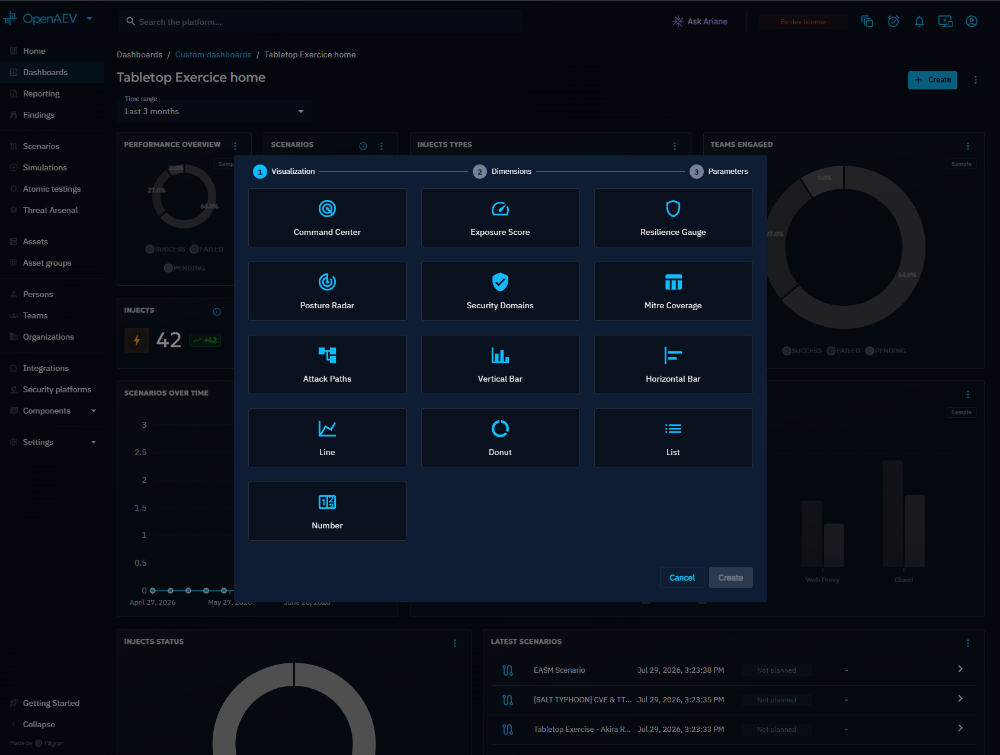
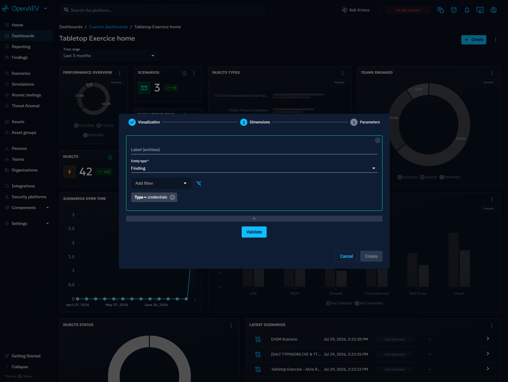
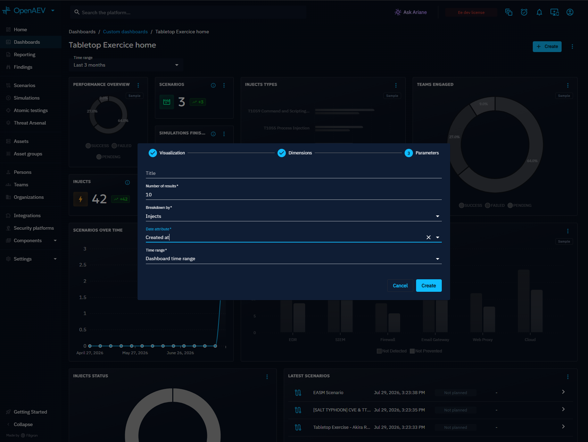

# Widgets

Widgets are the building blocks of [custom Dashboards](custom-dashboards.md). Each Widget is configured in three steps: visualization, dimensions, and parameters.

## Why use Widgets?

- Display exactly the data you need with the right visualization type.
- Filter and group results by Scenario, Simulation, Inject, kill chain phase, or time period.
- Combine multiple Widgets on a Dashboard to build a tailored security posture overview.

## 1. Visualization

Select the visualization type that best represents the data you want to display. Available types include Command Center, Exposure Score, Posture Radar, Security Domains, MITRE ATT&CK Coverage, Attack Paths, Vertical Bar, Horizontal Bar, Line, Donut, List, and Heatmap.

The visualization choice determines which dimensions and parameters are available in the following steps.

## 2. Dimensions

Dimensions define the dataset used by the Widget. Select the entity type that provides the data, choose a label, and optionally apply filters to focus on specific subsets.

If the Dashboard has dynamic parameters (e.g., Simulation), you can select them here so the Widget adapts to the context of the screen.

## 3. Parameters

Parameters control what the Widget displays and how. Based on the selected visualization, you can:

- Set the Widget title
- Choose the number of elements to display
- Select the data reference date
- Select a time range for the data
- Configure the display mode (structural or temporal)

Available time range values: Dashboard time range, all time, custom range, last 24 hours, last 7 days, last month, last 3 months, last 6 months, and last year.

!!! note

    The default value **Dashboard time range** uses the time range configured on the Dashboard itself.

## What's next?

- [Custom Dashboards](custom-dashboards.md) -- Create and manage Dashboards
- [Overview](../overview.md) -- Platform home screen and security posture overview
