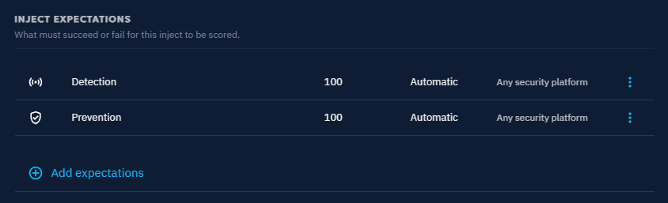
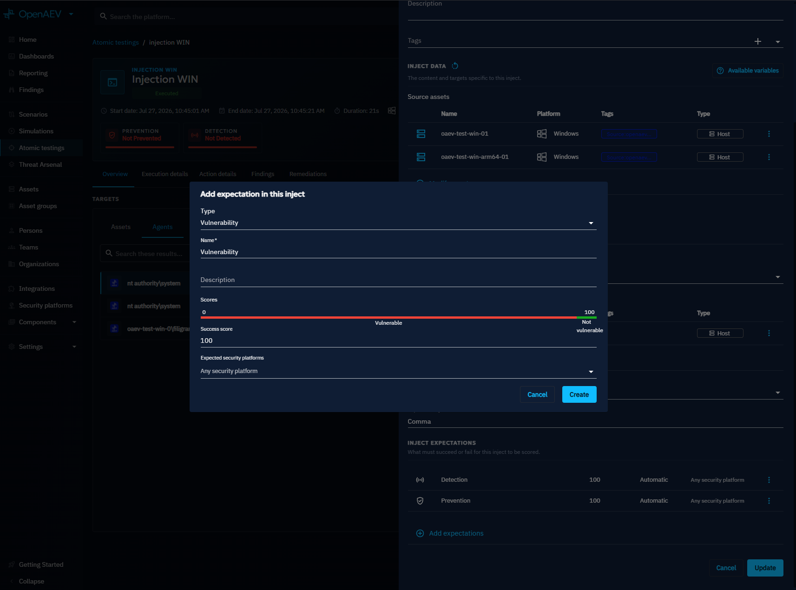
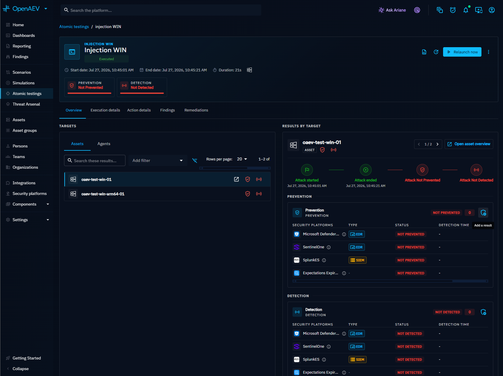

# Expectations

Expectations define what success means when an Inject targets an Asset or a Player. They answer the question: what should happen for this Inject to be considered successful?

## Why use Expectations?

Expectations allow you to:

- Objectively measure your **security posture** across prevention, detection, vulnerability, and human response
- Evaluate both **technical controls** and **human behavior** in the same Simulation
- Standardize scoring across exercises
- Determine when a **Simulation is complete** (all Expectations resolved)

## Expectation types

### Manual Expectations

Manual Expectations are validated by an organizer. Use them to evaluate human-driven actions that cannot be detected technically: decision-making, communication, process adherence.

Typical use cases: tabletop exercises, incident response drills, awareness training.

1. Add a **Manual Expectation** to an Inject.
2. Define the score, validation mode, and expiration time.
3. During the Simulation, validate the Expectation from **Execution > Validations**.

### Automatic Expectations

Automatic Expectations are validated by technical signals from connected security tools or manually provided results. They are essential for technical Simulations and BAS (Breach and Attack Simulation) use cases.

| Type | What it validates |
|---|---|
| Prevention | A security control blocks the attack |
| Detection | A security alert or incident is raised |
| Vulnerability | A CVE is present on the target |
| Article | Targets read or acknowledge a media pressure article |

## Add an Expectation to an Inject

1. Open the Inject.
2. Click **Add expectations**.
3. Select the Expectation type.
4. Configure the name, score, and expected security platforms.
5. Click **Create**.

!!! tip

    You can attach multiple Expectations to a single Inject.

## Validation modes

A validation mode defines how individual target results are aggregated at group level. Each Expectation uses exactly one validation mode.

### All targets must validate

Every member of the group must succeed for the Expectation to pass.

- All targets succeed: **100 (Success)**
- At least one target fails: **0 (Failed)**

Use this mode for compliance checks, mandatory training, and baseline security requirements.

### At least one target must validate

A single successful response is enough for the Expectation to pass.

- At least 1 success: **100 (Success)**
- No success: **0 (Failed)**

Use this mode for SOC (Security Operations Center) detection, escalation workflows, and redundancy testing.

## Result aggregation

A single Expectation can receive multiple validation results for the same Inject. This happens when several security tools monitor the same Asset, multiple Collectors report results, or results are added both manually and automatically.

### Adding a manual result

When automated result retrieval is not possible (e.g., non-technical Injects), record results manually:

1. Open the Inject result page.
2. Click the **shield** icon labeled **Add a result**.
3. Fill in the result form and save.

### How the final result is computed

1. All results are collected.
2. Results are ordered by severity.
3. The highest result always wins.

!!! warning

    A negative result never overrides a positive one. If one tool detects the attack and another does not, the Expectation is marked as detected.

## Status propagation

Expectation results propagate from technical entities to organizational entities:

| Entity | Rule |
|---|---|
| Agent | Direct result (0 or 100) |
| Asset | Valid only if all Agents succeed |
| Asset group | Depends on validation mode |
| Player | Depends on validation mode |
| Team | Aggregated from Players |

!!! note

    Validation mode always applies at group level.

## Scoring

Each Expectation type has a default score applied at creation:

| Type | Default score |
|---|---|
| Manual | 50 |

The default score can be configured via environment variable:

| Parameter | Environment variable | Default | Description |
|---|---|---|---|
| `openaev.expectation.manual.default-score-value` | `OPENAEV_EXPECTATION_MANUAL_DEFAULT-SCORE-VALUE` | 50 | Default score for manual Expectations |

## Expiration

Expectations must validate within a defined time window. If the time expires, the Expectation fails automatically and the result is marked as "Not Detected", "Not Prevented", or equivalent.

### Default expiration values

| Expectation type | Default |
|---|---|
| Detection / Prevention | 6 hours |
| Human (manual, article, challenge) | 24 hours |

Override expiration times globally (environment variables) or per Expectation (UI):

| Parameter | Environment variable | Default (seconds) | Description |
|---|---|---|---|
| `openaev.expectation.technical.expiration-time` | `OPENAEV_EXPECTATION_TECHNICAL_EXPIRATION-TIME` | 21600 | Technical Expectations (detection and prevention) |
| `openaev.expectation.detection.expiration-time` | `OPENAEV_EXPECTATION_DETECTION_EXPIRATION-TIME` | 21600 | Detection Expectations |
| `openaev.expectation.prevention.expiration-time` | `OPENAEV_EXPECTATION_PREVENTION_EXPIRATION-TIME` | 21600 | Prevention Expectations |
| `openaev.expectation.human.expiration-time` | `OPENAEV_EXPECTATION_HUMAN_EXPIRATION-TIME` | 86400 | Human Expectations (manual, challenge, article) |
| `openaev.expectation.challenge.expiration-time` | `OPENAEV_EXPECTATION_CHALLENGE_EXPIRATION-TIME` | 86400 | Challenge Expectations |
| `openaev.expectation.article.expiration-time` | `OPENAEV_EXPECTATION_ARTICLE_EXPIRATION-TIME` | 86400 | Article Expectations |
| `openaev.expectation.manual.expiration-time` | `OPENAEV_EXPECTATION_MANUAL_EXPIRATION-TIME` | 86400 | Manual Expectations |

## Expectations drift

Injects inherit the predefined Expectations of their Injector contract at creation time and keep them as-is, even when the contract later evolves. This divergence is called expectations drift.

When at least one Inject of a Scenario, Simulation, or Atomic Test carries Expectations that no longer match its contract, a warning indicator appears in the header with the number of drifted Injects. A drifted Inject is not an error -- Expectations may have been customized on purpose. The indicator only surfaces that the underlying contracts evolved, so you can decide whether to realign.

The **Realign expectations** action overwrites the stored Expectations of every drifted Inject with the current predefined Expectations of its contract. Customizations are replaced by the contract defaults.

## What's next?

- [Inject overview](../injects/inject-overview.md) -- Create and configure Injects
- [Inject result](../injects/inject-result.md) -- Understand result breakdown
- [Inject status](../injects/inject-status.md) -- Execution statuses and computation
