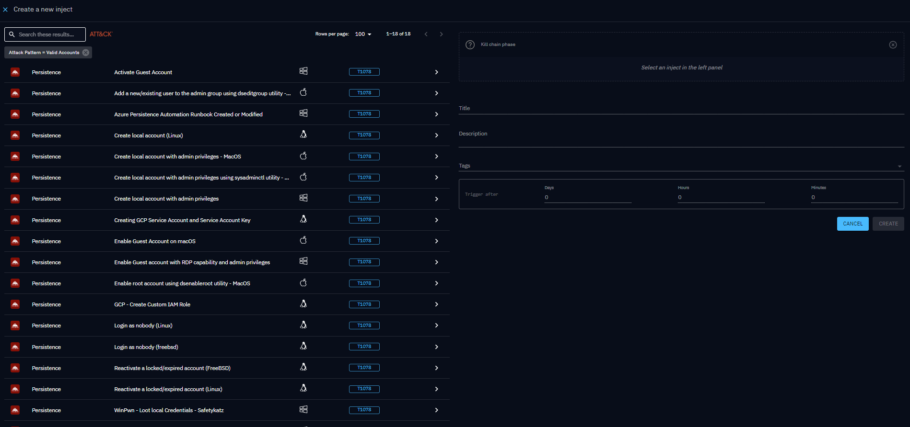

# Injects

Injects are the building blocks of security testing in OpenAEV. Each Inject represents a single action (phishing
email, command execution, DNS resolution…) that OpenAEV executes against your infrastructure during a
[Scenario](../../build/scenario/scenario.md) or as a standalone [Atomic test](../atomic-testing/atomic-testing.md).

## Create an Inject

Creating an Inject means defining **what** to execute, **against whom**, and **what outcome to expect**. Every Inject is
powered by an [Injector](../../environment/injectors.md), the connector that knows how to deliver the action (email, agent command,
API call, etc.).

### Benefits

- **Validate defenses**: test whether your security stack prevents or detects a specific technique.
- **Build realistic Scenarios**: combine multiple Injects into a full attack chain.
- **Measure response**: check if your teams react as expected when facing a threat.

### Steps

The creation workflow is the same whether you work from Atomic testing or from a Scenario/Simulation.

#### 1. Open the creation panel

| Context | Where to go |
|---------|-------------|
| Atomic testing | **Atomic testing** in the left menu, then click the **+** button (bottom-right) |
| Scenario / Simulation | Open the Scenario or Simulation > **Injects** tab > click the **+** button (bottom-right) |

!!! note

    An Inject defined in a Scenario applies to all subsequent Simulations of that Scenario. An Inject added directly to a Simulation is **not** replicated back into the Scenario.

#### 2. Choose the Inject type

The left panel lists all available Inject types. Each row shows the Injector logo so you can identify the source at a
glance. Use the search bar or filter by [MITRE ATT&CK](https://attack.mitre.org/) technique to narrow the list.

#### 3. Configure the Inject

Select an Inject type on the left. The right panel loads a form with a default title. Fill in:

| Section | What to define |
|---------|---------------|
| **General** | Title, description, tags, and execution timing (for Scenarios/Simulations) |
| **Targets** | [Endpoints and Asset groups](../../build/assets.md) or [Players and Teams](../../build/people.md) |
| **Expectations** | [Expected outcomes](../expectations/expectations.md): prevention, detection, human response |
| **Attachments** | Supporting documents or resources |
| **Inject-specific fields** | Email subject/body, obfuscation options, channel pressure, etc. |

### In practice

You want to test whether your EDR (Endpoint Detection and Response) blocks a `Mimikatz` execution (MITRE ATT&CK T1003):

1. Open **Atomic testing**, then click **+**.
2. Filter by technique **T1003: OS Credential Dumping**.
3. Select the matching command-line Inject.
4. Assign your target Windows Endpoint.
5. Add a **Prevention** expectation.
6. Save and launch.

## Output parsing and results

Some Inject types produce structured output that OpenAEV parses automatically to extract actionable results (CVEs,
vulnerabilities, alerts…) without any manual work. The parsing logic depends on the Injector and is handled by each
integration individually.

Many community and official integrations are available. Check the
[OpenAEV integrations repository](https://github.com/OpenAEV-Platform) for the full list of supported tools and
connectors.

## What's next?

- [Inject tests](inject-tests.md) -- Dry-run email and SMS Injects before launching a Simulation.
- [Inject status](inject-status.md) -- Understand execution traces, trace statuses, and how statuses are computed
- [Expectations](../expectations/expectations.md) -- Define success criteria
- [Findings](../findings/findings.md) -- See parsed results after execution
- [Inject results](inject-result.md): full breakdown of your security posture against a test.
