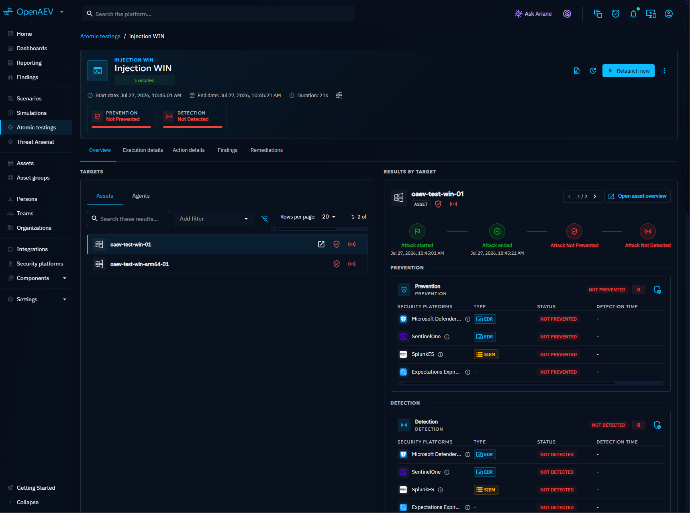
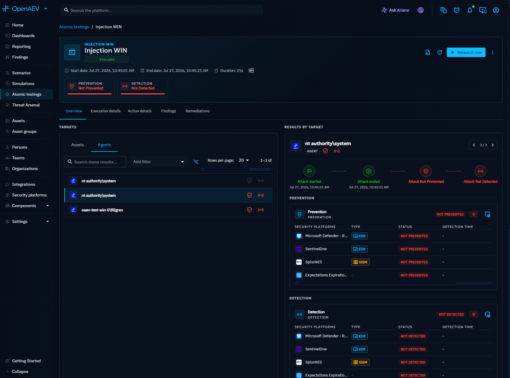
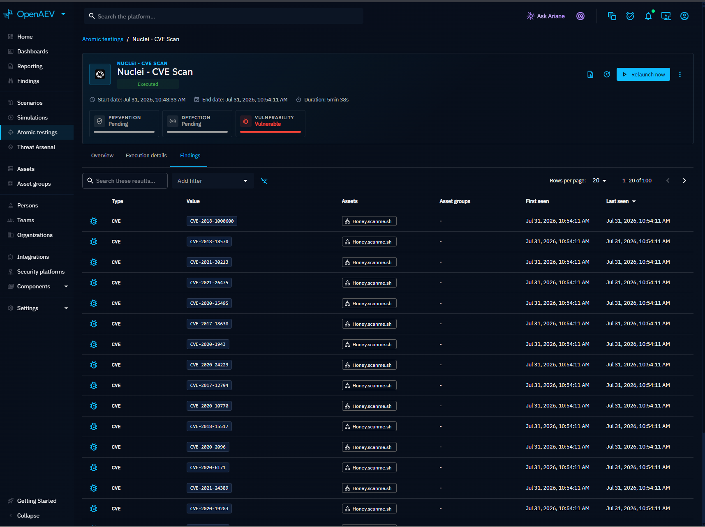
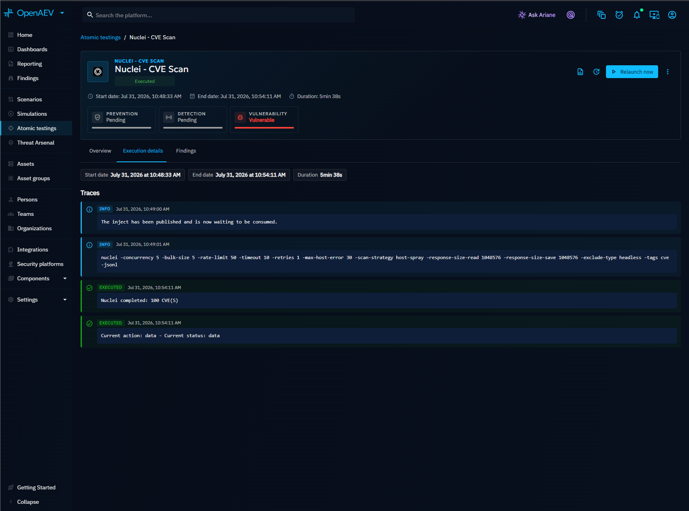
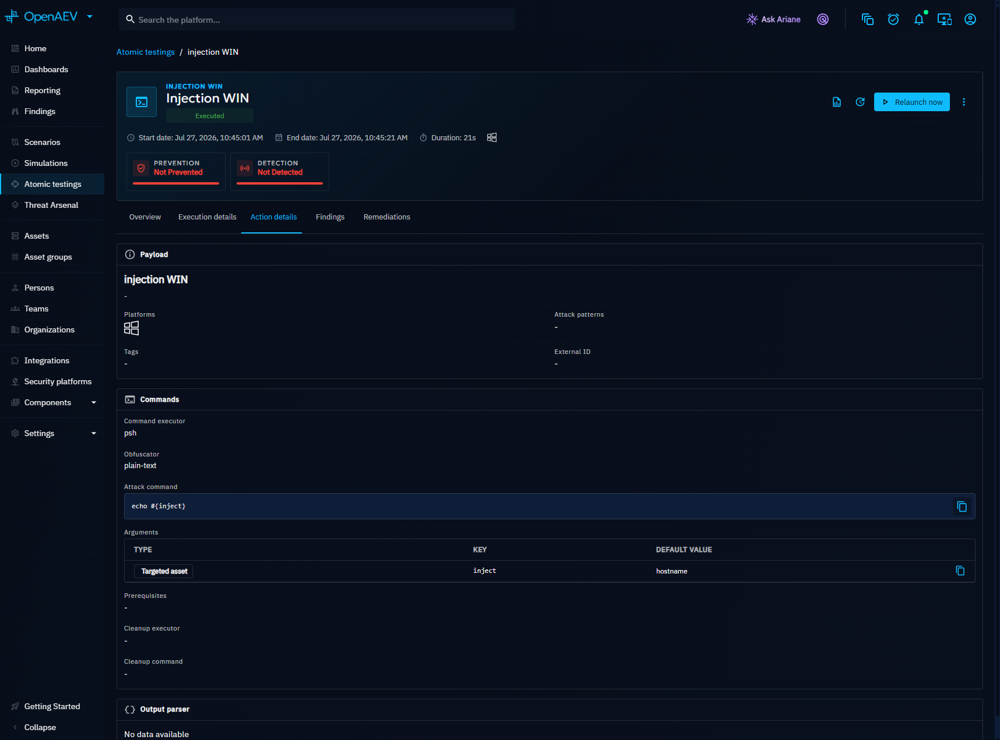

# Inject result

The Inject result page shows a detailed breakdown of your security posture against a specific executed Inject. Access it by clicking on an Inject in an Atomic Test or Simulation.

## Why review Inject results?

- Understand exactly which defensive controls prevented or detected an attack.
- Inspect Findings parsed from execution output (open ports, extracted credentials, etc.).
- Verify that detection and remediation rules match the Threat Arsenal Action.

## Overview

Results are broken down into four categories:

- **Prevention**: whether your security stack blocked the Inject
- **Detection**: whether your security stack detected the Inject
- **Vulnerability**: whether CVEs (Common Vulnerabilities and Exposures) were identified
- **Human response**: whether Teams reacted as expected

At the top, summary metrics show how all targets performed. On the left, a list of targets lets you check results for each one. Select a target to see a timeline of the test and its results, including execution logs.

Switch to the **Agents** tab to see per-Agent results with Prevention and Detection status from each connected security platform.

## Findings

The Findings tab displays indicators discovered during execution, based on the output parser configured in the Threat Arsenal Action. Filter Findings by name, type, creation date, target, value, or tag.

## Execution details

This tab shows the full execution trace, including logs and status information for each target.

## Threat Arsenal Action info

For technical Injects, this tab displays metadata about the Threat Arsenal Action that was executed: command, platform, attack patterns, and domains.

## Remediations (Enterprise Edition)

!!! tip "Enterprise Edition"

    Remediations are available with a valid Enterprise Edition license.

For technical Injects, this tab displays detection and remediation rules related to the executed Threat Arsenal Action. One Remediation tab appears per Collector available in the platform.

Ariane (the AI assistant) can generate detection rules from an executed Inject for the following configurations:

- **Threat Arsenal Action types**: Command, DNS resolution
- **Collectors**: Splunk, CrowdStrike

Remediation statuses:

- **No remediation**: no rules have been created yet
- **Human-written**: rules authored manually by an analyst
- **AI-generated**: rules generated by Ariane
- **Outdated**: the Threat Arsenal Action has changed since the rules were generated

## What's next?

- [Inject status](inject-status.md) -- Understand execution statuses and how they are computed
- [Findings](../findings/findings.md) -- Explore all Findings across the platform
- [Inject overview](inject-overview.md) -- Create and configure Injects
