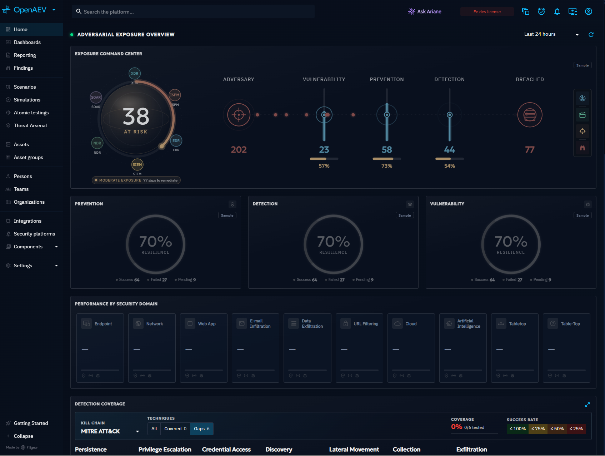
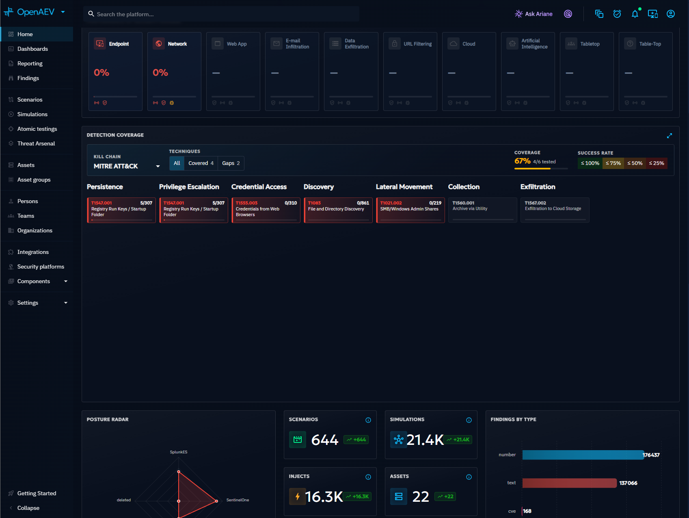
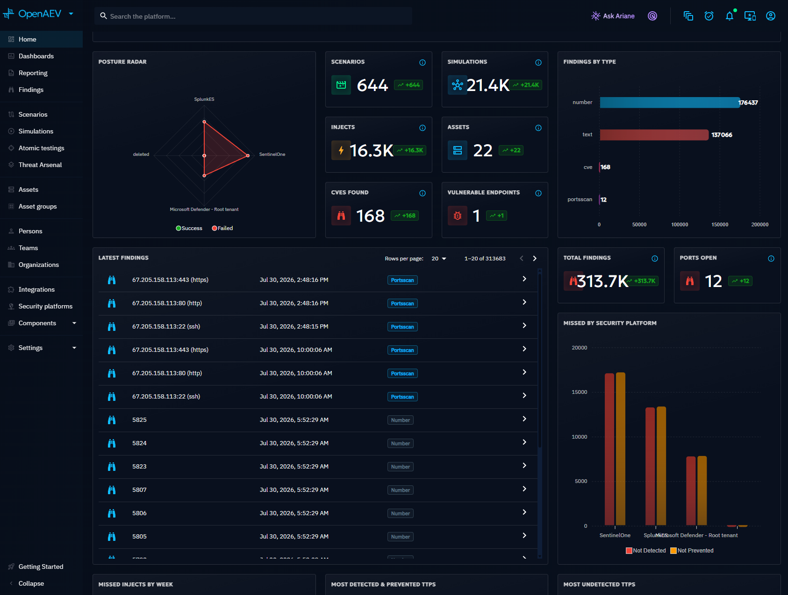
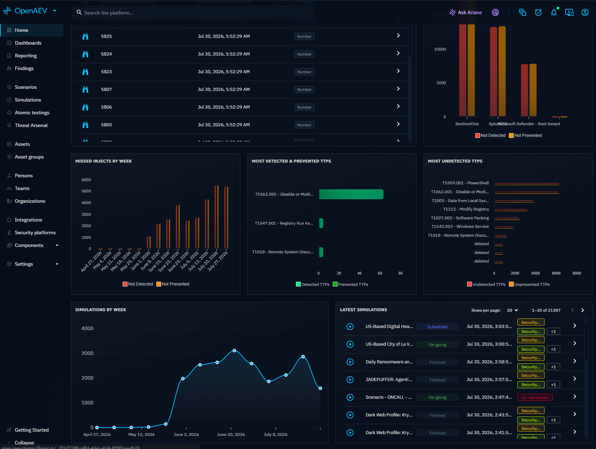

# Overview

The Home screen provides an overview of the platform's live activity and a snapshot of your global security posture. It aggregates data from Simulations to surface key metrics, Findings, and coverage gaps in a single view.

## Adversarial exposure overview

The top section displays the **Exposure Command Center**: a central radar showing your overall risk score, surrounded by four key indicators:

- **Vulnerability**: number of detected CVEs and the percentage addressed
- **Prevention**: how many attack steps were blocked
- **Detection**: how many attack steps were detected
- **Breached**: attack steps that bypassed both prevention and detection

Below the command center, donut charts break down your **prevention**, **detection**, and **vulnerability** scores, and the **Performance by Security Domain** section shows how each domain (endpoint, network, email, etc.) performs.

## MITRE ATT&CK detection coverage

The MITRE ATT&CK matrix shows which tactics and techniques have been covered by your Simulations and how well they were handled. The matrix supports both **Kill Chain** and **Techniques** views, and displays coverage and success rates per technique.

Below the matrix, metric cards provide counts for the key platform objects: Scenarios, Simulations, Findings by type, Injects, and Assets.

## Findings and statistics

This section surfaces your latest Findings in a searchable table, alongside aggregate statistics:

- **Total Findings** and **Ports** discovered across all Simulations
- **Missed by Security Platform**: which security tools failed to detect or prevent attacks
- **CVEs Found** and **Vulnerable Endpoints** counts

## Trends and recent activity

The bottom section provides temporal views of your testing activity:

- **Missed Injects by week**: tracks undetected or unblocked Injects over time
- **Most detected and prevented types**: which attack types your stack handles best
- **Most undetected types**: where your gaps are
- **Simulations by week**: your testing cadence over time
- **Latest Simulations**: the most recent Simulation runs with their results

## What's next?

- [Scenarios and Simulations](../foundations/scenarios-and-simulations.md) -- Understand the Scenario and Simulation workflow
- [Custom Dashboards](dashboards/custom-dashboards.md) -- Build custom views of your data
- [Findings](findings/findings.md) -- Explore discovered vulnerabilities and exposures
