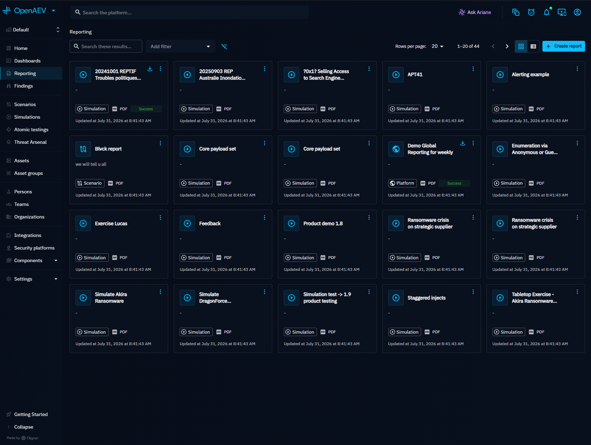
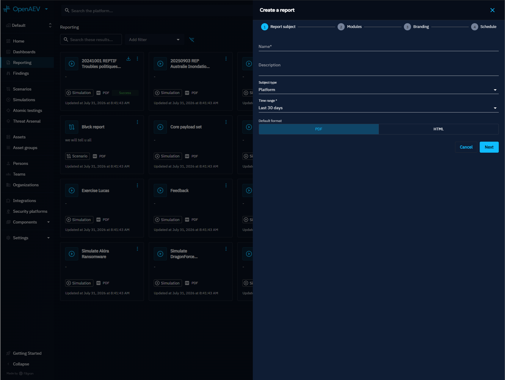
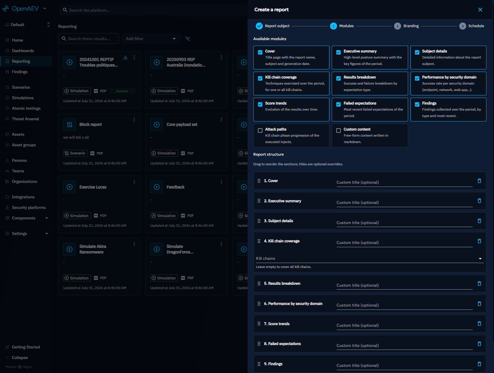
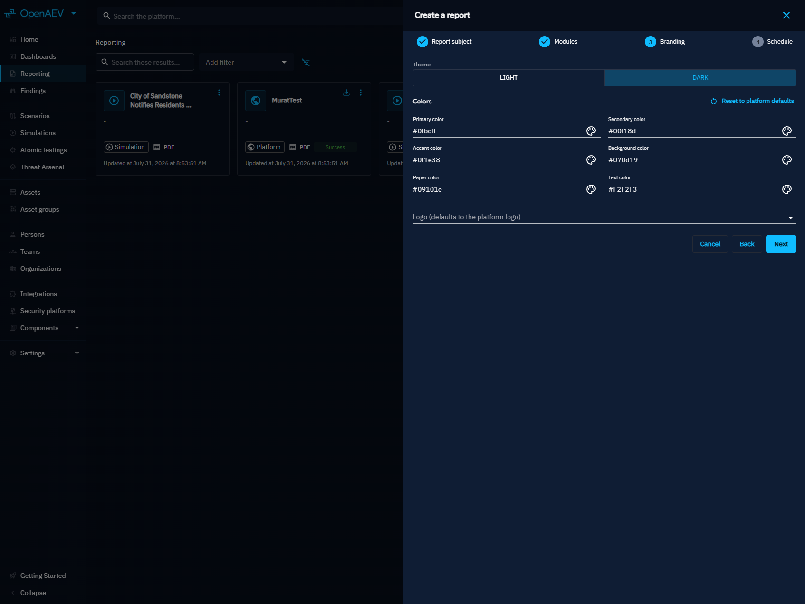
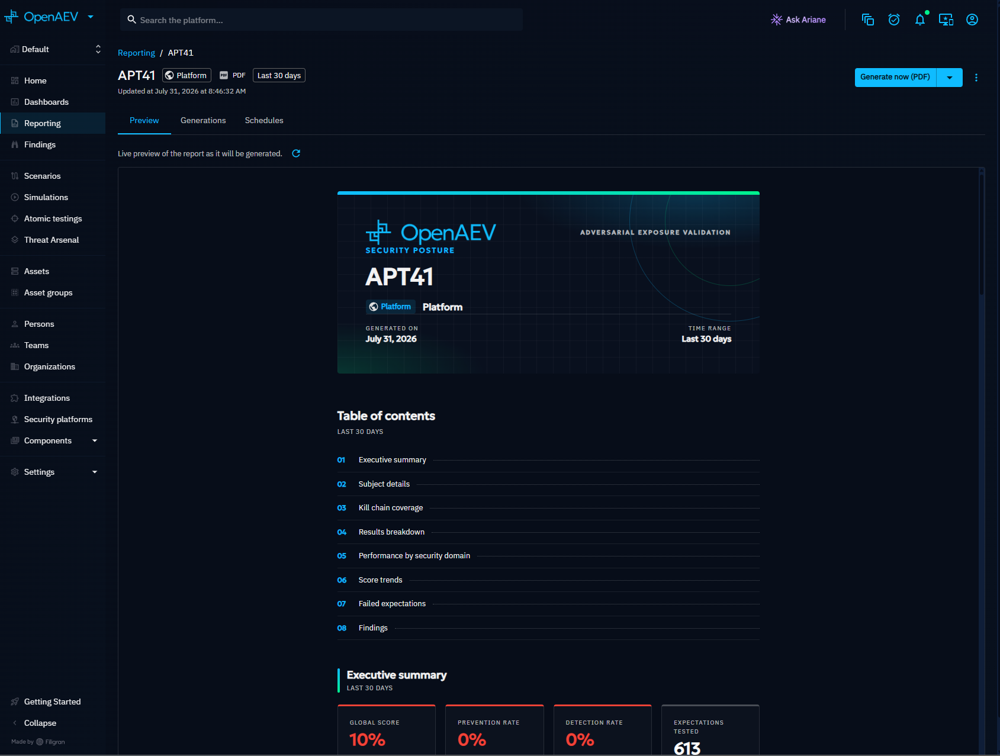
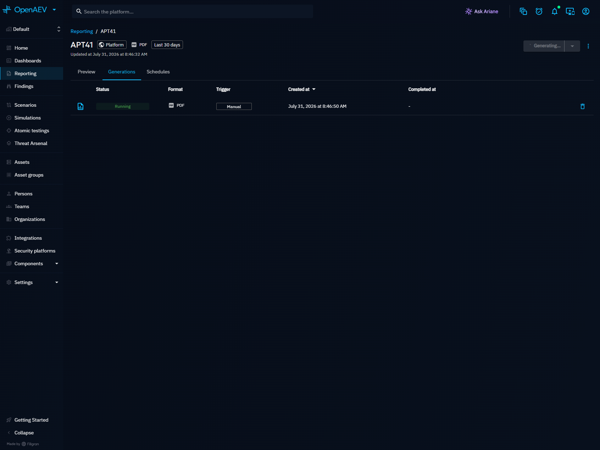

# Reporting

Reports are customizable, template-based documents that summarize security posture results for a specific subject. Generate them on-demand or on a recurring schedule, export as PDF or HTML, and distribute them to internal users or external email recipients.

## Why use reports?

Custom Dashboards are useful for live exploration, but reports provide a different value:

- **Snapshot in time**: each generation captures data at a specific moment, creating an auditable history
- **Distribution**: send results to stakeholders who don't have platform access
- **Branding**: apply your organization's colors and logo for professional output
- **Scheduling**: automate weekly or monthly report delivery without manual intervention

## Report subjects

A report is always scoped to a subject. The subject determines which data is included:

| Subject type | Description |
|---|---|
| Platform | Organization-wide posture across all Simulations |
| Simulation | Results of a specific Simulation |
| Scenario | Aggregated results across all Simulations of a Scenario |
| Atomic Test | Results of a specific Atomic Test |
| Endpoint | Findings and results for a specific endpoint |
| Asset group | Aggregated data for an Asset group |
| Player | Results related to a specific Player |
| Team | Results related to a specific Team |

## Manage reports

Navigate to **Reporting** in the left menu to see all existing reports displayed as cards. Each card shows the report name, subject type, output format, and last update date.

## Create a report

1. Click the **+** button to open the creation wizard.
2. Complete the four steps:

### Step 1: subject

Set the report name, description, subject type and entity, time range, and default output format (PDF or HTML).

### Step 2: modules

Select and order the sections that make up the report. Available modules:

| Module | Description |
|---|---|
| Cover | Title page with report name, subject, and generation date |
| Executive summary | High-level posture summary with key figures |
| Subject details | Detailed information about the report subject |
| MITRE ATT&CK coverage | Techniques exercised, filterable by kill chain phase |
| Results breakdown | Success/failure breakdown by expectation type |
| Security domains | Success rate per security domain (endpoint, network, email, etc.) |
| Score trends | Evolution of results over time |
| Failed expectations | Most recent failed Expectations |
| Findings | Findings collected, grouped by type |
| Attack paths | Kill chain phase progression of executed Injects |
| Custom markdown | Free-form markdown content with optional custom title |

Drag modules to reorder them. Each module can have a custom title override.

### Step 3: branding

Customize the report's visual identity:

- **Theme**: light or dark
- **Colors**: primary, secondary, accent, background, paper, and text colors
- **Logo**: upload a custom logo or use the platform default

Click **Reset** to revert to the platform theme defaults.

### Step 4: schedule (optional)

Optionally add a recurring schedule during creation. Schedules can also be managed later from the report detail page.

## Preview

The report detail page includes a **Preview** tab that shows a live, paginated A4 rendering of the report as it will appear when exported. The preview updates automatically when the report configuration changes.

## Generate a report

Generate a report on demand from the report detail page:

1. Open the report.
2. Click **Generate now** and select the output format (PDF or HTML).
3. The generation starts in the background. Status progresses from **Pending** to **Running** to **Success** or **Error**.
4. Once complete, download the generated document.

## Generations

The **Generations** tab on the report detail page lists all past generations with their status, format, trigger type (manual or scheduled), and timestamps. Download any past generation directly from this list.

## Schedules

The **Schedules** tab lets you create recurring generations:

| Field | Description |
|---|---|
| Period | Hour, day, week, or month |
| Trigger time | When the generation fires (UTC). For weekly: day of week + time. For monthly: day of month + time. |
| Format | PDF or HTML |
| User recipients | Internal platform users who receive the report |
| Email recipients | External email addresses |
| Enabled | Toggle the schedule on or off without deleting it |

## Quick generation from entities

Reports can also be generated directly from entity detail pages (Simulations, Scenarios, Atomic Tests, etc.). A panel on the entity page lists recent reports scoped to that entity and offers quick generate buttons.

## What's next?

- [Custom Dashboards](../dashboards/custom-dashboards.md) -- Build interactive data views
- [Findings](../findings/findings.md) -- Explore discovered vulnerabilities
- [Scenarios and Simulations](../../foundations/scenarios-and-simulations.md) -- Understand the Scenario/Simulation model
