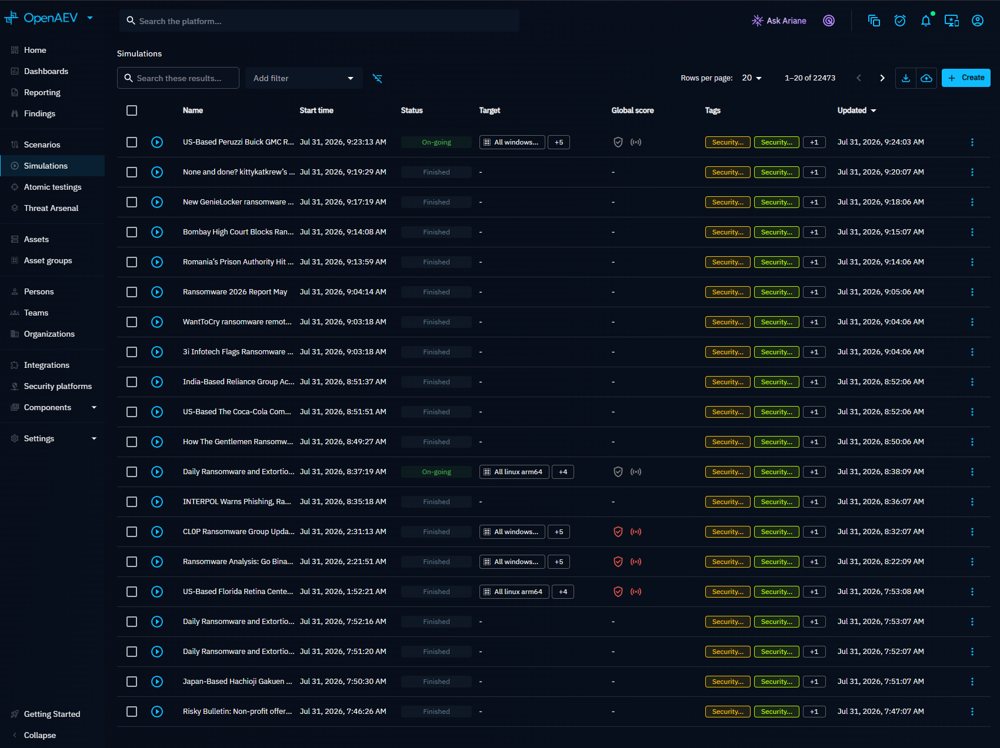
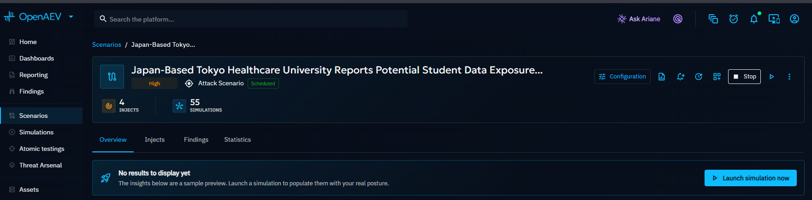
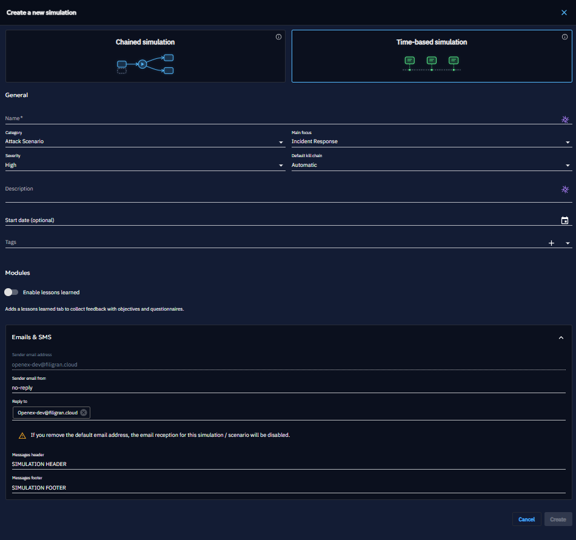
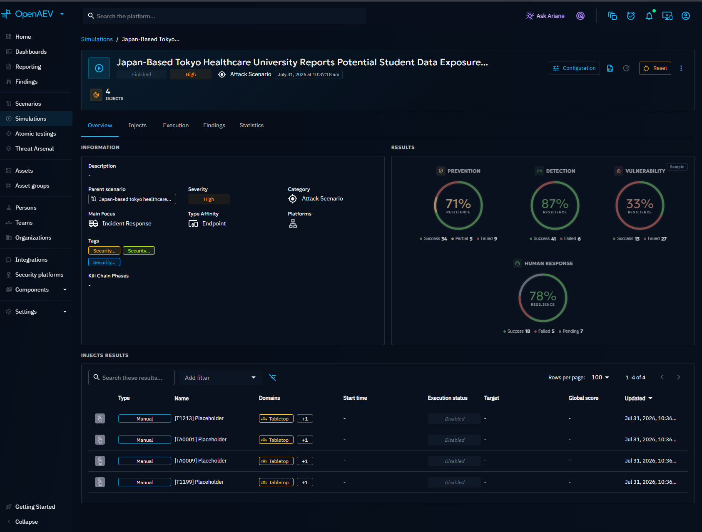
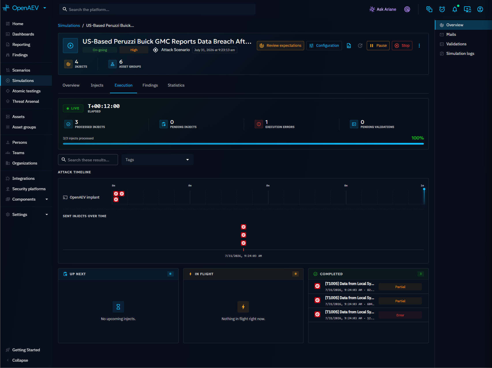

# Simulation

A Simulation is a concrete execution of a [Scenario](../../build/scenario/scenario.md) against your infrastructure. It produces measurable results across four axes: prevention, detection, vulnerability, and human response. Run Simulations once or schedule them for recurrence to track your security posture over time.

## Why use Simulations?

- Validate your defenses against realistic attack Scenarios on real infrastructure.
- Measure prevention, detection, vulnerability, and human response in a single run.
- Schedule recurring Simulations to track security posture trends over time.
- Compare results across runs to identify regressions and improvements.

## Simulation list

Navigate to **Simulations** in the left menu to see all Simulations. Filter by tag (e.g., a specific threat actor) and sort by status, date, or score. The list shows the latest global scores for each Simulation.

## Create a Simulation

The recommended approach is to create a Simulation from a [Scenario](../../build/scenario/scenario.md) to evaluate your security posture against a defined threat context. You can also create standalone Simulations directly.

### From a Scenario

1. Open the Scenario.
2. Click **Launch Simulation now**.
3. The Simulation inherits the Scenario's Injects, Teams, and components. You can customize the Simulation without affecting the parent Scenario.

### Standalone

1. Click the **+** button at the bottom right of the Simulations list.
2. Fill in the creation form.
3. Click **Create**.

## Simulation statuses

| Status | Description |
|---|---|
| Scheduled | Initial state, ready for launch |
| Running | Actively executing Injects |
| Paused | Paused mid-execution, can be resumed |
| Finished | All Injects executed and all their Expectations resolved or expired |
| Canceled | Manually stopped before completion |

!!! note "When does a Simulation become Finished?"

    A Simulation does **not** finish as soon as its Injects are sent. It stays **Running** until, for every Inject, execution has completed **and** all of the Inject's [Expectations](../expectations/expectations.md) are resolved -- either fulfilled (by a Collector, a security platform, or manual validation) or [expired](../expectations/expectations.md#expiration). Only then does it move to **Finished**.

    Expectations that are never fulfilled expire after their configured window (see [Expiration](../expectations/expectations.md#expiration)), which guarantees a Simulation always reaches **Finished** even when a Collector never reports.

### Actions

| Action | Available when | Effect |
|---|---|---|
| **Start** | Scheduled | Begins Inject execution |
| **Pause** | Running | Suspends execution (can resume) |
| **Resume** | Paused | Continues execution |
| **Stop** | Running or Paused | Cancels the Simulation |
| **Reset** | Finished or Canceled | Returns to Scheduled and clears all results |

!!! warning

    Resetting a Simulation permanently deletes all execution results, Findings, and expectation data.

## Simulation detail tabs

### Overview

The Overview tab displays results as four posture gauges: prevention, detection, vulnerability, and human response. Each gauge shows the percentage of Inject expectations that were met. Below the gauges, an Inject list shows individual results by MITRE ATT&CK attack pattern.

### Injects

View and modify the Injects that make up the Simulation. You can add, remove, or reorder Injects without affecting the parent Scenario. Distribution charts and scoring summaries are displayed alongside the Inject list.

### Execution

The Execution tab is a live operations dashboard for monitoring and managing a running Simulation. It contains five sub-tabs:

- **Timeline**: attack schedule with a live cursor showing progress, Inject status progression (Up Next, In Progress, Completed), elapsed time, and next Inject countdown
- **Mails**: email and SMS distribution analytics by Inject, Player, and Team
- **Logs**: execution logs and events
- **Chat**: communication channel for the animation team to coordinate during the Simulation
- **Validations**: manually validate Expectations to consolidate results

### Lessons learned

An opt-in module for post-Simulation debriefs. Enable it during Simulation creation or update. Organize
customizable survey questions by category, distribute them to Players, and collect qualitative feedback. Responses can be anonymized for sharing. Apply pre-built lesson templates from [Components > Lessons](../../build/components/lessons.md).

!!! note

    For chained Simulations, the Lessons target team list comes from the run scope. For time-based
    Simulations, it comes from the Simulation teams you configured.

### Findings

Displays [Findings](../findings/findings.md) discovered during the Simulation: CVEs, open ports, credentials, and other indicators extracted from Inject execution output.

### Statistics

Displays a custom [Dashboard](../dashboards/custom-dashboards.md) scoped to the Simulation. The Dashboard is automatically configured with the Simulation context so all Widgets reflect this Simulation's data. You can switch to a different Dashboard from the tab if you have the appropriate permissions.

## Overriding the Scenario definition

A Simulation inherits its definition from the parent Scenario but can override specific elements without affecting the Scenario:

- Teams and Players
- Variables (e.g., change an email address for a specific run)
- Media pressure articles
- Challenges
- Injects (add, remove, or modify)
- Email settings (from address, reply-to, header, footer)

This allows you to customize a single run for temporary changes while keeping the Scenario as a stable template.

## What's next?

- [Scenario](../../build/scenario/scenario.md) -- Create reusable attack Scenarios
- [Scenarios and Simulations](../../foundations/scenarios-and-simulations.md) -- Understand the Scenario/Simulation model
- [Inject overview](../injects/inject-overview.md) -- Create and configure Injects
- [Expectations](../expectations/expectations.md) -- Define expected outcomes for Injects
- [Findings](../findings/findings.md) -- Explore discovered vulnerabilities
